import AuthorCard from '@site/src/components/AuthorCard';

<AuthorCard authors={['半个水果', 'YZB']} />

## 菜鸟篇

恩恩，本来很早就想写的，哪知道计划跟不上变化啊.....

这个教程只是针对和我一样的菜鸟但是也想学汉化的人准备的，如果您是老鸟有一定基础的话就不用看了啊~~

阿是！废话少说，那些什么耐心啊，恒心啊，也知道大家都有了的.....

首先，大家应该知道DC游戏90%是用的Shift-JIS编码（不知道也不要紧，现在知道了）

然后这个Shift-JIS编码里面有很多日文汉字的，所以，我们菜鸟目前的初衷就是把那些蝌蚪文的日文字换成中文的那些汉字就可以了....

那应该从哪开始呢？
当然是先找找那个游戏是不是用的Shift-JIS编码.....

我随便拿个游戏做做例子，就阿卡吧....

看图1：

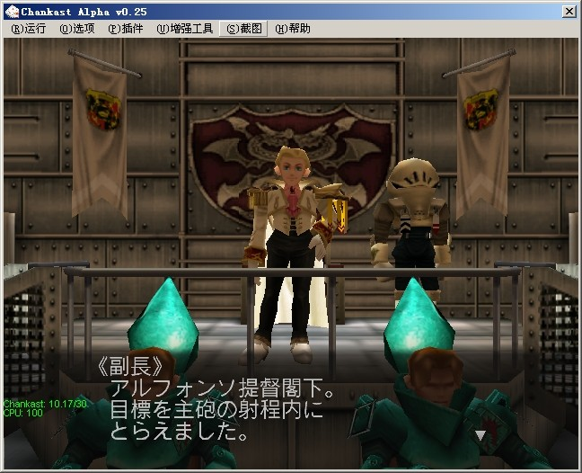

看到图里那几个字没有，恩...
然后就开始搜索了...

先我们就要用到的第一个软件出现了：StrParser，先你要把这个软件设置成和图2里面一样~

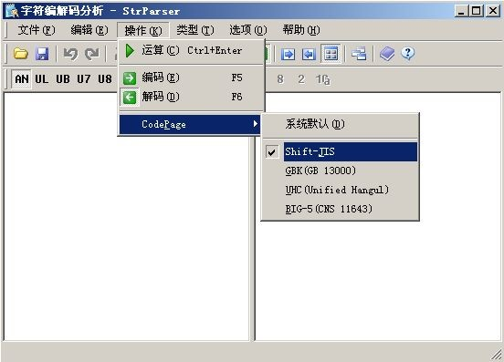

然后在左边打上刚刚在图里面看到的第一行的那几个汉字，写前面的日文也可以，但是难输入^0^记得要换繁体的输入法输入哦.....

也就是这几个字：“提督閣下”，然后运算，得到右边的一排数字图3：

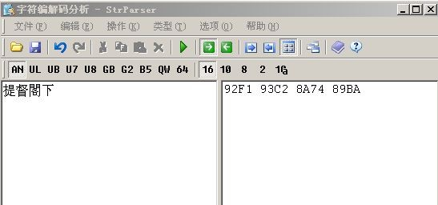

那些每4个数字代表一个汉字，Shift-JIS编码的大部分都是这样，4个数字代表一个文字，然后把这些数字一起复制（记得把中间的空格去掉哦）

现在需要用第2个软件了，WinHex，呵呵，万能的软件~

用WinHex打开啊卡的镜像（就是那个CDI或者NGR或者别的的一个大文件），然后按CTRI+ALT+F搜索16进制数值，然后点运算（其实直接点那个大望远镜旁边那个小望远镜下面带HEX那个图标也可以），搜索刚刚得到的那一组数字，看图4

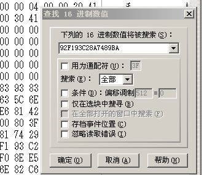

然后在等代一段时间后，如果能搜索到的话就是Shift-JIS编码，如果搜索不到的话90%不是Shift-JIS编码了...

这个是后话，本文着重讲的是Shift-JIS编码的游戏^-^

看搜索到了吧图5，这也就证明该游戏是Shift-JIS编码的了。

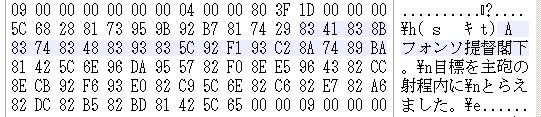

也许看到上图很多朋友会有疑问，为什么我这显示的那些文字和你的不同呢？呵呵，这是因为我把WinHex这个软件的字体换成日文的了..

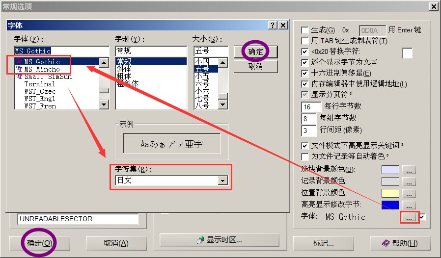

看到右下角那个“字体”了吗？

那里设置后，字体选MS Gothic或者MS Mincho，字符集选日文即可。

找到了以后，为安全起见，看看这个地方是不是出现在图1里面的文字，我们就随便换一下文字看看（注意刚刚学，最好换的字要和原来的字数要相同）

运行StrParser.exe，把图6的字输入进去，

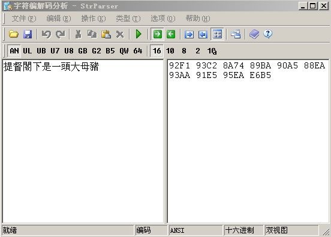

运算得到数字复制，然后粘贴到WinHex那地址里面

看到图7没有，

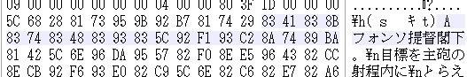

我圈上的刚刚好是10个字的数据，然后把鼠标点在画上的第一个数字那（就是83的字），在点写人粘贴版内容图8（里面左数第2个图标）

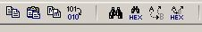

开始会有个提示，直接点确认，后面的格式选择ASCII HEX，然后点确认，在点保存就可以了~

然后运行模拟器，哈，看到了吧，是不是出现效果了~

图9

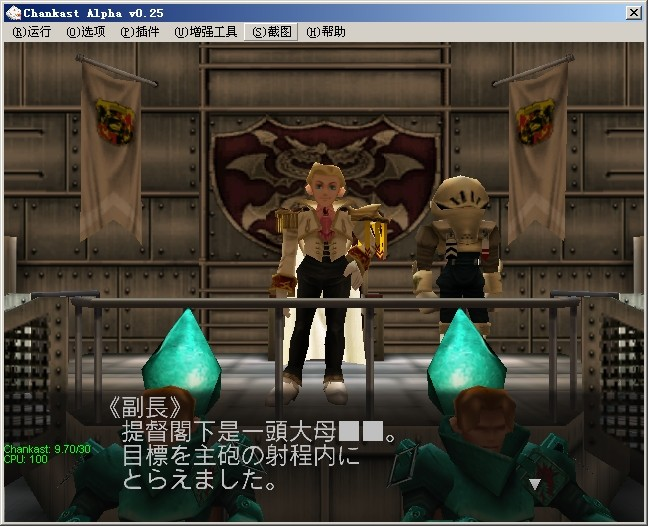

恩，但是为什么最后一个字没出现呢~

哈，是因为游戏的字库里面没那个字，所以系统会自动把那最后面的4个数字自动算成2个乱码屏障掉...

那要如何解决呢？？如果是很多字的RPG，还这样做的话那不是要累死人啊...

这要到下一次才慢慢讲到啦~

本贴的目的只是给你们一个基本的认识~~

累死了，再次声明一下，这个教程只是针对和我一样的菜鸟但是也想学汉化的人准备的，如果您是老鸟有一定基础的话就不用看了啊~~

另外里面有提到错误的地方，请不要笑，麻烦指出来..

文中提到的软件我已经上传，有需要的请妆Ρπ下载

WinHex因为下面的贴有了，我就不传了，想下直接去那下吧~

## 菜鸟进化篇

因为本人也是菜鸟，目前学习中，所以知道的高手就不用往下看了，都是一些很基本的东西，算是和大家一起学习吧~

废话少说，开始~

先说下上次忘说了一个很重要的事情，那就是要汉化某个游戏一定要知道她的字库是BIOS的还是游戏本身自带的，这个很重要啊（啥是BIOS啊？\~哈哈\~以前我也不知道，具体现在我也不是太懂^-^，不知道的就理解成游戏机本身的系统吧，这个东西是存在主机上的，不是游戏里的哦）免得在游戏里找半天也找不到字库在哪~

区别这个很简单的说，就是把这个BIOS里面的文字改一下就可以了，因为现在DC模拟器已经算是很好了，所以测试这个很简单啊~

请出本篇的第一个软件，CrystalTile！！

这个软件很强大，而且目前还在更新中，真是辛苦作者了\~但是因为本人懒惰，所以还在用很老的版本，希望大伙别BS我\~

先用CrystalTile打开模拟器文件夹内的BIOS文件，看图A 

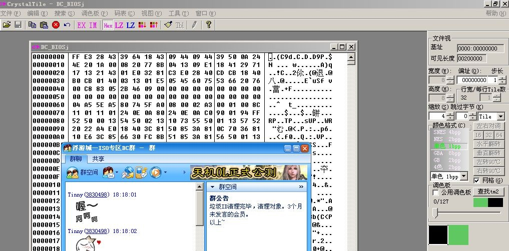

你会看到一排排的数字，不要理，点窗口上的HEX图标，这时打开的窗口会有变化，然后在点右边的宽度，把改成24，高度也改成24，缩放和行宽想怎么改都可以，自己看着方便就好。

改好后拉动窗口，把进度条往下啦，拉到我图B的位置大概就差不多了

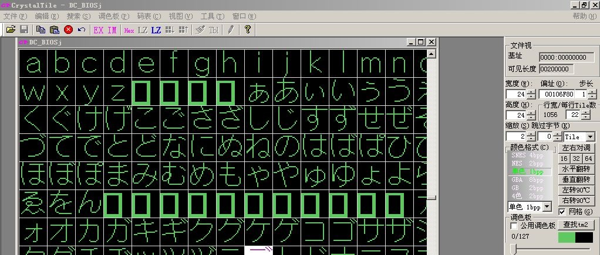

在这你会看到和我图一样或者类似的文字，如果你的是有点不整齐的话，可以按F3或者Ctrl+方向键上下左右稍微移动调整一下，直到看得清楚为止。

好了，看清楚了吧，在图框里找到那些可恶的日本蝌蚪文，在随便一个日本蝌蚪文上面点一下按Ctrl + D调出Tile编辑器，在TBL旁边的空格处随便打个汉字看图C

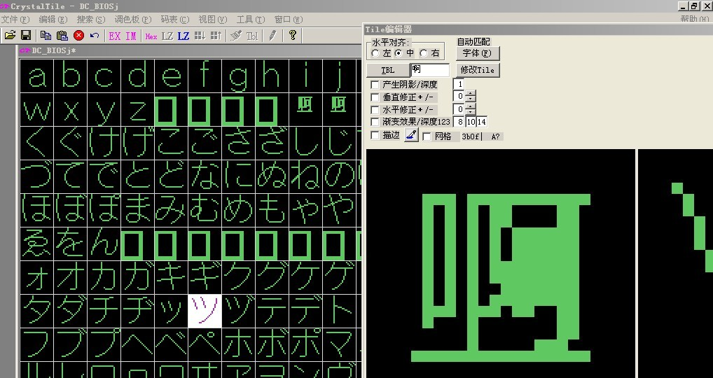

点修改，看，那个蝌蚪文不见了，换成了你打的那个汉字，很神奇吧 - -！以此类推，把所有的蝌蚪文都改一下，改完以后看起来很壮观吧，记住不是蝌蚪文不要乱改啊。改完以后记得保存哦~

~哈哈看图D

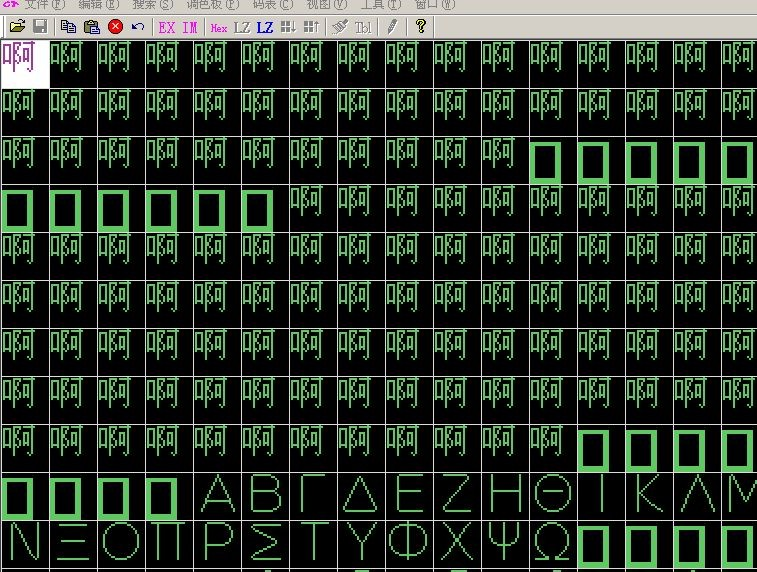

保存好了，找游戏测试吧，哈哈，拿什么游戏呢？就拿以前传说中的SGGG吧看图F

这是原来没改字库时候的图

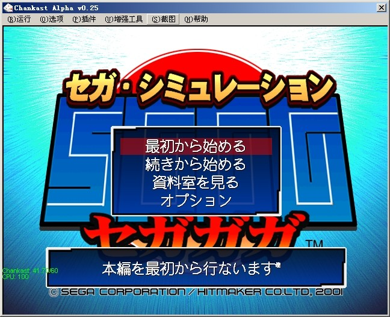

改了BIOS后在进游戏，看图E

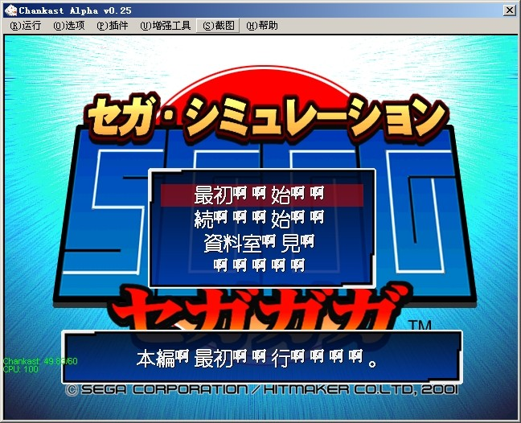

果然改变了，这就表示这游戏是BIOS字库的了，BIOS字库的和许多PS游戏一样，是不能在主机上玩的，因为BIOS是在主机上不能随便改，所以汉化好的BIOS游戏也目前也只能是是模拟器上玩玩了~

以后在拿模拟器测试，如果游戏画面上还有这么多啊啊啊的，就是BIOS字库啦，这知道了吧~

好，在跳回到前面，如果说我拿模拟器测试了，游戏的文字还是没变呢？那就恭喜了，这游戏不是BIOS字库的，想改就改吧\~呵呵\~

接着~

本想接着拿阿卡做实验的，无奈ISO太大，测试麻烦，所以就拿UNDER DEFEAT这个飞机说事，此游戏已经有精简版，才5M，方便测试（只有一关的说）~

下完，解压，里面有个INI文件是以前留下的病毒残余文件，大家可以54的删掉~- -！

下完了，解压了，现在该做什么呢？

笨，当然是模拟先啊，看看这个游戏是不是BIOS文件，好，进游戏测试一下，顺便记点文字好搜索~

进入游戏，好，没看见那么多啊啊啊啊，好这不是BIOS字库游戏！
因为这只是个教程，所以我只进去修改一句话就可以了（^-^）

进到菜单画面吧，找到第2句话，看图0

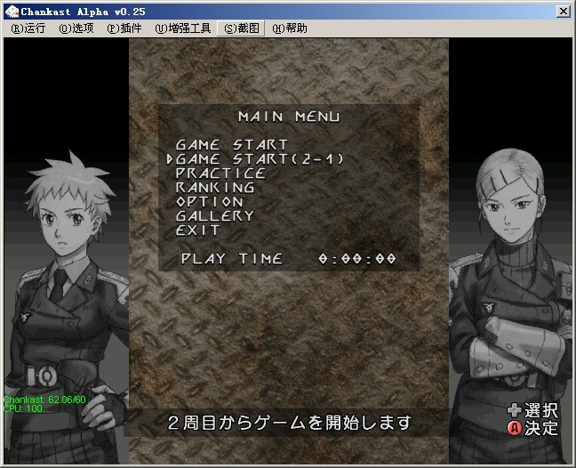

２周目からゲームを開始します

这个好记啊\~嘎嘎\~

然后按我以前第一篇的方法搜索到这句话是出现在1ST_READ.BIN里面（这个会了吧，在ISO或各个文件里面搜索周目的代码8EFC96DA），然后记住这句话出现的地址的开头和结尾，看图1

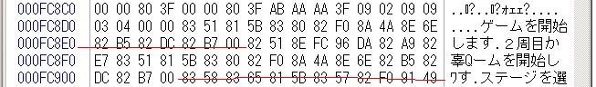

也就是开头FC8E7和结尾FC903（有人问为什么不是FC902而是FC903呢，这。。。我也不清楚，估计是多个最后的字节吧，后面用得着）

记住了以后现在要怎么做啊？噔噔噔登（做机器猫翻口袋状），本次教程的第2个软件出产了：菜鸟（这名字真贴切，都是我们菜鸟用），开始用她打开我们刚才的那个1st_read.bin文件，具体设置看图2

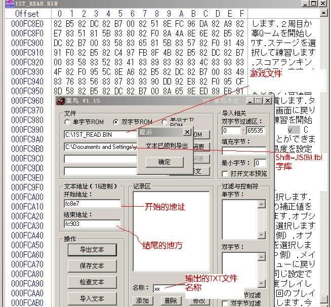

没什么要说明的，字都在图里了，1.打开1ST游戏文件，2.Shift-JIS(B).tbl码表，3.开始结尾地址，4.写上输出的TXT文件名称，5.导出文本就可以了

导出文本文件以后，打开这个TXT文件你会看到里面只有一行：

000FC8E7，28，２周目からゲームを開始します 

第一段数字就是文件地址，第2个28表示这段有28个字节，也就是14个字，我们要做的呢就是修改这14个字，把改成

直接进行第2轮的挑战

保存就OK了

接着第3个软件：菜の数出场....

这个软件和前面那个软件都是菜鸟小生写的，软件好象很老了的样子，哈哈，懒人的后果啊，也许更新了我也不知道吧~

不管了，开始啦~

用她打开刚才我们修改的那个TXT翻译文件，看图3

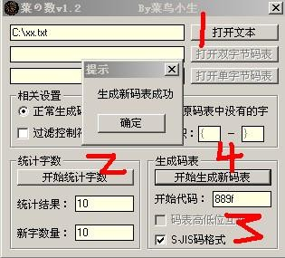

也没什么好说的了，打开刚才的TXT，然后统计字数，统计好以后，在旁边的SJS码格式上打勾，添上开始代码（这个地方很重要，虽然可以随便添，但是在游戏当中有很多重要的代码，如果你的代码和游戏的有冲突的话，嘿嘿，所以建议是从Shift-JIS(B)码的汉字区开始最好，用记事本打开Shift-JIS(B)往下翻你会发现汉字是从889F=亜这开始的，OK，我们就填上889F，然后点开始生成码表。

码表做好了，接着就把码表和翻译好的TXT导入进1ST了，再次使用教程的第2个软件-菜鸟.EXE，看图7

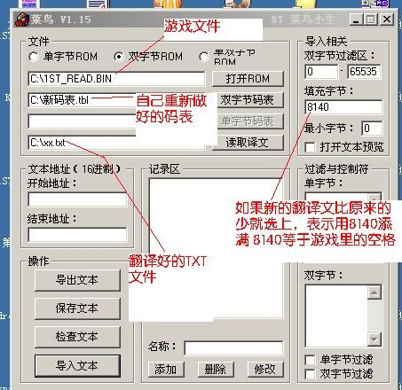

这次真的不说了，都选好以后点导入文本就可以了~

做好后我们可以在去1st_read.bin里面去看看是不是修改了，看图8

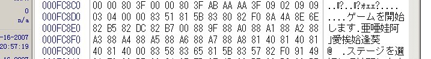

恩，都变了，而且多余的字也变成了空格，很好，嘎嘎~

接下来忘记了一件很重要的事，就是字库还没修改呢，虽然游戏文件是改了，但是字库没改的话也没用啊，恩，做最后一步工序，修改字库了~

说到修改字库这个，对我们新手来说最头疼了。为什么呢？

因为我们都不知道字库文件是哪一个啊，怎么找呢？

别急，有办法，嘿嘿~

我们都知道电脑里面的字库文件一般是以FONS或者类似的文件名组成，看看这游戏是不是这样。

看图11

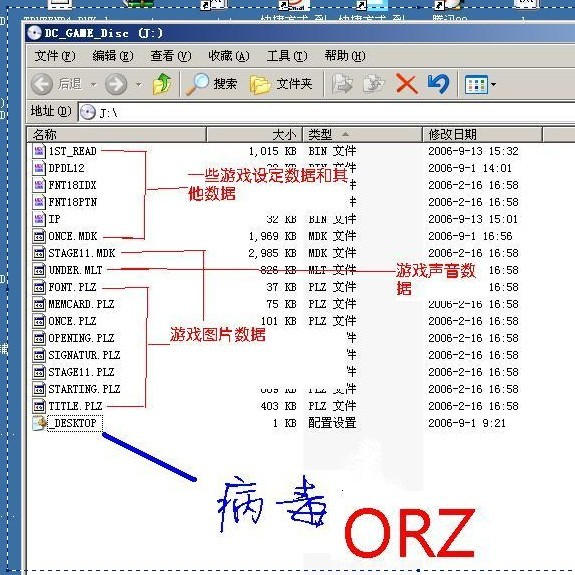

真幸运，看见只有3个类似的文件。

FNT18IDX.bin    才16K，应该不是，先无视掉~

FNT18PTN.bin    600多K 这个有点像，先看看后面的在说

FONT.PLZ   这个才37K，也不是

好了，分析完了，开始查看了，当然，这次软件还是我们最先用的那个CrystalTile软件，嘿嘿，CrystalTile真是好东西啊，还有好多好用的功能我们都还没用到呢，我们这只是用到皮毛而已~

用CrystalTile打开FNT18PTN ，然后按看BIOS字库的方法查看一下，什么嘛，什么也看不清楚，别急，慢慢调，下面还有颜色格式给你选，你搭配着在拼一下看（考验你耐心和细心的时候到了）

以下省略XXXXXXXX时间

终于，发现了，在配合宽度20 高度18，颜色4色2BPP的情况下看清楚了，大家看图4

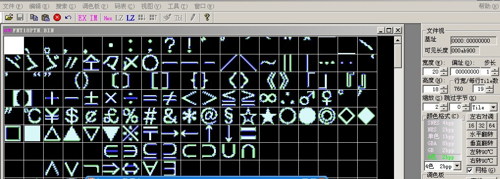

够清楚了吧，不枉我浪费N多时间来找啊，不要紧，菜鸟有的是时间，嘎嘎~

接着怎么做呢？呵呵，这下简单了（按ctri+D调出Tile编辑器修改啦），先别急着按，我们刚才那个码表的代码是先从汉字的889F=亜这开始的，我们要改的话也从这个字库的汉字区域开始比较好点~

恩，箭头往下拉，在中间部分找到汉字开始的部分了看图5

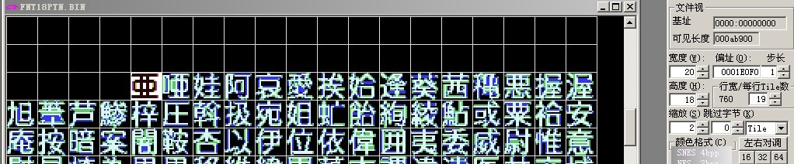

嘿嘿，看你还想往哪躲~

Ctrl + D调出Tile编辑器，出来以后先点一下字体，换上你喜欢的字体很其他属性吧，然后出现分支

第一个方法：和前面最开始修改BIOS字库一样，一个字一个字的改 - -！

第二个方法：选好字体以后在Tile编辑器的TBL上点一下，她会叫你在载入一个TBL文件，（什么TBL文件啊？笨，就是刚才我们做好的那个新的字库文件）载入以后，看图6

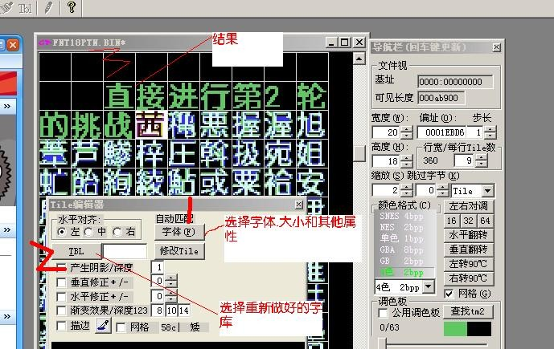

（当然如果你是一个字打一个字打的也可以啦）出现结果，字都改好了，保存吧~

终于全部做好了，目前确定修改的文件有2个，一个是1st_read.bin文件，另外一个FNT18PTN.bin文件，替换重新做直读吧~

建议使用：CDmage，这可是好东西啊，直接可替换ISO中的文件，免去重做ISO的麻烦，不过好象只支持A600的直读碟！

做好了，终于到激动人心的时候了，拿模拟器测试吧~

开始进入菜单，恩？不对啊？怎么是这样的啊，看图9

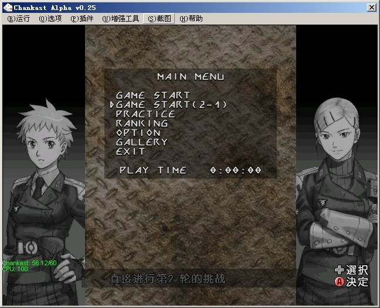

字体怎么是黑的啊？是不是哪错了啊？

恩恩恩，别急，先听我说，在前面大家不知道注意没有，我们改好的字和游戏原来的字的颜色相差很大，问题就是出在这，原来的游戏字库是4色的，而我们改的只有2种颜色，所以....

目前的解决办法是写程序- -！

写程序对我们这类菜鸟来说简直是XXOO，算了，还是拜托高人吧~
幸亏venus大大帮了我这忙（上次的Border_Down也是他帮写的，其实就是一个程序）

使用此程序转换字库以后进入游戏查看，恩好多了啊~看图10

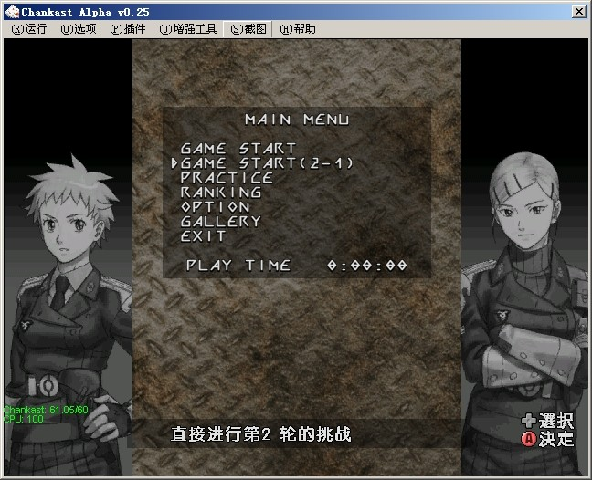

哈，马马乎乎啦~

终于汉化完成了一句话，真辛苦啊~

有试过的朋友也会和我一样，觉得汉化游戏特别累吧，以后可不要在动不动就说汉化XX游戏啦，XXXX游戏怎么不汉化了吧`- -！！

嘿嘿~

最后想说几句，在所有主机当中，DC是比较容易汉化的机种（注意是比较），所有想做汉化的朋友都来加入学习汉化DC的队伍吧（^0^）b

只要你有耐心，有恒心，有细心，有。。。。就可以，相信我，没错的~

以上教程如有不对的地方请高手指教，请不要放声大笑，掩嘴小声笑笑还可以，另文中提到的软件可以在上篇和这篇中下载，感谢写这些软件的朋友，没有你们，我们这些新手永远也做不出一个作品，永远也走不出这一步，THK！！~

终于写完了，累死了\~收工哦\~

大家有钱的给个钱场，没钱的给个人场回下贴子吧~