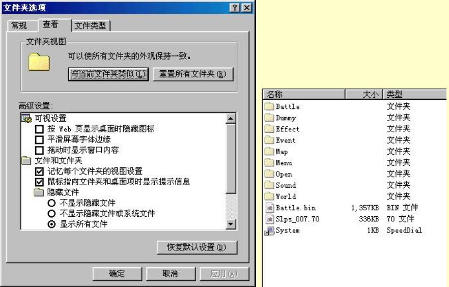
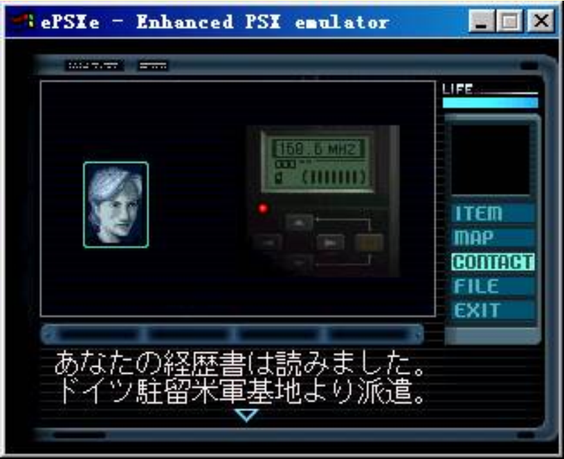
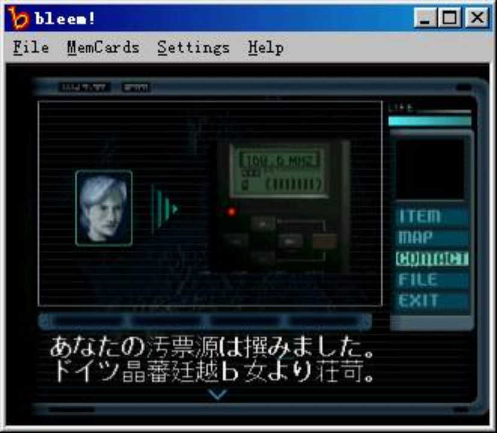
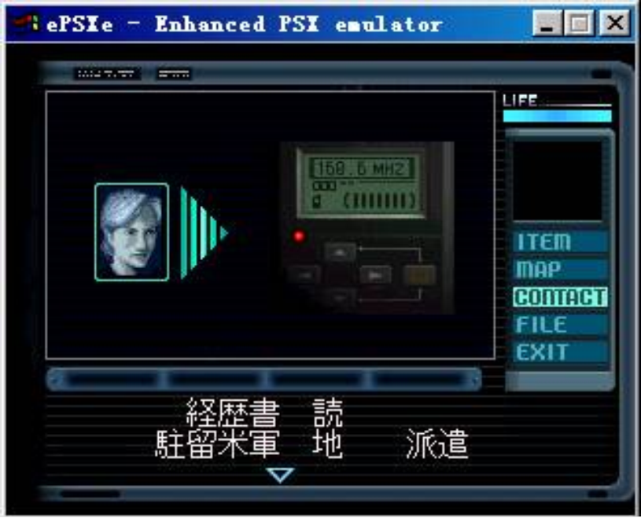
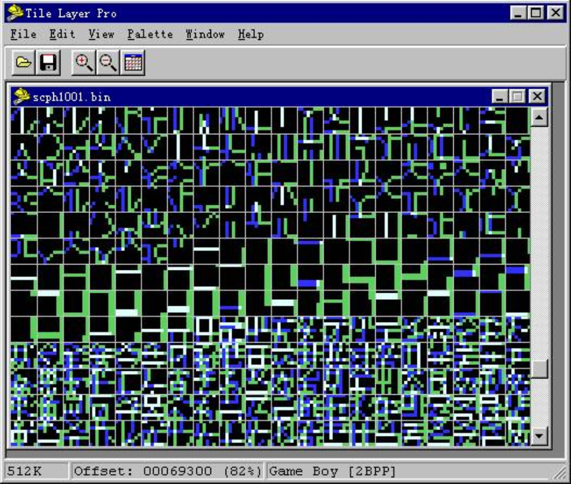
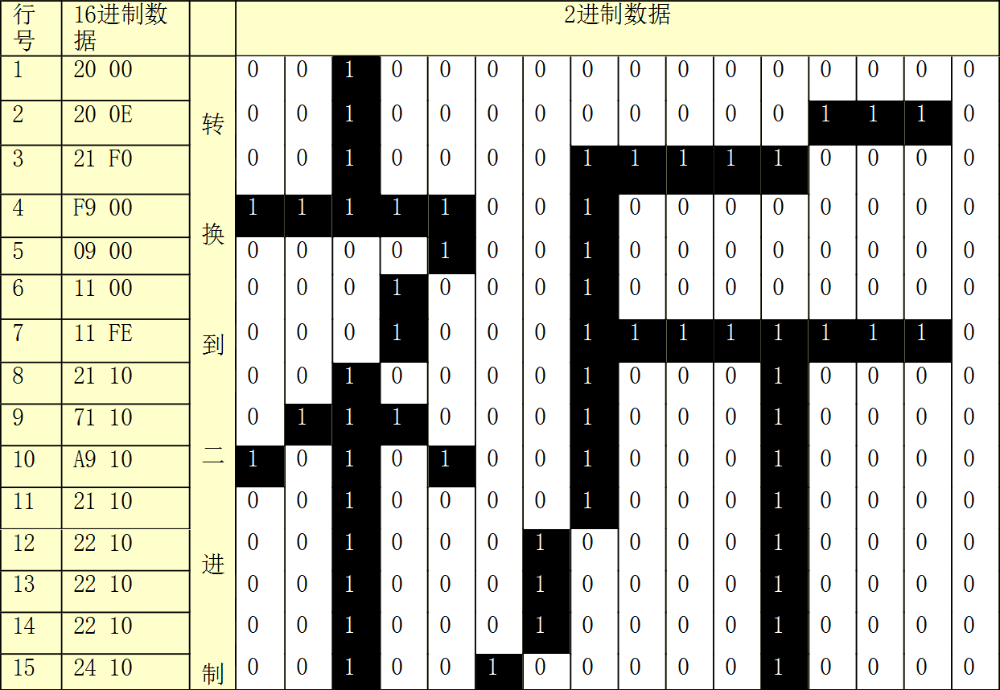
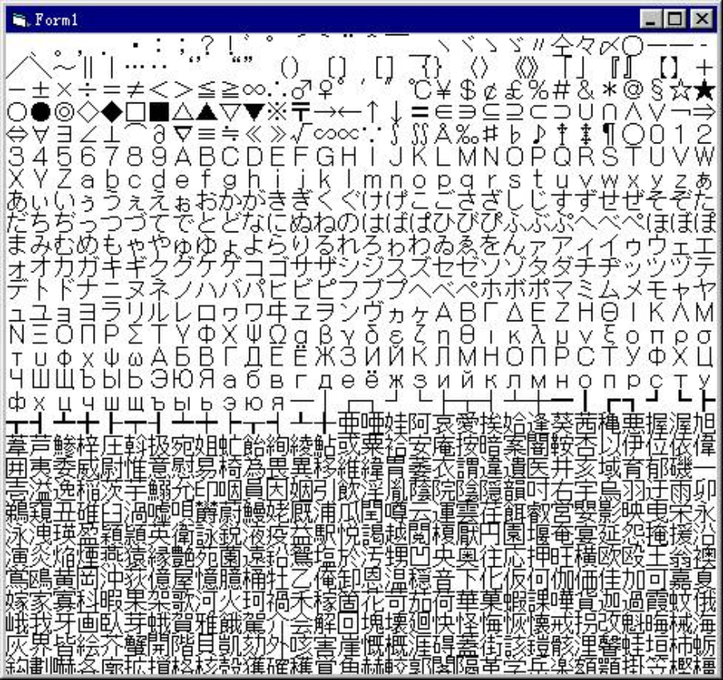
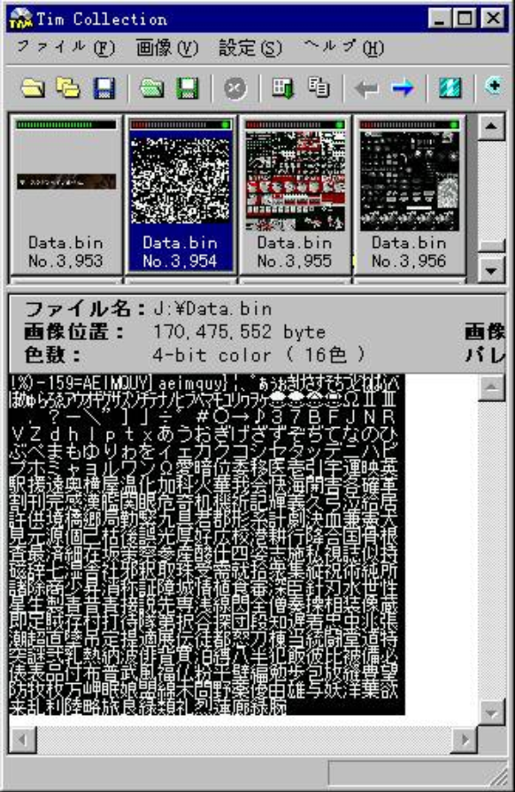

import AuthorCard from '@site/src/components/AuthorCard';

<AuthorCard authors={['半个水果', '施柯昱', '梁文豪']} />

## 基础知识

在开始这篇教程前，让我先说说本文中会反复提及的一些术语。可能不是非常的准确，不过希望大家能理解。

1. `字库（字模）`：指游戏中要显示的字符的点阵数据。
2. `脚本`：指游戏中要显示的文本数据经转换后得到的可以看懂的文本。
3. `编码规则`：脚本数据与脚本之间的转换方法。
4. `字符对照表`：是使用枚举法来表示脚本的编码规则的一个文件，它可以被很多的十六进制编辑器调用来显示游戏的脚本，通常的格式是 数值＝字符，譬如“8A63=劃”，它表示在脚本数据中如果有两个字节是 638A，那么在游戏中它会被显示成“劃”字。

## 汉化对象的选择

如果你是一个初学者的话，那么选择一个比较容易汉化的游戏是相当重要的，这样可以避免因为有过多的挫折感而半途而废。这里的“容易”是相对而言的，主要指那些无需修改游戏程序部分即ASM破解就可以完成汉化，那么如何判断一个游戏的汉化难易程度呢？

首先，通常日文游戏要比英文游戏容易一些。大家知道英文的字符数量是比较少的，一般不会超过128个字符，所以在游戏中经常使用单字节的编码方式来表示，而英文字符的结构也比较简单，所以每个字的点阵大小会相当小，无法满足汉字显示的需要，要汉化这样的游戏要涉及到修改脚本显示程序、扩充字库空间的很多方面，是相当有难度的，而日文游戏因为会使用到较多的日文汉字所以通常可以不用修改程序部分就可以达到汉化的目的。

另外，尽量选择在模拟器上可以良好运行的游戏也很重要，这样调试起来会方便得多。在这篇教程中我会主要以SQUARE的Final Fantasy Tactics（最终幻想－战略版）日文版（以下简称FFT）为例来讲解一些PS游戏的汉化方法、过程和技巧。

## 从何开始

经常有人会写信问我“我想汉化某某游戏，但是我如何开始呢？”，对于这样的问题我的回答总是“应该从查找字库开始”。

这样说的原因有以下的两点，首先要很好的汉化一个游戏，想不修改字库是不可能的。有些游戏如“天诛”因为使用了PS机中的BIOS字库，目前还没有找到修改字库的方法，所以只能利用日文汉字来汉化，很多日文中没有的汉字如“你”就只能用近似的字来代替，当然效果就不是很好。而那些使用自带字库的游戏，其字库中的汉字就更少了，完全无法满足汉化的需要。

所以只有找到了游戏使用的字库，才能确保你可以汉化它，之后的工作才不会白费。

另外一个原因是，在字库中文字的排列次序和游戏中脚本的编码规则是有非常密切的联系的，有汉化教程提到使用反复修改游戏数据来建立字符对照表的方法，这个方法虽然可行但相当麻烦费时，如果先能够找到游戏使用的字库，那么建立字符对照表会变的相当的容易，具体的方法我会在脚本的提取部分详细介绍。

## 准备工作

在正式开始汉化以前，让我们先做些准备工作，首先你必须有一张FFT的光盘，游戏的编号应该是Slps00770，然后你必须安装一下CDRWIN这个软件，我们需要使用它来制作一个该游戏的光盘影像文件，我们所有的测试工作都将在这个文件上进行。

使用CDRWIN制作光盘影像文件的方法很多地方都可以找到，在这里就不说了，注意请将影像文件名统一为fftjap.bin。另外强烈建议你学习一些基本的编程知识，以便根据本文的思路编写自己的工具程序。此外我们还会需要一些其他的辅助程序，我会在本文中陆续提到。

如果你手头已经有一张FFT的光盘的话，请把它放入光盘中看看吧，有些朋友会发现居然光盘上一个文件都没有，其实这张光盘上是有很多的文件和目录的，只不过它们都被隐藏了而以，你只需打开资源管理器，点击查看→文件夹选项→查看→显示所以文件、按确定，怎么样，所有的文件都显示出来了吧。

从目录名中我们已经可以大致了解到其中存放的数据的内容了。要补充说明的是不是每个游戏都有这么“友善”的文件结构的，很多时候游戏的制作者会将游戏数据文件打包到一个或数个大文件中，譬如FF8。更有甚者，象“秘宝传说”这个游戏，在光盘中除了两个引导文件外根本找不到任何的数据文件。当然对于这样的游戏，我们依然是可以处理它的，稍后会提到。



## 字库的查找

首先我先来讲一下PS机的BIOS字库，大家都知道，如果我们不放入任何光盘就启动PS机的话，会进入一个PS的记录卡管理和CD播放界面，在记录卡的管理界面中，我们可以看到每个的记录的详细信息。

为了能够显示这样信息，PS机的BIOS中被设置了一个完整的标准日文字库，当然这个字库也可以被游戏程序调用，有很多游戏就使用了该字库，譬如“天诛”、“胜利十一人”、“午夜列车”以及“名侦探柯南”系列等。

由于BIOS字库是固化在PS的主板芯片中的，不能够被简单的修改，即使可以修改，也会使PS机失去正常的显示功能，所以对于这些游戏我们通常是使用日文汉字来做汉化的。那么如何判定一个游戏是否使用的了BIOS中的字库能，其实一般我们可以通过屏幕直接看出来，BIOS字库是16X15点阵的，字体较大，而通常游戏自带的字库的字体是没有这么大的。

另外一个判定依据是使用BLEEM这个模拟器，由于BLEEM为了避免侵权没有使用标准的PS的BIOS文件，而其对BIOS的字库调用又模拟的不是很好，会导致很多此类的游戏在运行时出现掉字、错字的现象。不过一个最好的方法是在epsxe中使用一个破坏掉字库部分的BIOS文件来运行游戏，如果出现字体缺失的话就可以断定其使用了BIOS字库。

正常的游戏画面 



在BLEEM中的画面



使用破坏了字库的BIOS后的画面



现在我就以PS的BIOS文件为例，说一下使用工具软件查找字库的基本方法，这里我们要用到的软件叫Tile Layer Pro（以下简称TLP），它是一个通用的精灵（游戏中的活动块）编辑器，我们可以用它来查看和修改ROM中的图形，当然也包括字库。现在让我们用它来打开PS的BIOS文件SCPH1001.BIN,不过你必须将它拷贝到你的硬盘里并且去掉只读属性后才可以用TLP打开，如果你使用PS模拟器EPSXE的话你也可以在其BIOS目录中找到它们。）看看。按1键切换到Game BOY  \[2BPP\]模式，然后下移到这个文件的后部，你可以看到如下图片



虽然不是看得非常清楚，不过大概可以看到字符的一些比划了，你也可以都按几下1键，看看这个字库在其他模式下的显示状况。大家会发现无论切换到何种模式都无法将字库中的文字清晰的显示出来，这是因为精灵图片在存储时通常被分割成8乘8的小方块，我们将这些小方块称为“瓦片”（tile），而TPL也是按照这样的方式来显示图片的，因此在显示16乘15的BIOS字库时就会出现混乱。不过BIOS中的字库的结构还是相当简单的，它是一个1BPP字库，即每个点由一位数据表示，那么16乘15的一个字应该使用的字节数是（16*15）/8=30。那么第ｉ个字的字库数据就是从　字库起始地址＋ｉｘ30　开始的连续30个字节。如果这些数据如下：

```
20 00 20 0E 21 F0 F9 00 09 00 11 00 11 FE 21 10 71 10 A9 10 21 10 22 10 22 10 22 10 24 10
```

因为字体的宽度是16，也就是说每行是由两个字节表示的，然后将数据转成二进制，把“0”看成白色，把“1”看成黑色，就可以看到它其实就是一个“祈”字。



了解了它的结构就不难写出相应的字库显示程序了，下图就是使用专用程序得到的字库图。



上面说了很多关于PS的BIOS字库的东西，不过其实完全使用BIOS字库的游戏并不是很多，有些游戏会同时使用BIOS字库和自带字库，譬如“胜利十一人”系列和“柯南”系列，而更多的游戏则完全使用的是自带字库。

游戏自带字库的查找要麻烦些，比较特殊的一种形式是使用标准的PS图片格式TIM格式来存放字库，譬如我以前汉化的“寄生前夜1”就是这样。查找这样的字库有一个非常有用的工具叫“Tim Collection”，这是一个非常不错的TIM图片显示转换工具，它甚至可以为你找出那些打包在大文件中的TIM图片。

通常使用它所找到的字库是非常完美的无需作任何的修正，不过有事也会有特殊的情况发生，下面是我用这个软件在“妖精战士Ⅲ”找到的字库图片，如果你仔细看的话会发现其中少了很多字，譬如从“B”直接跳到了“F”，即没有“A”也没有“C”，我可以保证在这张光盘中你再也找不到另外的字库图片了，那么那些字到底在哪里呢？我先卖个关子，希望大家都来研究研究看，我下次会告诉大家。

