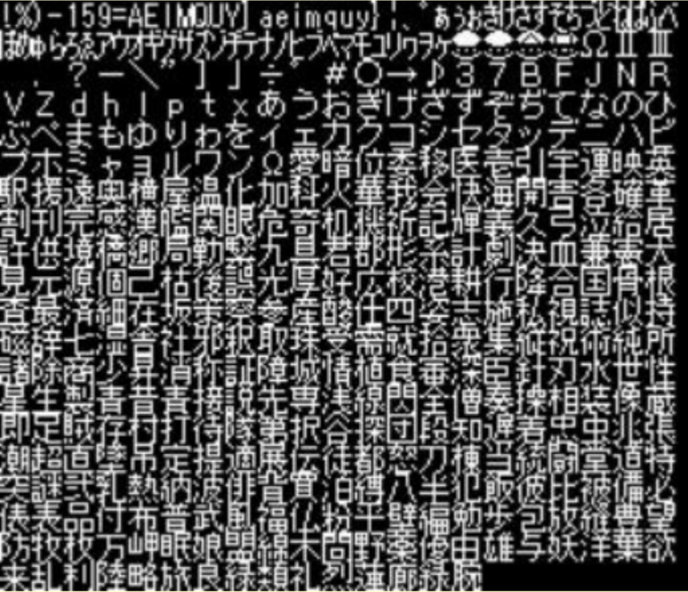
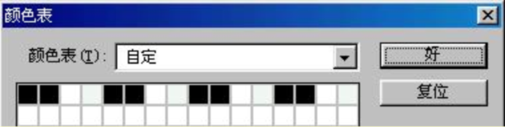
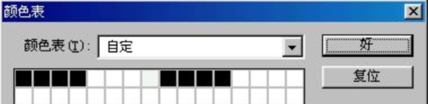
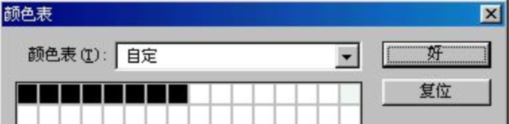
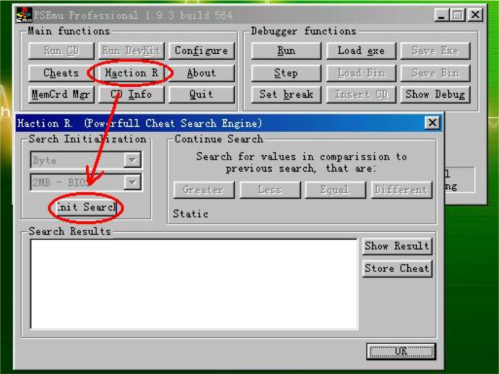
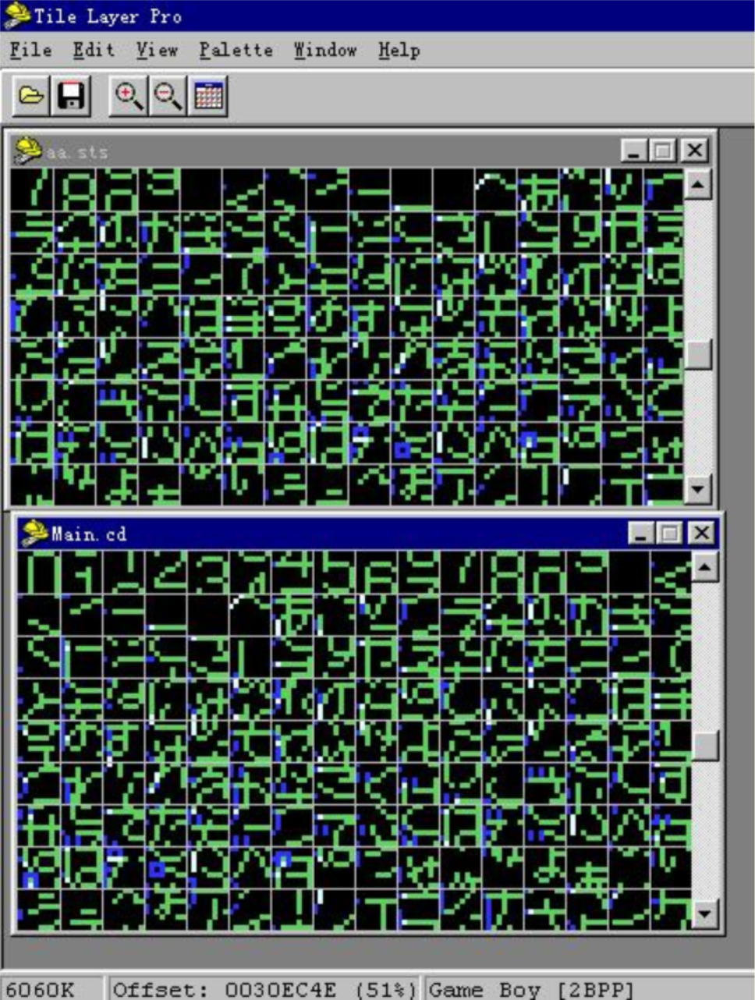
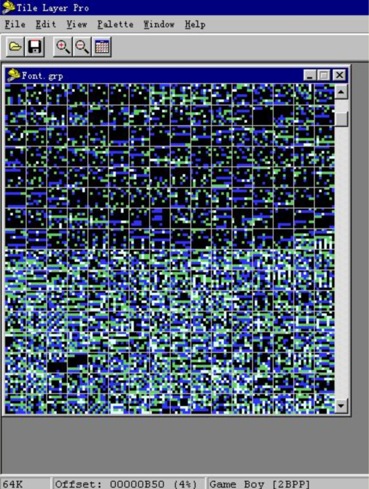
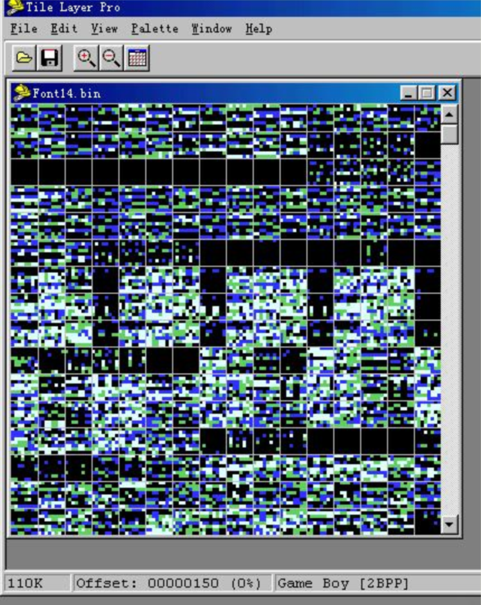
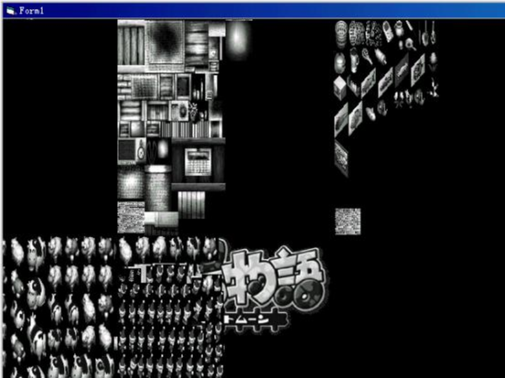

import AuthorCard from '@site/src/components/AuthorCard';

<AuthorCard authors={['半个水果', '施柯昱', '梁文豪']} />

首先让我先来揭晓上次问题的答案，那些失踪的字符其实就藏在那副图片中只是无法直接看到而已，现在希望你可以跟着我一起动手把它们找出来。请点击[这里下载](#)[^1]Data_3954_1.bmp文件，它就是用TIMCOL导出的“妖精战士Ⅲ”的字库图片，现在我们用PHOTOSHOP打开它，点击“图像”－“模式”－“颜色表”，可以看到如下的颜色表

对应的字库图如下

然后按下图修改颜色表就可以看到对应的字库图

颜色表2

字库2

颜色表3

字库3

颜色表4

字库4

怎么样，是否觉得很神奇呢？

如果你在你要汉化的游戏光盘中找到了TIM格式的字库，那你是非常幸运的，因为事实上使用这种字库格式的游戏也不是非常的多，还有更多的游戏会使用自己所特有的字库格式。

由于光盘的容量非常的大，要在数百兆的数据中查找未知格式的字库是比较困难的。一个缩小查找范围的方法是在光盘中查找文件名中有“FONT”、“FNT”和“FON”的文件，通常这就是我们要找的包含字库的文件。可惜的是PS光盘的文件命名通常不是非常友好的，有时整个光盘上会找不到任何的数据文件，遇到这样的游戏大家都会感到束手无策。

现在我要来讲一个缩小数据搜索范围的通用方法。我们知道在计算机中任何要被处理的数据都会从外部存储器中读入到内存中，在PS上也不例外，通常我们总可以在内存中发现我们最关心的数据。

现在的问题是我们如何获得PS机在运行时的内存数据呢？我们当然不可能购买到昂贵而稀有的PS调试设备，但是我们却有一个更好而且免费的工具，那就是模拟器。我们现在要用到的第一个PS模拟器是PSEMU PRO，作为一个已经停止开发的早期PS模拟器，现在依然还在使用的人恐怕很少了，不过它的一个特殊功能对PS汉化确有着特殊的作用。

首先我们先使用PSEMU PRO来运行你所要汉化的游戏（具体的配置和使用方法我不多说了，大家可以看网上的相关资料。），当屏幕上出现你所感兴趣的东西的时候（通常我会选择出现我要查找的对话时），按ESC键暂停游戏回到软件的主画面，然后点击“Haction R.”按钮，再点击弹出窗口中的“Init Search”按钮，这时在PSEMU PRO的运行目录中的HactionR子目录中就会生成一个大小为2兆的名为Prevsrch.hcr的文件，这个文件就是PS在暂停运行时的内存影像。

不过PSEMU PRO的兼容性确实不是很好，很多游戏在这个模拟器上是无法正常运行的，常常使得这个方法失效，所以大家自然会将目光转到那几个依然在开发的PS模拟器上，那么它们是否也有同样的功能呢？

我们知道在PS模拟器中EPSXE和AdriPSX都有方便的即时存盘功能，即时存盘的原理其实就是将模拟器模拟的PS机的内存和CUP寄存器内的数据以文件的形式保存起来，以便在读入存档是恢复之前中断的现场，因此在模拟器的即时存档文件中肯定是包含了全部的PS内存数据的。可惜的是在所有版本的EPSXE和最新版本的AdriPSX中，即时存档的数据都是经过压缩后储存的，也就是说如果不了解文件的解压缩方法是看不到我们所需的数据的。

幸好在AdriPSX的早期版本（在本期配套光盘的ｘｘ目录中有AdriPSX 01.06.15中，即时存档数据是未经过压缩的，而这正是我们所需要的，你所要做的仅仅是在游戏运行到恰当的地方时按下F4键保存记录既可。另外大家如果比较PSEMU PRO生成的文件和AdriPSX生成的文件会发现，后者要比前者大很多，大约有4兆多，这是因为PSEMU PRO生成的文件仅是PS主内存中的数据，而AdriPSX的即时存档文件则包括了PS内存、PS显存、寄存器等其他数据。

由于字库数据不仅仅出现在PS内存中，有时它也会以贴图的形式存放在PS显存中，所以使用AdriPSX的即时存档文件来查找字库是目前我所认为的最好方法。有一点要特别说明一下，在文件的尾部的字库是BIOS字库而不是自带字库，大家不要搞错了。

## 字库的显示

找到了游戏使用的字库位置，下面的任务就是写个程序来显示它，这个工作虽然TPL也可以干，但由于PS自带字库的格式是多种多样的，有些情况下TPL会无法胜任，而且自己编写字库显示程序有助与我们进一步了解字库的结构，为下一步写入字库作准备，在字库中我们通常要了解的是单个字的宽度、高度和色深（也就是每个点有几种颜色、或者说由几位的数据来表示一个点），这些我们可以通过观察游戏的运行画面来了解到。下面我挑几个不同的游戏来举例说明一下。

### 1、武藏传

在AdriPSX的即时存档文件的25F600H附近用TLP可以看到字库，用16进制编辑器在该位置查到其数值为 02H 00H 02H 00H 04H 00H，然后到光盘的所以文件中查找该数值串，我们可以在MAIN.CD文件的30ECECH处找到，然后用TLP查看该处，可以确定字库就在该位置。通过观察游戏的截图，我们可以知道游戏中的字体是11X11的双色（1BPP）字体，而且因为可以用TPL的2BPP模式正常的显示，所以字符每行的宽度应该是2个字节，也就是16位，剩下的就是写个程序将它显示出来了。

### 2、西游记

在这个游戏的光盘的Grp目录中有个Font.grp文件，从文件名就可以断定它是字库文件，不过用TPL打开的话，会发现根本看不清楚，这也许会给大家一个误解，以为字库是被压缩过了的，其实不然，这个字库只是结构比较特殊而已。如果我们仔细观察的话，我们可以发现一个大多数字库都具有的特征。我们知道在字库中文字的排列通常是有规律的，一般标点符号、数字、英文字母、日文字母会排列在靠前的位置上，而日文汉字会排列在靠后的位置上，这样造成的结果是在TLP中观察字库会发现代表数据的点会逐渐由稀疏变得紧密。（如下图）

其实上西游记的字体和武藏传的字体一样都是11X11的双色（1BPP）字体，如果像武藏传一样每个字的横向使用2个字节（即16位，可以表示横向的16个点）来表示的话显然会有5个位的数据是浪费的，所以在西游记的字库中每个字的横向只使用1.5个字节（即12位）表示，举例说明，如果数据是24H 04H 80H的话，240H表示的是某字的上一行，而480H表示的是某字的下一行，这也正是TPL无法正常显示字库的原因。

### 3、放浪冒险潭

虽然光盘中的文件都被设置成了隐藏的，不过使用前文提到的方法我们依然可以轻松的看到它们，在MENU目录中我们可以找到一个有趣的文件Font14.bin，显然它应该是一个字库文件，而且是应该用于菜单显示的，而那个14我推测应该是表示字体是14X14的吧。通过观察游戏的运行画面我们可以肯定这一点，而且可以发现字体是4色（2BPP）的。但是使用TPL观察会发现结果相当混乱，看不到任何的字体。

通过不断的尝试我们会发现它使用的是宽度位64的16色的一个位图（BITMAP）格式，放大显示的结果如下：

很显然，这个图片和我们在“妖精战士Ⅲ”中找到的字库类似，也缺少了部分的字符，但如果仔细观察的话会发现，这些字符是以较暗的颜色隐藏这的。具体的原因不在此浪费篇幅说明了，想知道详细情况的话可以看看本教程附带的字库显示程序源代码。要顺便说明的是该游戏还有另外一个字库，有兴趣的可以自己找找看。

### 4、最终幻想-战略版 

可能因为都是SQUARE的作品的缘故，光盘的目录格式和上面的“放浪冒险潭”非常类似，在Event目录中我们可以找到Font.bin这个字库文件，而且很类似的用TPL也无法看清楚任何字体。通过观察游戏画面我们可以知道如果包括阴影的话字体是10X13的4色（2BPP）字体，事实上我们可以将该字库看作宽度为5的4色位图来显示。

### 5、牧场物语 

和上面的几个游戏不同，牧场物语的字库不是驻留在PS的主存中的，而是以贴图的形式存在于PS的显存中的，也就是说，我们可以在AdriPSX的即时存档文件的头部找到这些数据，事实上我们可以把整个PS显存看成一个宽度为2048的256色位图来显示和查找其中的字库，不过由于我还依然不清楚PS贴图在光盘中的压缩存放格式，所以暂时还无法汉化此类游戏。下图就是用程序显示的PS显存中的内容，因为没有使用正确的调色板，所以是黑白的。

[点击这里](#)[^2]可以下载以上五个游戏的字库显示源程序fontview.zip，大家可以参考一下。另外如果在PS内存文件中找到了字库，而在PS光盘中找不到对应的数据，那么要注意了，这个字库可能是压缩存放的，关于数据的压缩和解压缩会在以后提到。字库的查找和显示现在就讲完了，下次我会开始讲解脚本的查找和提取。

[^1]:因文章久远链接已不可用，原始链接：`www.pubyun.com`
[^2]:同上