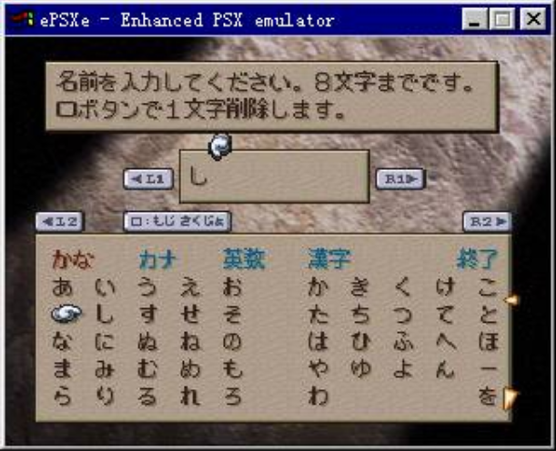
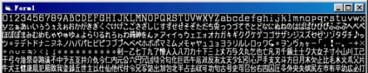
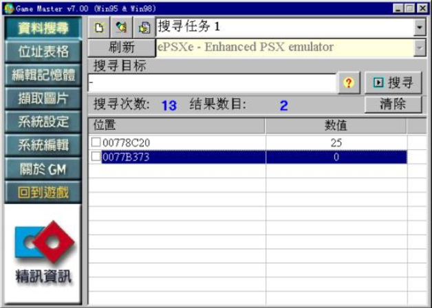
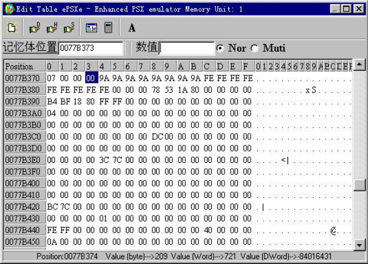
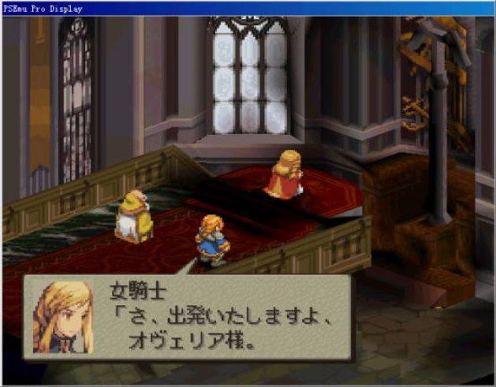
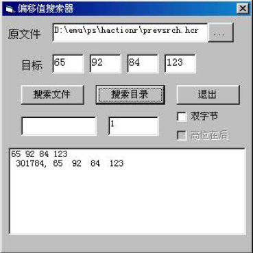
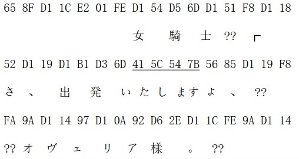
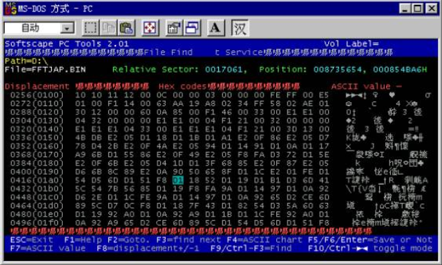
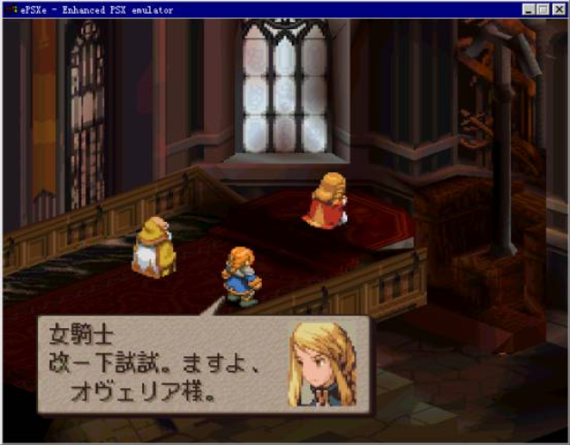

import AuthorCard from '@site/src/components/AuthorCard';

<AuthorCard authors={['半个水果', '施柯昱', '梁文豪']} />

为了便于理解后面的内容，我先要简单讲解一下游戏中文本显示的过程。当程序被指定来显示某段文本时，程序会根据内部的规则对该段数据逐个进行判断，如果是控制符号如“另起一行”、“等待按键”等会交由相应的程序处理，如果是文本数据则交给字符显示模块来处理。在字符显示模块中，程序会根据字符的内码通过内置的规则来计算出在该字符的点阵数据在字库中的位置，然后到该位置来读取数据，转换后将其显示到屏幕上。下面我以标准中文字库HZK16的显示为例说明一下游戏程序是如何实现从字符内码到字符点阵数据地址的转换的。HZK16字库是一个16\*16的点阵字库，对应的字符编码是标准的汉字GB码，它是一个双字节的编码方式。在字库中第一个字为全角的空格，对应的内码是A1H A1H，最后一个字符是“齄”，对应的内码是F7H FEH，一共有8178个字符。我们通常将两个字节中后面的一个字节称为“低位”，它是按照字符在字库中的顺序递增的，而将前面的一个字节称为“高位”，它是在低位到达最大值（在GB码中是FEH）时才递增的，此时低位会回到最小值（在GB码中是A1H）。如果我们将字库中的第一个字符作为零号字符，我们就可以通过下面的公式来得到任意一个字符在字库中的位置 （高位－高位最小值）×（底位最大值－低位最小值＋1）＋低位－底位最小值。如我们已知中“汉”字的内码是BAH BAH，我们可以知道它是字库中第 (BAH-A1H)\*(FEH-A1H+1)+BAH-A1H=947个字符，我们知道在HZK16中每个字符的点阵数据的长度是16\*16/8=32字节的，所以“汉”字的点阵数据在HZK16中的位置是947\*32＝7660H。字符显示程序只要将此位置的32个字节读入，就可以显示出“汉”这个字了，具体的演示程序[按此处下载](#)[^1]。

通过上面的介绍，我们可以知道，因为字符点阵数据的地址和内码间存在着转换关系，所以相对应的不同的字库就对应了不同的内码方式。这可以回答很多人心里的一个疑问，那就是为什么大多数的PS游戏不象电脑游戏一样使用标准的内码方式，而使用了基本上各不相同的内码方式，给汉化游戏带来了很多的困难。标准的内码方式要求有标准的字库相对应，在电脑上的字库都有着相同的字符排列顺序，而在PS上为了节约字库所占用的运行空间（毕竟PS机的内存只有两兆），很多游戏都会使用一个只包含游戏中用到的字符的最小化字库。同时有些游戏为了节约脚本所占用的空间，会将使用频率较高的字符用单字节表示，这都使得PS游戏的内码变得相当特别。当然有一个例外是那些使用PS的BIOS字库的游戏，因为使用了同一个标准字库的缘故，他们的文本内码方式也相当的统一，都是标准的SJIS内码，对与此类游戏的脚本的提取和写入是完全可以通过通用的程序来完成的，稍后我会提到。

对于使用非标准内码的游戏而言，要提取脚本就必须找到其编码的规则，如果是使用通用的脚本提取工具如Thingy的话，就是必须先建立字符对照表。要完成这个工作其实有很多的方法，下面结合最终幻想－战略版（FFT）的脚本查找来具体说一下。在FFT中，开始游戏后会有一个输入姓名的画面：



我们知道在这里输入的任何字符，都会以游戏内码的形式保存在内存的某个地方，只要我们输入不同的字符该处的内码就会作相应的变化，通过跟踪这个地址的数值的变化，我们就可以知道游戏内部的编码规则了。这里我使用的工具是常用的游戏作弊工具GAMEMASTER。首先运行EPSX，读入游戏，运行到输入姓名的位置，输入第一个字符“あ”，然后启动GAMEMASTER，选择要搜索的ePSX窗口，然后输入“?”后按搜索键进行模糊搜索（此处软件会提示进行“单字节”还是“双字节”搜索，分别对应单字节内码和双字节内码的搜索，可以先随便选个试试，搜不到的话再换一种方式）。然后我们切换到EPSX的窗口，将原来输入的字消去，在原来的位置上输入新的字符“い”，现在看一下前一讲中我们得到的FFT的字库图：



我们会发现“い”是排在“あ”字之后的，所以相应的内码也应该是前者大于后者，所以我们切换到GAMEMASTER窗口输入“＋”号继续搜索，如此重复前面的操作来逐步缩小搜索的范围，最终可以得到如下图中的两个地址：



点击右键选择编辑内存，我们就可以观察到该地址的数据。现在我们输入数个相同的字符作为姓名，然后观察这两个地址，可以发现第一个地址的数据没有重复的现象发生，所以该处并不是存放内码的地方，而第二个地方的数值有明显的重复，所以应该就是我们要找的地址。



现在如果你有足够的耐心的话，你可以将游戏中的文字逐个输入一遍，就可以得到文本与内码的对应关系了，不过这个游戏有两千多的字符，要都输入一遍是有相当难度的，所以我下面要介绍一个更快捷方便的方法，但要稍微多动些脑筋。我们知道字符的内码和其在字库中的位置是有换算关系的，我们只要多观察几个字符就可以推算出这种关系。回到游戏中，我们在输入姓名处输入“あいう”，切换到GAMEMASTER中，在内存的77B374H处可以发现其内码分别是3FH 41H 43H，而这几个字符在字库中的次序分别是63、65和67（第一个字符作为0号字符），正好和其内码相符，所以我们可以推测在字库中的第一个字符“0”的内码也应该是00H，到游戏中输入验证一下也确实如此，这样单字节内码的编码方式就清楚了，其内码就是其在字库中的位置。不过一个字节只有0到255共256个值，最多也只能表示256个字符，用来表示此游戏中的两千多个字符显然远远不够，所以该游戏一定还存在双字节的编码方式。现在我们按照字库中字符的顺序向后输入字符，观察其内码，我们可以发现在输入“マミムメ”时内码发生了特别的变化，内存中的内码是”CEH CFH D1H 00H D1H 01H”，显然单字节编码的字符应该是00H到CFH，一共是208个，之后的字符都是双字节编码的，而且双字节编码的高位最小值是D1H，低位最小值是00H。还记得我们前面提到过的从字符内码推算其在字符中位置的公式吗？因为存在单字节编码的字符，现在要作修正如下：字符位置＝（单字节内码最大值－单字节内码最小值＋1）＋（高位－高位最小值）×（低位最大值－低位最小值＋1）＋低位－底位最小值，现在我们还缺少一个“低位最大值”不清楚，所以我们重复之前的操作搜索下去，当输入到“平”和“幼”是我们发现它们的内码分别是D1CFH和D200H，显然“低位最大值”和“单字节内码最大值”一样都是CFH。整理一下：

```
单字节字符位置＝字符内码

双字节字符位置＝（CFH－00H＋1）＋（高位－D1H） ×（CFH－00H＋1）＋低位－00H
                    ＝208＋（高位－209）×208＋低位

反过来

单字节字符内码＝字符位置

双字节字符高位＝取整（字符位置/208）＋208

双字节字符低位＝取余数（字符位置/208）
```

以上是通过游戏作弊软件获取游戏内码编码方式的一个方法，其实上根据同样的原理，我们也可以通过比较游戏存盘文件的方式来实现。因为在游戏中设定的姓名是会保存在游戏存盘文件中的，我们在相同的存盘文件中，每次存入不同的姓名，通过比较这两个存档的不同也可以获得其编码的规则，不过操作起来没有上面的方法方便，所以就不细说了。另外我也曾经遇到过相当特殊的情况，当我在汉化“异闻录2 罪”时发现前后的两个存档中不同的数据很多，且和输入字符在字库中的顺序变化没有什么明显的关联，后来才明白存档中保存的并不是字符的内码，而是字符的点阵数据，这应该是相当特别的现象了。

上面的方法在实际的使用中有一个限制条件，就是要求游戏必须有输入字符的地方才可以，不过很多游戏是没有这个功能的，所以下面介绍一个更通用，也是最常用的方法－相关搜索法（Relativeful Search）。相关搜索的原理其实前面已经提到了，因为字符内码与其在字库中的位置是有换算关系的，所以通常来说两个字符在字库中的距离和其内码的距离也是相同的，举例说明，如果有两个字符他们在字库中的位置分别是63和92，那么它们的内码的差也应该是63－92＝-29，对于双字节内码的文字来说，必须是同一区段（也就是高位相同）的情况下才是如此。因此我们只要在游戏中挑选一句文字，将其中每个字符在字库中的位置计算出来，然后算出其两两间的差，然后再到游戏文件中搜索两两间差与此相同的数据，就可以找到游戏的脚本数据和推算其内码方式了。进行相关搜索需要大量的计算，通常是需要工具软件的辅助的，现成的相关搜索软件有很多如Relativeful Search、TranslHextion等，不过因为都是老外编的，所以对双字节内码的支持不是很好。因此在这里不得不放上我很久以前写的一个工具给大家用用，[请按此处下载](#)[^2]。 下面结合FFT脚本的查找来将一下具体的使用方法。

首先让我们启动PSEmupro软件（用它而不使用常用的EPSX的原因是因为它可以很方便的获取PS运行时的内存数据，由于光盘上的数据非常的多而且有些可能会被压缩过，搜索起来非常困难，所以使用搜索PS内存影像数据的方法来缩小数据搜索范围，具体说明请参考上一篇教程），使用它来运行FFT，当游戏运行到如下的画面时



我们按ESC键暂停游戏，然后点击“Haction R.”按钮，再点击弹出窗口中的“InitSearch”按钮，这时在PSEMU PRO的运行目录中的HactionR子目录中就会生成一个大小为2兆的名为Prevsrch.hcr的文件（[按此处下载](#)[^3]），现在运行我的search程序，在原文件框中打开该文件，然后让我们选择屏幕上字库中距离较近的四个字符（之所以选择较近的是为了保证选中的几个字符都在同一区段里），这里我们选“いたしま”这几个字，查询上面的字库图片我们可以知道它们在字库中的顺序分别是“65、92、84、123”，我们将这四个数字输入目标文本框中，在下面有两个选择框，分别是“双字节”和“高位在后”按钮，前者决定按单字节内码还是按双字节内码进行搜索，后者决定搜索双字节内码时默认高位是第一位还是第二位，默认都不选为搜索单字节内码，如果找不到可以换另两种方式试试，现在按“搜索文件”按钮进行搜索，非常幸运我们一下就找到了结果。在下面列表中有两排数字，第一行的几个数字是输入的数值，第二行是找到相对值相同的数据的地址和该地址的几个数据，如果找到多个的话会一一列出。



现在我们用一个十六进制编辑器（有很多，但我喜欢用DOS下的Simplify PC Tools，它的一大特点是可以同时搜索多个文件，[请按此处下载](#)[^4]。）打开Prevsrch.hcr，在上面的地址附近可以找到下面的数据，其中带下划线的部分是我们刚才查找的那四个字的内码。显然这几个字符是以单内码方式表示的，通过前面的推测，我们确定此游戏采用的是单字节和双字节混合的内码方式，根据这点我们将上面的那段文字与其内码对应起来。



根据对比我们可以知道，对于单字节内码的文字，其内码等于其字符在字库中的位置。下面我们来确定双字节内码的编码规则，在这段文字中内码最小的是“リ”字，内码为“D10A ”，它在字库中的位置是218，明显小于单字节可以表达的字符数256。所以我们可以断定高位最小值就是D1H，而双字节内码的最小值应该是D100H，对应的字是“リ”的前面第10个字“ム”，它的字库顺序是208，那么单字节字符的最大值就应该这数减1是207（CFH），现在根据前面我们提到的公式：

字符位置＝（单字节内码最大值－单字节内码最小值＋1）＋（高位－高位最小值）×（低位最大值－低位最小值＋1）＋低位－底位最小值

我们取两个不同区段的字符就可以计算出低位最大值了

```
对于“リ”字 218=（CFH-00H+1）+（D1H-D1H）*（X-00H+1）+0AH-00H

对于“発”字 733=（CFH-00H+1）+（ D3H-D1H）*（X-00H+1）+6DH-00H

515=2*（X+1）+99

X=（515-99）/2-1=207
```

所以低位最大值和单字节最大值一样也是CFH。这样我们就可以得到和前面一样的内码与字库位置的转换公式。现在我们要来实际测试一下这个公式是否正确。



通常我是通过是将PS光盘中文件拷贝到硬盘中修改后再写入光盘影象文件，然后在模拟器中读取该影象来测试的，不过因为将修改后的文件写入PS光盘影象文件的方法要留在后面几讲讲，所以这里使用直接修改影象文件的方法。用十六进制编辑器大开PS光盘影象文件FFTJAP.BIN（用CDRWIN生成的），搜索上面在内存文件中找到的数据，一共可以找到有三处，虽然不知道为何，但都改了肯定没错。 现在假设我们要写入的文本是“改一下试试。”，这句话中的几个字字库中都有，根据公式作如下的计算。

```
“改” 字库顺序1818

高位＝INT(1818/208)+208=216(D8H)
低位＝1818 MOD 208=154(9AH)

“一” 字库顺序260

高位＝INT(260/208)+208=209(D1H)
低位＝260 MOD 208=52(34H)

“下” 字库顺序273

高位＝INT(273/208)+208=209(D1H)
低位＝273 MOD 208=65(41H)

“试” 字库顺序1660

高位＝INT(1660/208)+208=215(D7H)
低位＝1660 MOD 208=204(CCH)

“。” 字库顺序236

高位＝INT(236/208)+208=209(D1H)
低位＝236 MOD 208=28(1CH)
```

所以要写入的数据是“D8 9A D1 34 D1 41 D7 CC D7 CC D1 1C”，将这些数据写入上面我们找到的地址中，用EPSX运行可以获得如下的画面，证实我们找到的转换关系是正确的。



[^1]:因文章久远链接已不可用，原始链接：`homepage.3322.net`
[^2]:同上
[^3]:同上
[^4]:同上