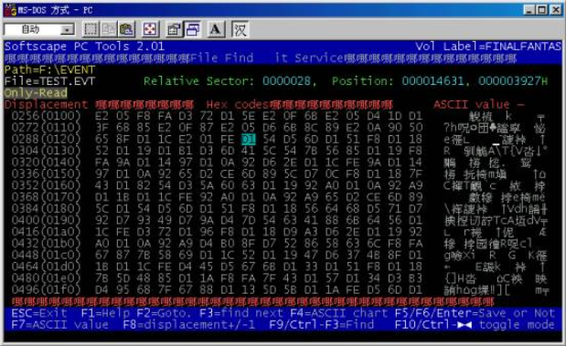
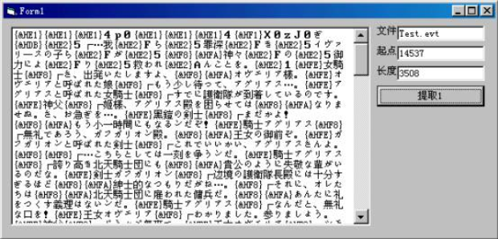
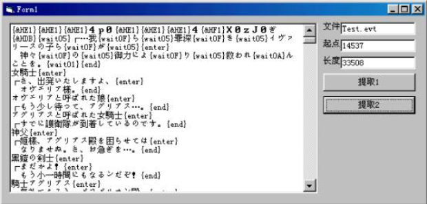
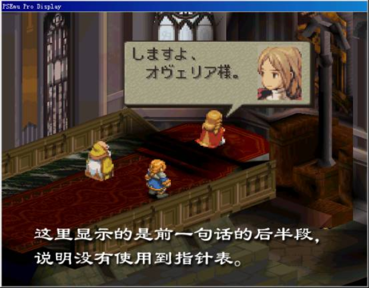
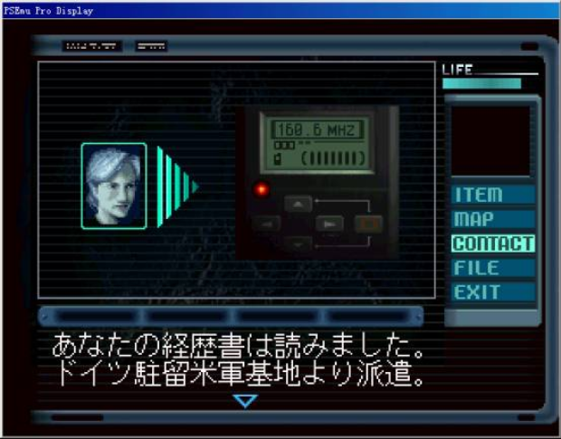
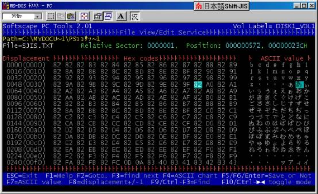
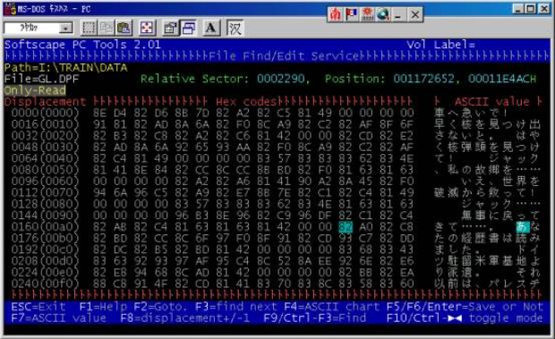
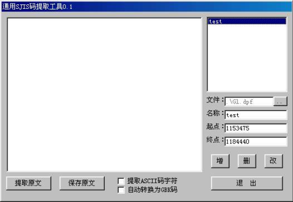

import AuthorCard from '@site/src/components/AuthorCard';

<AuthorCard authors={['半个水果', '施柯昱', '梁文豪']} />

在前面的一讲里我介绍了fft中文本的编码规则的研究，有了之前的研究成果，我们就可以开始着手编写脚本的提取工具了。首先我们必须先确定一下我们要提取的文本在光盘上的哪个文件里，确定的方法非常简单，在前一讲中我提到的那句对话的内码是“D1 54 D5 6D D1 51 F8 D1 18 52 D1 19 D1 B1 D3 6D <u>41 5C 54 7B</u> 56 85 D1 19”，现在我们只要在光盘的文件中搜索该代码就可以找到游戏对话数据所在的文件了，虽然光盘上的文件比较得多但如果去除str结尾的动画文件和sound目录中的声音文件的话还是很容易在Event目录中的Test.evt找到对话的数据的。



下面的工作就是要开始导出脚本，虽然脚本的导出是有现成的通用程序可用的，但为了获得更大的灵活性，以及考虑到之后的字库生成及脚本的写入，我通常是自己写程序来完成，毕竟写一个并不是非常的困难，而且以后只要稍加修改就可以用到其它的游戏汉化上。在开始编写程序前先要做一件麻烦事，就是将字库图片中的几千个字按照字库中的顺序输入到一个文本文件中（因为日文汉字以繁体字据多，所以有些字如果找不到的话可以用微软拼音输入法的繁体字输入功能试试），它的作用相当于使用通用脚本提取工具时用到的字符对照表，只是因为我们这里是通过公式运算来转换内码的所以无需输入字符对应的游戏内码。脚本提取程序的原理是相当简单的，首先程序读入前面输入的文本字库备用，然后从指定文件的指定位置读取一个字节，如果它的值在单字节最小值和单字节最大值之间则通过转换公式将其转换为该字的字库位置，然后将文本字库中该位置上的字符加入到已提取的脚本中。如果不是则判断其是否在双字节高位最大值和高位最小值之间，如果是则读入后面的一个字节，然后通过转换公式将其转换为该字的字库位置，然后将文件字库中该位置上的字符加入到已提取的脚本中（在本文的范例程序中是先进行转换，然后根据其位置值是否超出了字库的总字符数来判断的）。如果前面两者都不符合则判断其是否为控制符，是的话将相应控制符插入脚本，如果还不是则将该值直接转换为文本格式插入脚本中。具体的FFT的脚本提取程序请[点击此处下载](#)[^1]。

通过观测和小范围提取文本的试验，我们可以基本肯定FFT游戏中的脚本是相对集中存放，因此我们完全没有必要将整个Test.evt文件都处理一遍，通过简单的方法就可以判断出脚本数据的大致范围，我们知道，在FFT中00H对应的文本是“0”，由于在脚本中通常不会有连续的“０”字符出现，所以我们初步将连续的00H作为我们提取字符的起始和结束位置，来设定脚本提取的起始地址和长度。要注意的是在十六进制编辑器中文件的起始地址是0而在VB中文件的起始地址是1，也就是说在十六进制编辑器中观察到的某个地址的数据要在VB程序中读取的话，必须将地址加1才能正确读取到。下面是仅仅处理单、双字节字符后提取出的文本。



因为没有考虑控制符的缘故提取出的文本显得比较的混乱，下面的工作就是对照游戏中文本的显示来推测控制符，我们注意到“女騎士”一句后面应该是另起一行的，而“オヴェリア樣。”后这一句对话就结束了，因此判断F8H为另起一行符号我定义为“\{enter\}”、FEH为句末符号我定义为“\{end\}”。而游戏开始是的“┌…我ら罪深きイヴァリ—スの子らが”一句在这里提取为“\{&HE2\}５┌…我\{&HE2\}Ｆら\{&HE2\}５罪深\{&HE2\}Ｆき\{&HE2\}５イヴァリ—スの子ら\{&HE2\}Ｆが\{&HE2\}５”，因为紧接在未定义值E2H后的一个字符也是错误的字符，所有可以初步判断E2H是一个双字节的控制符，考虑到这句话在显示时所表现的延时现象，我们可以断定其为延时符号，而后面的一个值应该表示的是延时的长短，我定义为“｛WAITXX｝”。当然这个游戏中使用到的控制符还有很多，需要在汉化的过程中根据其在游戏中的实际作用来逐步补充完善。下面是考虑了部分控制符后的脚本提取效果，是不是要容易看懂得多了呢？为了提取的文本更加清楚，我在“另起一行符”和“结束符”后也将文本转到了下一行。



观察上面的文字我们可以发现原来初步确定的提取起点并不正确，真正的起始位置应该是在第一个“\{wait05\}”处也就是文件的14555位置，长度是3490。这样我们就得到了第一个脚本段，而在Test.evt中是存在着多个脚本段的，由于暂时我还没有找到标记脚本段的起始地址的数据或特征，所有无法写出专门的脚本定位程序来，只好用肉眼观察加提取测试的方法来定位每个脚本段的起点和长度，这是相当花时间的，如果大家有兴趣的话可以一起帮我来完成它，另外游戏中的脚本也不只存在于这一个文件中，譬如教学演示部分的脚本就在tuto1.mes到tuto7.mes文件中，而战斗方面的提示则保存在atchelp.lzw文件中，但只要使用前面提到的方法，通过游戏中的文本推算出其游戏内码，然后搜索该内码确定初步的位置，然后在提取程序中多提取几次试试就可以了。

到这里FFT的脚本提取应该是讲完了，接下来我要说说在提取其他游戏脚本时可能会遇到的一些问题。

首先是关于“指针表”。一个脚本段中都会包含多句脚本，它们之间通常是使用一个结束符来分割的，游戏程序在显示某一句脚本时必须获得该句脚本的起始地址这个参数，然后会从这里开始显示脚本，直到遇到结束符而终止。获得这个起始地址的方法有两种，一种是FFT中所采用的顺序方式，当显示完上一句脚本后自动将该句的结束符的地址加一作为后一句的起始地址，因此并没有使用到指针表，另外一种是随机方式，就是根据要显示的脚本的句编号查询指针表中的相应记录，然后通过计算来直接获得第n句的起始地址。对于前一种方式，我们只要确保每句译文后面都插入结束符就可以了，而对于后一种方法，我们就必须在写入译文后根据译文的每句的长度来重建指针表。判断一个游戏是否使用了指针表的简单方法是在任意一句脚本的中间插入一个结束符，然后到游戏中观察该脚本的显示情况，如果游戏是分两次显示了脚本的前半句和后半句则说明其采取的是第一种顺序方式，如果显示的是脚本的前半句和正常的后面一句则说明其采取的是第二种使用了指针表的随机方式。指针表的查找是一件相当困难的事，因为它没有固定的存放地点和格式，常见的格式有两种，一种是直接存放每句的起始地址或相对偏移值，另一种是存放每句脚本的长度。



其次是关于“漂浮脚本”。前面我们提到FFT中的脚本是集中存放的，也就是说多句脚本直接是紧密的连接在一起或是通过少量的可以辨识的控制符相连的。这样的脚本存放方式对汉化是相当有利的，一般来说汉化后的脚本是不会与原来的脚本等长的，如果是使用集中存放方式，译文大于原文的句子就可以借用译文小于原文的句子所遗留的空间，这样翻译时就不必过多考虑译文长度问题，只有注意控制整个脚本段的长度就可以了。与此对应的脚本存放方式就是漂浮脚本方式，游戏的脚本一句句的夹杂在大量不可识别的数据之间，这些数据可能是游戏的程序、图片、音乐或是不可识别的控制符，如果你把整个文件想像成一片水面，那么脚本数据就象是原木一样散乱的漂浮在其上。在提取这样的游戏的脚本是必须注意保存每句脚本的起始地址和长度，在写入是要注意校验译文的长度是否超出原文的长度，如果超出的话就不能写入，否则容易引起显示错误或死机，如果太短的话，要在尾部插入空格使其和原文等长，因此翻译上的约束是比较大的。当然集中脚本方式和漂浮脚本方式的区别并不是绝对的，如果我们能完全辨识夹杂在漂浮脚本间的数据，漂浮脚本就变成了集中脚本。下面你看到的是从精灵战士１中提取出来的部分漂浮格式的脚本（注意脚本间的距离是比较大的）。

```
1371253,20,"町の外へでますか？{enter}"
1371275,12,"はい{enter}いいえ"
1371485,20,"町の外へでますか？{enter}"
1371507,12,"はい{enter}いいえ"
1371705,16,"港へでますか？{enter}"
1371723,12,"はい{enter}いいえ"
1372661,12,"イティオの町"
1373861,12,"レンバルの家"
1373969,6,"空き家"
1374245,6,"空き家"
1374659,30,"記錄．宿泊．お預かり{enter}「宿屋」"
1374735,50,"アイテム．武器防具、売ります買います{enter}「ショップ」"
1374831,24,"歌姫シャンテの店{enter}「酒場"
1374857,8,"アルフ」"
1374911,38,"ハンタ－への依頼はこちらへ{enter}「ギルド」"
1374995,20,"この先、イティオの港"
1375059,62,"イティオの町にようこそ！{enter}宿屋、ショップ、酒場、ギルドあります"
```

最后是关于使用BIOS字库的游戏的脚本提取问题。我在前面的教程中提到过，使用BIOS字库的游戏都是使用标准的SJIS内码的，因此我们只要了解SJIS的编码规则就可以写出通用的脚本提取工具来。SJIS是一种双字节的编码，它的高位分布在两个区间，一段是从129到159（这部分是一级字符，在PS的BIOS字库中是包含的），另一段是从224到234（这部分是二级字符，在PS的BIOS字库中不包含，可以不提取），它的低位的区间是64到252，但127不包含在其中。了解了上面的这些就可以很方便的写出一个提取工具来，现在你可以[点击此处下载](#)[^2]。下面我结合前面教程中提到的“午夜列车”这个游戏讲一下具体的使用方法。

在模拟器中运行游戏，当出现我们要提取的文本时暂停，将文本记录下来。



现在我们必须知道这段文字的SJIS编码，以便在光盘中查找它究竟存放在哪个文件中。首先我们运行一个多内码支持软件（这里推荐使用南极星NJSTAR）。将内码设为JapaneseShift-JIS，然后在十六进制编辑器中打开<span style={{ borderBottom: '1.5px solid #0066CC' }}>SJIS.TXT</span>文件，就可以查找某个文字对应的SJIS码了。



根据上面的图片我们知道游戏中“あなたの”这几个字对应的内码是“82 A0 82 C8 82BD 82 CC”，然后我们到光盘上的文件中去查找该串数值。我们可以在光盘的GL.DPF文件中找到该句文本。



通过观察我们可以确定一个大致的文本提取范围，就是文件的1153475到1184440。然后运行SJIS码脚本提取程序，按屏幕右边按钮选择要提取脚本的文件，在下方输入脚本的名称、提取的开始地址和结束地址，按“增”按钮添加到右上方的列表中，然后按左下方的“提取原文”按钮来提取文本。屏幕中下方的两个选择框用来确定是否提取ASCII码字符和是否将提取的SJIS码文本专为GBK码文本以便于阅读。文本提取完毕后删除提取错误的部分后可以按“保存原文”按钮保存文本。



脚本提取完毕后，紧接着的工作就是翻译了。翻译质量的好坏是判断一个游戏汉化得是否成功的一个重要指标，游戏文本的翻译和其它文本的翻译有很多共通的地方，譬如要求翻译准确、语言流畅、在对话的翻译中要注意体现角色的性格、身份、状态等。但它也有很多自身独特的要求，譬如很多著名的游戏中的人名、地名、物品名称都有约定俗成的叫法，如果随便翻译的话肯定会被FANS们抗议，这就要求翻译者也非常了解翻译的游戏才行。另外游戏可以说是一门综合的艺术，有些游戏会涉及到非常广泛的内容，上到天文、下到地理、前到希腊神话、后到未来科技都有可能遇到，这也要求翻译者必须有相当广泛的知识面，而一些外来词的翻译，仅仅精通日文是不够的，还要熟悉英文才行。上面是语言上的要求，还有来自于技术方面的要求，譬如为了能将译文放入原来原文的位置，就要求很好的控制译文的长度，特别是对于漂浮脚本的游戏，长度控制是对每句话都必须作的。由于光盘媒体的特殊格式，要在PS游戏中扩充字库是相当困难的，所以对于原来字库不大的游戏还要控制译文使用的字符的数量。翻译的时候也要非常小心的不去破坏原文中的控制符，因为一不小心是有可能导致游戏死机的。所以说游戏文本的翻译是要求相当高也相当辛苦的工作，因此希望大家能给我们的翻译多一些关注和掌声，而不是看到自己不满意的翻译就说声“垃圾”了事，我在此也要顺便向所有帮助过我翻译游戏文本的朋友们说声“谢谢！”

这一讲的内容就到此为止了，下一讲我会开始讲非常重要的脚本的写入和字库的生成部分。

[^1]:因文章久远链接已不可用，原始链接：`homepage.3322.net`
[^2]:同上