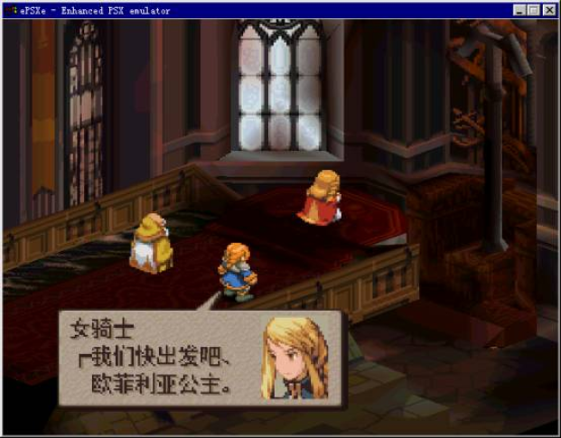

import AuthorCard from '@site/src/components/AuthorCard';

<AuthorCard authors={['半个水果', '施柯昱', '梁文豪']} />

在整个的游戏汉化过程中，脚本的写入和字库的生成是相当关键的部分，它直接关系到汉化后游戏的稳定性和显示效果。不过相对于字库查找和脚本查找的多样性和复杂性，这一部分的工作要相对固定得多。脚本的写入是脚本提取的一个逆过程，其中主要须完成三方面的工作，首先是对译文进行必要的检测，翻译的过程中难免会有些因疏忽导致的错误和未考虑到的部分（譬如控制符是否正确，译文是否超出限定的长度等等），如果将这些错误带入到rom中，很容易导致rom的损坏，而通过手工的方法校对又相当费时费力，因此应该尽量选择使用程序校对的方法，其次是通过之前获得的内码与字库位置的转换公式来进行逆转换，将译文转换为游戏内码写入到游戏rom中，最后是要在进行内码转换的同时同步的建立新的字库，我在以前的教程中提到过字符的内码和字符在字库中的位置是相关联的，因此在前面转换游戏内码的同时事实上也就确定了新字库中字符的排列顺序，在脚本写入程序的最后我们需要把这种次序保存下来，以备之后的字库生成程序来调用。具体的程序请对[点击这里下载](#)[^1]，这是一个FFT的集成汉化工具，我在其中有详细的注释。下面我说说脚本写入中要注意的几个细节问题。

首先是固定字符的问题。在前面我提到新字库的生成是在译文数据写入的同时进行的，当脚本写入程序写入一个字符时先要到已有字库中查询，如果该字符已经存在则通过其位置计算内码然后写入，如果不存在则在字库尾部添加该字符，然后按新位置计算内码后写入。因此在新字库中的字符必然是在译文中出现过的字符，且其顺序是按照字符在译文中出现的次序来排列的。对于大多数字符来说这并没有什么问题，但对于某些字符如数字、标点符号等，它们可能并不会在译文中出现但会在游戏中显示出来，譬如角色的各种数值、持币数等地方。这些字符的显示是在游戏中动态进行的，无法通过修改脚本数据的方法来修改，对于这些字符必须要存放在与原来字库相同的位置上才能被正常显示，因此在脚本写入之前，通常需建立一个包含这些固定字符的基本字库，以便在脚本生成时调用。

其次是单字节字符的处理问题。我在之前的教程中提到FFT中采用的是单字节和双字节混合的内码方式，也就是说在字库靠前的部分字符是用单字节表示，而后面的大多数字符是用双字节表示。为了节约脚本数据所占用的空间，通常游戏的制作者会将出现频率较高的字符放在字库的前部，用单字节来表示。而在脚本写入的过程中生成的字库其字符排列顺序是按字符在脚本中出现的次序排列的，这就可能导致常用字反而排在字库后部导致写入的脚本数据偏大。对于脚本数据集中存放的游戏来说这个问题并不是很大，虽然有部分的对话会超长，但只要控制好整段文本不超长就可以了，而对于漂浮文本的写入，因为长度控制要针对每一句文本进行，经常会出现文本超出原有空间而无法存放的问题，这一方面可以通过精练语言来避免，另一方面要考虑对译文中的字符进行出现频率的统计，将经常出现的字符找出来，放到字库的单字符部分去，以减少译文的存储空间。

还有是写入脚本的尾部处理问题。对于漂浮文本的写入不仅要考虑前面提到的超长问题，因为写入的文本很少会有和之前文本等长的情况，因此还要考虑译文长度小于原文的情况。通常的处理方法有两种，如果游戏脚本中有使用特殊值来表示句子的终止的，我们可以将此控制符写到译文的尾部，来停止文本的显示。如果没有的话，我们可以通过程序在译文的尾部添加空格符使其和原文等长，但要注意的是在某些游戏中，句末添加过多的空格符会导致显示的混乱，这就必须将空格分散的插入句中。

字库的生成相对于脚本的生成就要复杂得多了。生成字库最简单的方法是使用现成的精灵查看和编辑软件如前面教程中提到的Tile Layer Pro（TLP）来绘制，这个方法无需编程，即使是初学者也可以很容易的掌握，但同时也有很大的缺点。首先TLP所支持的字库结构是有限的，只有那些在TLP中可以清晰识别的字库才可以被修改，而这样的字库在PS游戏中却不多见，其次使用TLP生成字库的工作量很大，要完全靠手工绘制上千个字符几乎是不可能的，虽然也可以通过导入图片的方式简化部分操作，但之前的准备也相当麻烦，因此我通常更愿意选择编写程序的方法。在编写字库生成程序前你必须了解字库在光盘中存放的地点和格式，这方面的知识在教程的第一、二讲中都已经提到，大家可以翻阅以前的杂志或到我的网站上查询。有了前面的知识就可以开始编写字库生成程序了，下面我以PS的BIOS字库的修改为例来具体说说。在本教程的第一讲我就提到PS的BIOS字库是16乘15的1BPP的结构，它和我在第三讲中提到的标准中文字库HZK16的字库结构非常的相似，唯一不同的是HZK16中字符的点阵是16乘16的。因此我们可以借用HZK16的数据来修改PS的BIOS字库，具体的方法是通过要写入的汉字的内码获得其点阵数据在HZK16文件中的地址（具体算法请看本教程第三讲），根据此地址从HZK16中读入数据，然后根据要修改的字符在BIOS字库中的编号计算出它的位置（16乘15点阵的1BPP字符所使用的存储空间为（16\*15）/8＝30个字节，那么第n个字符的地址是字库起始地址＋n\*30），然后将从HZK16中读出的数据写入其中就可以了。当然在实际的汉化过程中是很少会正好有合适的字库可以借用，因此我们考虑将WINDOWS中安装的TrueType字体转换为我们需要的点阵字体。转换的原理是这样的，首先在窗体创建一个图片控件，将的它的背景色设为黑色，前景色设为白色，它的刻度模式（ScaleMode）设为3（像素模式）。然后修改它的字体属性使其显示的字的大小与原游戏的字体的大小相同，通常11乘11的设为小五号字体、16乘16的设为小四号字体。然后用print方法在其中显示要写入的字符，最后我们可以通过point方法来读取图片控件中某个点的颜色值来判断该点是否被画到，再根据原来字库的存储方式写入到文件中。具体的程序请[点击这里下载](#)[^2] 。其中“写入1”对应了第一种字库修改方法，“写入2”对应的是后一种方法。

FFT的字库是一个比较特殊的情况，在前面的教程提到过FFT的字库是10乘13的4色（2BPP）的，其中包含了阴影部分，实际的字符的大小只有9乘12，这样的字体很难找到现成的字库可以借用，而用前面提到的第二种方法又只能生成长宽相同的正方形字体。要生成这样的字库有两种方法，一个方法我们可以用先前面的方法获得12乘12的字体，然后通过程序将其中纵向的某些行进行合并，从而获得所需要的字体，但根据选择合并行的规则不同和合并的方式不同，产生的质量也有很大的不同。另外一个方法就比较简单了，其实WINDOWS本身就提供了字体的缩放和旋转功能，我们所要做的就是通过调用系统的API函数来实现它。调用的方法比较烦琐，我就不在这里列举了，有兴趣的朋友请查阅与本期教程配套的FFT集成汉化工具中的字库处理部分。不过说实话，使用前面两种方法所获得的字体，我依然不是非常的满意，因此在没有找到标准的字库前，如果要想获得更好的文字显示效果，编写程序进行手工修正似乎是不可避免的了。

关于脚本的写入和字库的生成我就讲到这里了，大家可能会觉得我这次具体的细节上说得太少，其实是因为我发现要将程序中几句话就解决的问题用通常的语言来描述出来反而比较的麻烦，所以我把很多我想说的都放到源程序中了，懂编程的读者一定要看看，不懂的建议先找本简单的入门书学习学习，掌握一种编程语言对汉化是非常重要的。下一讲我将讲解PS光盘的修改方法，这样我们可以看到真正的汉化效果了。现在先放一张图给大家解解馋。

[^1]:因文章久远链接已不可用，原始链接：`homepage.3322.net`
[^2]:同上