import AuthorCard from '@site/src/components/AuthorCard';

<AuthorCard authors={['半个水果', '施柯昱', '梁文豪']} />

大家好，PS汉化教程又和大家见面了，在前面的几讲中我讲解了游戏脚本汉化的主要步骤，其实要完美的汉化一个游戏，除了文字方面的汉化外，游戏中的图片、动画和声音的汉化也是非常必要的，不过由于动画和声音的汉化需要涉及到复杂的视频和音频编码解码技术，在没有找到合适的软件工具前我一直没有涉及，因此我下面着重讲解一下PS图片汉化的一些方法。

PS游戏中使用的图片格式和其字库一样是多种多样的，其中最常用的一种格式是我们在前面讲解字库时提到的TIM图片格式，在那一讲中我也提到了处理TIM图片的一个非常有用的工具软件“Tim Collection”。它的一大功能就是超强的图片搜索功能，无论图片文件的扩展名是什么，是作为一个文件单独存放还是几个图片捆绑在一个大文件中，又或者是存放在很深的目录中，它都可以一次性的为你搜索出来。搜索图片的具体方法请看下图：

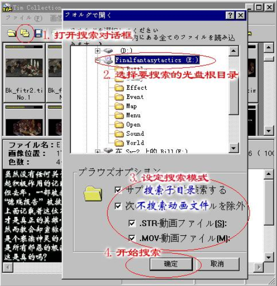

浏览搜索出的图片，寻找那些需要汉化的，如果是单独文件的话将其拷贝到硬盘中备用，如果是打包文件中的某个图片，则要通过文件菜单中的保存选项将另存为TIM格式的文件备用。

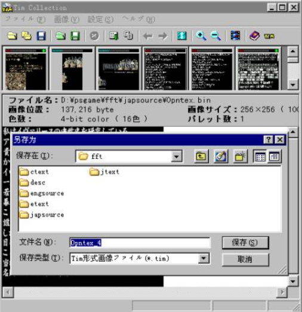

由于TIM格式是PS游戏的一种专用的图片格式，通常的图形处理软件是无法直接处理的，不过我们可以通过安装PhotoShop的TIM图片文件格式插件来使得PhotoShop可以处理TIM图片。安装方法是，先安装PhotoShop，然后请[点击这里下载](#)[^1]timplug.zip,解压缩到PhotoShop安装目录中的Plug-Ins\File Formats目录中，这样运行PhotoShop就可以打开和保存TIM格式的图片了。

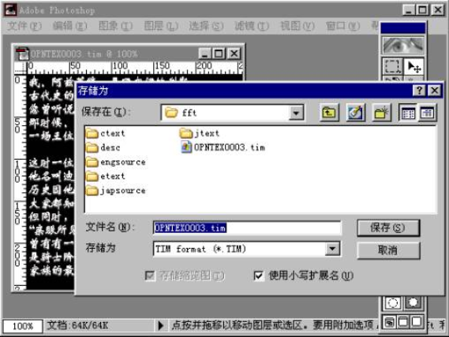

图片的汉化相对于文本的汉化要简单些，要注意的是必须保持修改前后图片的大小和格式的一致性，有时会有多个图片公用一个调色板的现象，就要注意保证这些图片调色板的一致性。象上面图片中的FFT片头字幕，就要注意新的文本的长度和位置必须和原来的日文保持一致，否则就无法正确显示。图片修改好后，如果是打包文件中的图片就碰到一个如何将图片写入的问题，虽然Tim Collection提供了提取图片的功能，但没有相应的图片插入功能。因此必须借用其他软件如UltraEdit的拷贝粘贴功能来实现，但操作麻烦且容易出错，在这里放个简单的小程序给大家使用(请[点击这里下载](#)[^2])，运行的界面如下，其中需插入的文件称为子文件，被插入文件称为母文件，这两个文件都可以通过右边的按钮来选择，起始地址要手工输入，其值可以在Tim Collection中找到（见下图），填写正确后按“写入”按钮就可以了。

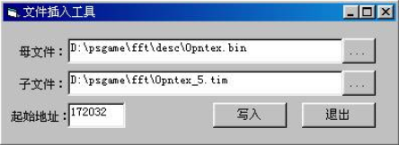
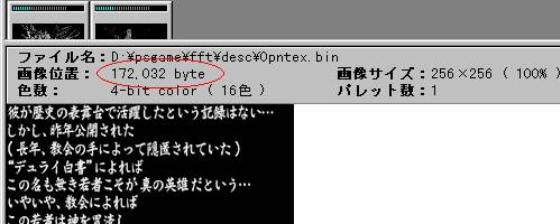

前面我提到TIM图片格式只是PS游戏的常用图片格式之一，对于其他格式的图片的修改则必须建立在对其的具体分析上面，只要掌握了其图片属性，调色板和图片点阵数据的存放格式和地点，那么编写一个简单的图片格式转换工具也不是不可能的。

与其它使用卡带为媒体的游戏不同，在PS游戏的汉化过程中，完成了文字和图形的汉化并不意味着汉化的完成，另一个要解决的问题就是我们如何将修改好的文件写入到PS的光盘中，必须作出一张可以在真正的PS上运行的汉化光盘，汉化才算是成功的。在我进行PS游戏汉化的早期，这个问题也同样的困扰着我。在使用了数种的刻录软件的坏了数张刻录盘后，最后我还是决定放弃使用现成软件刻录的方法，而转向通过研究PS光盘的数据存储结构来实现对PS光盘的修改。当然要研究光盘的存储结构还是要借用现成的刻录软件的，我在这里使用的是CDRWIN（请[点击这里下载](#)[^3]）。光盘上的数据是以扇区为单位存储的，使用CDRWIN的扇区查看功能（Sector Viewer），我们可以看到其中具体的数据。

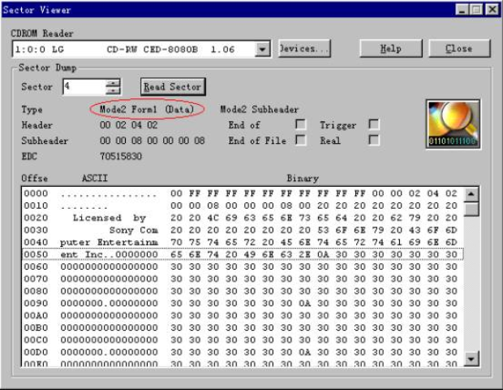

注意图中红色框中的部分，它表明该扇区的格式是Mode2 Form1 (Data)格式的，改变扇区号我们可以知道光盘上还要另外的两种扇区格式Mode2 Form2 (Audio)和Mode2 Form2(Empty)。通过查询相关的资料，我们可以知道在光盘上存放的资料可以分为两种，一种是正确性要求非常严格的，即使错一个BIT也不行，譬如游戏的程序、图片、文字等等，它在光盘上的存储格式就是Mode2 Form1，在其中包含了错误修正码(Error Correction Code - ECC)和错误侦测码(Error Detecting Code - EDC)，每个扇区存放2048Byte的数据。另一种是正确性要求较低的数据，如游戏中的音乐和动画数据，它在光盘上的存储格式是Mode2 Form2，这种格式只包含了错误侦测码（EDC）而不包含错误修正码（ECC），但却将空间节省了，每个扇区可以多存放276Byte达到2324Byte（这也是我们会发现某些PS光盘中的文件量会超过700M的原因）。两种扇区格式中的详细的数据分布情况请看下表：

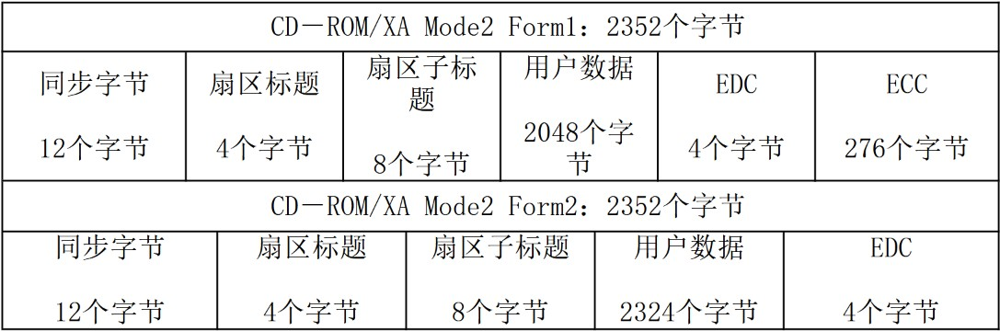

根据上面的资料我们可以知道，要汉化PS游戏应该先将PS光盘中的文件拷贝出来进行处理，然后再将处理完毕的文件写入光盘替换原有的文件，这样一方面处理的数据量较小，可以节省空间和时间，另一方面也可以避免除用户数据外的其它数据的干扰。下图是直接扫描PS映像文件产生的结果，图片中的斑点部分就是因为其中夹杂的非用户数据造成的，这样的图片显然是无法处理的。

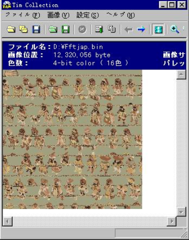

我们要把汉化好的新文件替换光盘上的旧文件，首先要先制作一个光盘的映像文件，然后在此映像文件中确定所要替换的文件所在的扇区，再将新文件按照上面表格中对应的用户数据的大小分工成若干的小数据块（因为我们目前所作的汉化都是文本和图片方面的，所以通常只对Mode2 Form1 (Data)格式的扇区进行修改，因此分割大小为2048个字节），最后将这些数据填充到对应扇区的用户数据位置替换原来的数据。光盘的映像文件我通常使用CDRWIN来制作，因为它生成的bin格式文件，仅仅包含光盘的扇区中的数据没有任何的文件头等，比较“干净”，具体的生成步骤相当简单，运行CDRWIN按“Extract Disc/Tracks/Sectors”按钮，选择PS光盘所在的光盘和要生成的映像文件名，然后按“START”键就可以了。

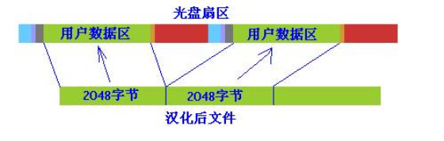
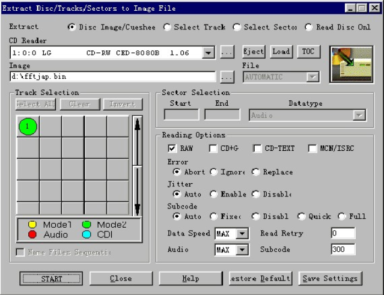

文件定位和写入的部分相当简单，大家可以使用我以前写的一个小程序来完成(请[点击这里下载](#)[^4])。运行程序可以看到如下的界面：

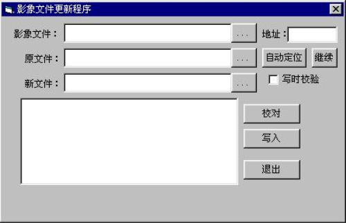

按“…”按钮选择要修改的映像文件和光盘上的原文件以及对应的汉化后的文件，然后按“自动定位”按钮来搜索原文件在光盘上的扇区号。搜索的原理很简单，就是在原文件中取头部的2048个字节与光盘上每个扇区中的用户数据进行比较，找到两者相等的扇区。找到后请按“校对”按钮来进行整个文件的校对，如果发现后面部分不相同的话，可以按“继续”按钮继续搜索，如果校对通过，就可以使用“写入”按钮将汉化后的新文件写入到光盘映像中去了。要注意的是因为采用的是新文件替换老文件的方式，所以新老文件的大小必须相同，否则无法写入。

上面的这个程序对于修改光盘映像中的单个文件是相当方便的，但如果汉化的修改涉及到了数十个甚至上百个文件，要对每个文件都进行一遍搜索和更新操作会相当麻烦，事实上在光盘映像中也包含了目录的数据，从其中我们可以获得光盘上所有文件的名字、属性和其在光盘上的位置。由于没有找到光盘目录数据的存放格式官方文件，因此按自己所研究的结果写了一个程序，可能会有些错误，在此放出仅供大家参考(请[点击这里下载](#)[^5])，下面是软件运行的界面：

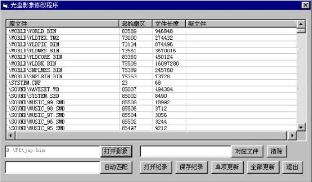

按“打开映像”按钮可以打开一个CDRWIN生成的BIN文件，程序会通过搜索目录扇区将光盘中的文件名、起始扇区和文件长度列出来。然后通过“对应文件”按钮来设定其对应的汉化后文件，如果所有的汉化后文件都放在同一个目录中且与原文件的文件名相同的话，可以在“自动匹配”按钮左侧的输入框中输入汉化后文件的存放路径，然后按“自动匹配”按钮来自动将原文件与新文件对应起来，这种对应关于可以通过“清除”按钮来取消。按“单项更新”或“全部更新”按钮可以分别更新当前选择的文件或所有设定了对应关系的文件。所以的对应关于可以使用“保存记录”和“打开记录”来保存和载入。

当所有要更新的文件都成功写入光盘映像后，我们就可以通过PS模拟器的载入映像功能来测试了。要注意的是象ePSXe和AdriPSX这些具有直接读取光盘映像文件功能的PS模拟器是可以直接运行前面修改后的映像文件的，而象vgs和bleem这些必须借助虚拟光驱软件来运行光盘映像文件的模拟器就会出现无法运行的情况。这是因为前面的修改方法只修改了扇区中的用户数据部分，而没有修改错误侦测码和错误修正码部分，虚拟光驱软件在读取这些扇区时会认为数据错误而拒绝读取导致死机，同样的原因，在某些早期的刻录机上刻录这样的光盘映像文件也会出现在PS机上无法使用的情况。这个问题的解决方法是使用一个专用的软件Eccregen来重建这些扇区的修改错误侦测码和错误修正码(请[点击这里下载](#)[^6])。这个软件的使用方法非常的简单，运行Eccregen.exe可以看到下面的界面：

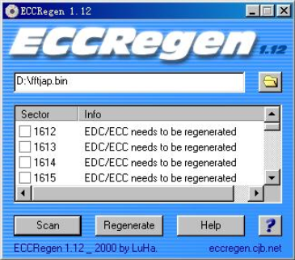

通过打开文件按钮选择更新后的光盘映像文件，按“Scan”按钮进行搜索，软件会把所有需要修正错误侦测码和错误修正码的扇区显示出来，等搜索结束后在列表中按鼠标右键，选择“select all”，然后按“Regenerate”键就可以将所有选中的扇区修复好了。

其实PS汉化光盘的制作方法也不是只有上面说的一种方法，在EMU-ZONE的汉化论坛（`http://gameclub.online.sh.cn/emu/forumdisplay.php?s=&forumid=5`）里有人提到用Sony的CDgen（PlayStation Programmer's Tool CD-ROM Generator Version1.30）重新构造PS光盘的方法，大家有兴趣的话可以到那里去看看相关的帖子。

讲完了PS光盘的修改，本教程也要暂时告一段落了，如果大家对本教程的内容有任何的疑问或发现有任何的错误的，欢迎与我联系指出，我的email是`shikeyu@163.net`和`shikey@wx88.net`。另外作为本教程的主要研究对象FFT，我会在稍后正式启动对其的汉化计划，如果大家对这个汉化计划有兴趣的话，也欢迎与我联系。

[^1]:因文章久远链接已不可用，原始链接：`homepage.3322.net`
[^2]:同上
[^3]:同上
[^4]:同上
[^5]:同上
[^6]:同上