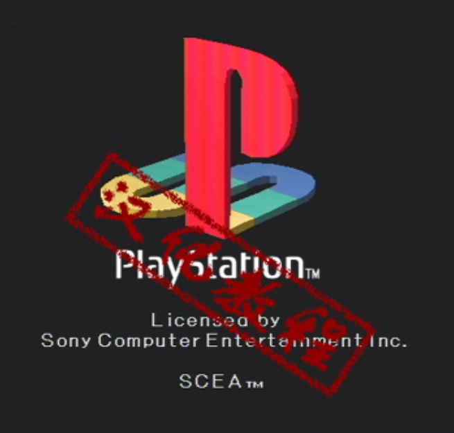

该文档原本为exe的电子书，这里经过人工抄录转换

作者：施柯昱

电子书制作：梁文豪

原前言：

>本教程是应《模拟地带》杂志（现已改名为《模拟与游戏》）的邀请而撰写的，已经连载完毕。由于是初次编写教程，难免会有疏漏和不足的地方，如果大家有任何的意见建议欢迎与我联系，我会及时进行补充和修正的。本教程未经作者本人同意不得在任何媒体上转载。

本站版本未经授权，仅作为存档防止丢失。

import DocCardList from '@theme/DocCardList';

<DocCardList />