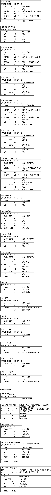
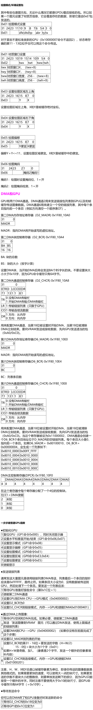

import AuthorCard from '@site/src/components/AuthorCard';

<AuthorCard authors={['半个水果','Pinocchio', 'pinokio']} />

GPU控制了一个1MB的帧缓存，提供了一个最大1024×512分辨率16位像素的屏幕。它同时也包括了一个2KB的材质高速缓存。可以以15位或24位色显示。

因为PSX缺乏一个FPU，所以增加了第二个协处理器，成为几何变换引擎 GTE（Geometry Transformation Engine）。GTE是PSX上所有3D运算的核心，它能够进行向量和矩阵运算，视角转换，颜色平衡等等。它对这些操作比CPU快得多，作为第二个协处理器（Cop2），它没有分配物理地址。

1MB的帧缓存不能被CPU访问，只能通过向GPU发送命令或者DMA传送数据。它有一个64字节的命令FIFO缓存，可以保存3条命令，它连接到一个DMA通道用来传送图像数据和链接命令列表（通道2）和一个DMA通道用来反向清楚一个顺序表（通道6）。 

## 通讯和顺序表（OT）

所有的绘图和绘图环境数据都作为信息包送到GPU。每一个信息包都告诉GPU怎样和在哪里绘一个图元，或者设置一个绘图环境参数。显示环境通过GPU的控制端口用一个单字命令设置。

信息包可以通过数据端口逐字送到GPU也可以用DMA大量传送。所以创建了一个特殊的DMA模式来方便地传送和管理大量的信息包。在这种模式，发送的是一个包列表。其中每一个条目都包含了一个头部（一个包含了下一个条目地址和信息包大小的字）和包本身。这样做的好处是信息包没有必要进行顺序储存，使得容易控制信息包被处理的顺序。GPU按照获得信息包的顺序处理它们，所以列表的第一个条目最先被画出。要插入一个包，只需要进行链表的插入操作，修改地址。

顺序表OT（Ordering Table）用来辅助在列表中寻找位置。在一开始，它是一个0字节包的链接条目，仅仅是包头部列表，没一个条目指向下一个条目。由程序生成的图元可以加入到这个表的某一个索引中。先读取表条目中的地址，将它替换成新包的地址，然后将表中的地址存到包里。当所有的包都生成后，只需要将第一个列表条目的地址传到DMA，就能够按照你输入表的顺序画出各个信息包。表中包条目索引值低的比索引值高的先画出。输入同一个索引的包，最后输入的最先画出。

在3D作图中，通常希望高Z值的图元先画出，所以Z值可以用作索引值。很简单，只要做一个表，其中每一个条目指向前一个条目，然后在最后一个表条目开始DMA。可以用一个特殊的DMA通道辅助你创建这样的表。

### 帧缓存

帧缓存是储存了所有GPU在绘图和显示图像过程中能够访问和处理的图像数据的内存，它个内存不能被CPU直接访问。大小是1MB，可以看作1024×512像素，每个像素大小是一个字（16bit）。它不像通常内存那样线性访问，而是通过坐标访问，左上角（0，0），右下角（1023，511）。

当数据从帧缓存中显示的时候，在这个记忆体中按照指定的坐标读取一个矩形区域。区域的大小可以从几种硬件定义的类型中选择。注意这些硬件大小只有在`X和Y停止/开始`寄存器处于缺省值的时候才有效。显示的区域可以用两种颜色格式显示：15位直接或24位直接，数据格式如下：

15位直接显示

<table>
    <tr>
        <td colspan="4">
            像素
        </td>
    </tr>
    <tr>
        <td>
            M
        </td>
        <td>
            蓝色
        </td>
        <td>
            绿色
        </td>
        <td>
            红色
        </td>
    </tr>
    <tr>
        <td>
            15
        </td>
        <td>
            14 &nbsp;&nbsp; 10
        </td>
        <td>
            9 &nbsp;&nbsp; 5
        </td>
        <td>
            4 &nbsp;&nbsp; 0
        </td>
    </tr>
</table>

也就是每种颜色值是0～31，最高位（M）是掩码。

24位直接显示

<table>
    <tr>
        <td colspan="2">
            像素字节0
        </td>
        <td colspan="2">
            像素字节1
        </td>
        <td colspan="2">
            像素字节2
        </td>
    </tr>
    <tr>
        <td>
            绿色0
        </td>
        <td>
            红色0
        </td>
        <td>
            红色1
        </td>
        <td>
            蓝色0
        </td>
        <td>
            蓝色1
        </td>
        <td>
            绿色1
        </td>
    </tr>
    <tr>
        <td>
            15 &nbsp;&nbsp; 8
        </td>
        <td>
            7 &nbsp;&nbsp; 0
        </td>
        <td>
            15 &nbsp;&nbsp; 8
        </td>
        <td>
            7 &nbsp;&nbsp; 0
        </td>
        <td>
            15 &nbsp;&nbsp; 8
        </td>
        <td>
            7 &nbsp;&nbsp; 0
        </td>
    </tr>
</table>

GPU也可以设置为24位模式，这种情况下，一个像素3个字节，每种颜色1字节。这样2个显示像素用3个帧缓存像素编码，显示为\[R0,G0,B0\] \[R1,G1,B1\]。

### 图元

GPU能够绘制的基本图形叫做图元，它可以绘制下面这些东西：

#### 多边形 

GPU可以画3点和4点多边形，每一点指定了帧缓存中的一点。可以带辐射阴影。4点多边形定点的顺序如下：

<table>
    <tr>
        <td>
            1
        </td>
        <td>
        </td>
        <td>
            2
        </td>
    </tr>
    <tr>
        <td>
        </td>
        <td>
        </td>
        <td>
        </td>
    </tr>
    <tr>
        <td>
            3
        </td>
        <td>
        </td>
        <td>
            4
        </td>
    </tr>
</table>

一个4点多边形在内部当作2个3点多边形处理。GPU画多边形的时候最右边和最下边的边不会画出，所以（0，0）－（32，32）实际画出（0，0）－（31，31）。要使两个多边形相接，只要使它们坐标相同就可以了。

#### 带材质的多边形

这种图元和上一种是相同的，特别之处是它可以用材质。多边形的每个顶点映射到帧缓存中的材质页中的一点。也可以带辐射阴影。 

#### 矩形

一个矩形用左上角定点和宽度、高度来定义，宽度和高度可以是任意的、8×8的或者是16×16的。它画得比多边形快得多，但是没有辐射阴影。

#### 精灵

一个精灵是一个材质矩形，在材质页面的坐标上定义一个矩形。如同矩形那样画得比多边形快，但是没有辐射阴影。虽然它也叫做精灵，但是它和传统意义上的精灵没有任何相同之处，仅仅是一个矩形图像小片。传统的精灵和PSX精灵不同，它不是画到位图里的，而是在显示的时候特别送到屏幕上的特殊位置的。

#### 直线

一条直线是两点之间的连线，可以有阴影。特殊的形式是多点线，可以指定任意多的点。

#### 点

点图元在指定的位置用指定的颜色绘制一个像素，实际是一个特殊的矩形，大小是1×1。

### 材质

材质是放到多边形或精灵的一个图像，它需要预先在帧缓存中准备好数据。这个图像叫做材质图案，材质图案放在帧缓存中某个地方的标准大小的材质页中。材质数据可以用3中不同的模式存放。

#### 15位直接模式

<table>
    <tr>
        <td colspan="4">
            索引0
        </td>
    </tr>
    <tr>
        <td>
            S
        </td>
        <td>
            蓝
        </td>
        <td>
            绿
        </td>
        <td>
            红
        </td>
    </tr>
    <tr>
        <td>
            15
        </td>
        <td>
            14 &nbsp;&nbsp; 10
        </td>
        <td>
            9 &nbsp;&nbsp; 5
        </td>
        <td>
            4 &nbsp;&nbsp; 0
        </td>
    </tr>
</table>

这表示了每种颜色的值是0～31，最高有效位（S）用来表明这个像素是否半透明的。

#### 8位调色板模式

每个像素用8位定义，它的值通过调色板转换为15位的颜色，很像标准VGA图片。这样可以使用256种15位精度的颜色。

<table>
    <tr>
        <td>
            索引1
        </td>
        <td>
            索引0
        </td>
    </tr>
    <tr>
        <td>
            15  &nbsp;&nbsp; 8
        </td>
        <td>
            7 &nbsp;&nbsp; 0
        </td>
    </tr>
</table>

索引0是左边像素的调色板索引值，索引1是右边的。

#### 4位调色板模式

和上面的一样，除了只有16种颜色，数据安排如下：

<table>
    <tr>
        <td>
            索引3
        </td>
        <td>
            索引2
        </td>
        <td>
            索引1
        </td>
        <td>
            索引0
        </td>
    </tr>
    <tr>
        <td>
            15 &nbsp;&nbsp; 12
        </td>
        <td>
            11 &nbsp;&nbsp; 8
        </td>
        <td>
            7 &nbsp;&nbsp; 4
        </td>
        <td>
            3 &nbsp;&nbsp; 0
        </td>
    </tr>
</table>

索引0到索引3先后从左到右绘制。

#### 材质页

材质页是一个256×256像素的单元，什么颜色模式对它没有影响。就是说，在帧缓存中它在4位调色板模式时是64像素宽，8位调色板模式时128像素宽，15位直接模式时256像素宽。像素的寻址是相对于材质页的位置，而不是帧缓存。所以材质页左上角的材质坐标是（0，0），右下是（255，255），页面可以位于帧缓存中的X乘以64和Y乘以256的地方。可以建立多个材质页，但是图元只能使用一个材质页里的材质。

#### 材质窗口

材质窗口里面的区域是材质页的重复，数据实际上并不知存在于整个材质页，但是GPU当它们存在而重复读取。X和Y和H和W必须乘以8。

#### 调色板

调色板在帧缓存中作如下安排：8位调色板模式是256×1的图像，4位调色板模式是16×1的图像。每个像素是16位的值，前15位用作15位颜色，第16位作半透明标志。调色板数据可以安放在帧缓存中X乘以16（0，16，32，48等等）和Y（0～511）的位置。可以有多个调色板，但是一个图元只能够使用一个。

### 材质高速缓存

如果要显示带材质的多边形，GPU需要从帧缓存中读取这些东西，将会减慢绘图过程，导致在给定的时间内能够绘制的多边形减少。因此GPU配上了一个材质高速缓存，材质高速缓存的大小依据材质颜色模式而不同。在4位调色板模式，它的大小是64×64，8位调色板模式是32×64，15位直接模式是32×32。

#### 高速缓存块

材质页被分割为不重叠的高速缓存块，每块的大小依据颜色模式。这些高速缓存块被平铺在材质页中。

<table>
    <tr>
        <td>
            高速缓存块0
        </td>
        <td>
            1
        </td>
        <td>
            2......
        </td>
    </tr>
    <tr>
        <td>
            . . .
        </td>
        <td>
        </td>
        <td>
        </td>
    </tr>
</table>

#### 高速缓存条目

每个高速缓存块分为256个高速缓存条目，按顺序编号，8字节宽，所以一个高速缓存条目包含了16个4位调色板像素，或者8个8位调色板像素，或者4个15位直接像素。

4位和8位调色板：

<table>
    <tr>
        <td>
            0
        </td>
        <td>
            1
        </td>
        <td>
            2
        </td>
        <td>
            3
        </td>
    </tr>
    <tr>
        <td>
            4
        </td>
        <td>
            5
        </td>
        <td>
            6
        </td>
        <td>
            7
        </td>
    </tr>
    <tr>
        <td>
            8
        </td>
        <td>
            9
        </td>
        <td colspan="2">
            ...
        </td>
    </tr>
    <tr>
        <td>
            c
        </td>
        <td colspan="3">
            ...
        </td>
    </tr>
</table>

15位直接：

<table>
    <tr>
        <td>
            0
        </td>
        <td>
            1
        </td>
        <td>
            2
        </td>
        <td>
            3
        </td>
        <td>
            4
        </td>
        <td>
            5
        </td>
        <td>
            6
        </td>
        <td>
            7
        </td>
    </tr>
    <tr>
        <td>
            8
        </td>
        <td>
            9
        </td>
        <td>
            a
        </td>
        <td>
            b
        </td>
        <td>
            c
        </td>
        <td>
            d
        </td>
        <td>
            e
        </td>
        <td>
            f
        </td>
    </tr>
    <tr>
        <td>
            10
        </td>
        <td>
            11
        </td>
        <td colspan="6">
            ...
        </td>
    </tr>
    <tr>
        <td>
            18
        </td>
        <td colspan="7">
            ...
        </td>
    </tr>
    <tr>
        <td colspan="8">
            ...
        </td>
    </tr>
</table>

高速缓存只能保存一个高速缓存条目。

### 描绘选项

有3种模式影响GPU向帧缓存描绘图元。

#### 半透明

当设置一个像素是半透明时，GPU会读取帧缓存中的目标像素和需要进行半透明的源像素，然后根据选择的半透明模式计算新目标像素的颜色。处理器速度也因此会减慢下来，GPU共有4种半透明模式。

B是从帧缓存读取的像素，F是半透明像素。

- 1.0×B＋0.5×F
- 1.0×B＋1.0×F
- 1.0×B－1.0×F
- 1.0×B＋0.25×F

每个图元都可以设置新的半透明模式，没有材质的图元可以选择半透明模式。有材质的图元最高有效位是半透明标志，所以一些像素可以设为半透明，其他可以是不透明的。对于调色板模式，半透明位从调色板中取得。

当颜色是黑色（BGR＝0），半透明的处理方法和不是黑色（BGR\<\>0）时不同，如下表：

<table>
    <tr>
        <td colspan="4">
            透明处理（命令的第1位）
        </td>
    </tr>
    <tr>
        <td>
            BGR
        </td>
        <td>
            半透明标志
        </td>
        <td>
            关
        </td>
        <td>
            开
        </td>
    </tr>
    <tr>
        <td>
            0，0，0
        </td>
        <td>
            0
        </td>
        <td>
            透明
        </td>
        <td>
            透明
        </td>
    </tr>
    <tr>
        <td>
            0，0，0
        </td>
        <td>
            1
        </td>
        <td>
            不透明
        </td>
        <td>
            不透明
        </td>
    </tr>
    <tr>
        <td>
            x，x，x
        </td>
        <td>
            0
        </td>
        <td>
            不透明
        </td>
        <td>
            不透明
        </td>
    </tr>
    <tr>
        <td>
            x，x，x
        </td>
        <td>
            1
        </td>
        <td>
            不透明
        </td>
        <td>
            透明
        </td>
    </tr>
</table>

#### 阴影

GPU有阴影功能，可以比例缩放图元的颜色到指定的亮度。有2种阴影：单调阴影和辐射阴影。单调阴影用一个亮度值指定整个图元的，辐射阴影则可以指定每个顶点的亮度，中间点自动进行插值。

#### 掩码

掩码功能可以阻止GPU向帧缓存中特定的像素写东西，就是说GPU向一个掩码区域画图元的时候，先读取它要写向的坐标点的像素，检查掩码标志，如果设置了就不写这个像素。掩码标志是像素的最高有效位，和不透明标志一样。GPU提供了一个掩码模式来设置这些位，写像素的同时设置它们的最高有效位。如果掩码和掩码检测都打开了，GPU就不向设置了最高有效位的像素写东西，而写没有设置的那些像素，同时把它们也设置成掩码像素。

### 绘图环境

绘图环境设置GPU绘制图元所需的全部全局参数。

- 绘图偏移

绘图区域的左上角坐标，图元坐标的原点设在这点上。所以绘图偏移是（0，240），一个多边形顶点坐标是（16，20），则它会被画到帧缓存的（0＋16，240＋20）的地方。

- 绘图修剪区域

指定了GPU绘制图元的最大范围，用它来制定绘图区的左上角和右下角。

- 抖动使能

当抖动使能时，GPU绘制阴影时会抖动该区域。内部以24位色运行，抖动颜色后再转会15位色。当它关闭时，只是简单的发散每个颜色的最低3位。

- 画到显示区使能

使能/禁止画到当前显示区域。

- 掩码使能

使能时，所有画到帧缓存的像素，GPU都会加上掩码标志（设置最高有效位）。

- 掩码判断使能

绘图时是否判断帧缓存中的掩码数据。

### 显示环境

包含了显示信息和显示区域。

- 帧缓存中的显示区域

指定了显示的分辨率，可以是以下大小：

宽度：256，320，384，512或者640像素

高度：240或者480像素

这些设置仅仅是指定了显示分分辨率，指明绘制多少像素。

- 显示（开始/结束）

指定屏幕的显示区域和发送多少数据到屏幕，屏幕显示区域大小只有在水平/垂直、开始/结束处于缺省值时才有效。可以通过改变这些来放大/缩小显示屏幕。大多数电视机在周围有一些黑边，可以设置使屏幕早一点开始晚一点结束来消除。像素的大小不会被这些设置改变，GPU只是简单地发送多一些数据到屏幕。

- 隔行扫描

当使能的时候，GPU会交错显示奇数行和偶数行。当使用480行而电视机屏幕又没有480条扫描线时需要使用这个功能。

- 15位/24位色直接显示

切换15位/24位色显示模式

- 视频模式

选择视频模式是PAL或者NTSC制式。

## GPU控制寄存器

有2个32位IO端口用于GPU，分别是0x1F80_1810的GPU数据寄存器和0x1F80_1814的GPU控制/状态寄存器。数据寄存器用于交换数据，控制/状态寄存器在读取时给出GPU状态，在写入时设置控制位。

### 控制/状态寄存器 0x1F80_1814（读取）

<table>
    <tr>
        <td colspan="12">
            31
        </td>
        <td colspan="13">
            0
        </td>
    </tr>
    <tr>
        <td>
            lcf
        </td>
        <td>
            dma
        </td>
        <td>
            com
        </td>
        <td>
            img
        </td>
        <td>
            busy
        </td>
        <td>
            ?
        </td>
        <td>
            ?
        </td>
        <td>
            den
        </td>
        <td>
            isinter
        </td>
        <td>
            isrgb24
        </td>
        <td>
            Video
        </td>
        <td>
            Height
        </td>
        <td>
            Width0
        </td>
        <td>
            Width1
        </td>
        <td>
            ?
        </td>
        <td>
            ?
        </td>
        <td>
            ?
        </td>
        <td>
            me
        </td>
        <td>
            md
        </td>
        <td>
            dfe
        </td>
        <td>
            dtd
        </td>
        <td>
            tp
        </td>
        <td>
            abr
        </td>
        <td>
            ty
        </td>
        <td>
            tx
        </td>
    </tr>
    <tr>
        <td>
            1
        </td>
        <td>
            2
        </td>
        <td>
            1
        </td>
        <td>
            1
        </td>
        <td>
            1
        </td>
        <td>
            1
        </td>
        <td>
            1
        </td>
        <td>
            1
        </td>
        <td>
            1
        </td>
        <td>
            1
        </td>
        <td>
            1
        </td>
        <td>
            1
        </td>
        <td>
            2
        </td>
        <td>
            1
        </td>
        <td>
            1
        </td>
        <td>
            1
        </td>
        <td>
            1
        </td>
        <td>
            1
        </td>
        <td>
            1
        </td>
        <td>
            1
        </td>
        <td>
            1
        </td>
        <td>
            2
        </td>
        <td>
            2
        </td>
        <td>
            1
        </td>
        <td>
            4
        </td>
    </tr>
</table>

Width（宽度）

<table>
    <tr>
        <td>
            W0
        </td>
        <td>
            W1
        </td>
        <td>
        </td>
    </tr>
    <tr>
        <td>
            00
        </td>
        <td>
            0
        </td>
        <td>
            256像素
        </td>
    </tr>
    <tr>
        <td>
            01
        </td>
        <td>
            0
        </td>
        <td>
            320
        </td>
    </tr>
    <tr>
        <td>
            10
        </td>
        <td>
            0
        </td>
        <td>
            512
        </td>
    </tr>
    <tr>
        <td>
            11
        </td>
        <td>
            0
        </td>
        <td>
            640
        </td>
    </tr>
    <tr>
        <td>
            00
        </td>
        <td>
            1
        </td>
        <td>
            384
        </td>
    </tr>
</table>

Height（高度）

<table>
    <tr>
        <td>
            0
        </td>
        <td>
            240像素
        </td>
    </tr>
    <tr>
        <td>
            1
        </td>
        <td>
            480
        </td>
    </tr>
</table>

Video（视频）

<table>
    <tr>
        <td>
            0
        </td>
        <td>
            NTSC
        </td>
    </tr>
    <tr>
        <td>
            1
        </td>
        <td>
            PAL
        </td>
    </tr>
</table>

isrgb24（颜色模式） 

<table>
    <tr>
        <td>
            0
        </td>
        <td>
            15位直接模式
        </td>
    </tr>
    <tr>
        <td>
            1
        </td>
        <td>
            24位直接模式
        </td>
    </tr>
</table>

isinter（扫描模式）

<table>
    <tr>
        <td>
            0
        </td>
        <td>
            隔行扫描关闭 
        </td>
    </tr>
    <tr>
        <td>
            1
        </td>
        <td>
            隔行扫描打开 
        </td>
    </tr>
</table>

den（显示使能）

<table>
    <tr>
        <td>
            0
        </td>
        <td>
            显示使能
        </td>
    </tr>
    <tr>
        <td>
            1
        </td>
        <td>
            显示禁止
        </td>
    </tr>
</table>

busy（忙）

<table>
    <tr>
        <td>
            0
        </td>
        <td>
            GPU忙（例如正在绘制图元）
        </td>
    </tr>
    <tr>
        <td>
            1
        </td>
        <td>
            GPU空闲
        </td>
    </tr>
</table>

img（影像）

<table>
    <tr>
        <td>
            0
        </td>
        <td>
            未准备好发送图像（信息包\$C0）
        </td>
    </tr>
    <tr>
        <td>
            1
        </td>
        <td>
            准备好
        </td>
    </tr>
</table>

com（命令）

<table>
    <tr>
        <td>
            0
        </td>
        <td>
            未准备好接收命令
        </td>
    </tr>
    <tr>
        <td>
            1
        </td>
        <td>
            准备好
        </td>
    </tr>
</table>

dma（DMA）

<table>
    <tr>
        <td>
            00
        </td>
        <td>
            DMA关闭，通过GP0通讯
        </td>
    </tr>
    <tr>
        <td>
            01
        </td>
        <td>
            未知
        </td>
    </tr>
    <tr>
        <td>
            10
        </td>
        <td>
            DMA CPU--\>GPU
        </td>
    </tr>
    <tr>
        <td>
            11
        </td>
        <td>
            DMA GPU--\>CPU
        </td>
    </tr>
</table>

lcf（交错行）
<table>
    <tr>
        <td>
            0
        </td>
        <td>
            偶数行交错描绘
        </td>
    </tr>
    <tr>
        <td>
            1
        </td>
        <td>
            非偶数行交错描绘
        </td>
    </tr>
</table>

tx（材质页X）

材质页X＝tx×64

ty（材质页Y）

<table>
    <tr>
        <td>
            0
        </td>
        <td>
            0
        </td>
    </tr>
    <tr>
        <td>
            1
        </td>
        <td>
            256
        </td>
    </tr>
</table>

abr（半透明状态）

<table>
    <tr>
        <td>
            00
        </td>
        <td>
            0.5×B＋0.5×F
        </td>
    </tr>
    <tr>
        <td>
            01
        </td>
        <td>
            1.0×B＋0.5×F
        </td>
    </tr>
    <tr>
        <td>
            10
        </td>
        <td>
            1.0×B－1.0×F
        </td>
    </tr>
    <tr>
        <td>
            11
        </td>
        <td>
            1.0×B＋0.25×F
        </td>
    </tr>
</table>

tp（材质页颜色模式）

<table>
    <tr>
        <td>
            00
        </td>
        <td>
            4位调色板
        </td>
    </tr>
    <tr>
        <td>
            01
        </td>
        <td>
            8位调色板
        </td>
    </tr>
    <tr>
        <td>
            10
        </td>
        <td>
            15位
        </td>
    </tr>
</table>

dtd（抖动模式）

<table>
    <tr>
        <td>
            0
        </td>
        <td>
            抖动关闭
        </td>
    </tr>
    <tr>
        <td>
            1
        </td>
        <td>
            抖动开启
        </td>
    </tr>
</table>

dfe（画到显示区域）

<table>
    <tr>
        <td>
            0
        </td>
        <td>
            禁止画到当前显示区域
        </td>
    </tr>
    <tr>
        <td>
            1
        </td>
        <td>
            允许画到当前显示区域
        </td>
    </tr>
</table>

md（掩码模式）

<table>
    <tr>
        <td>
            0
        </td>
        <td>
            不设置绘图像素的掩码标志
        </td>
    </tr>
    <tr>
        <td>
            1
        </td>
        <td>
            设置绘图像素的掩码标志
        </td>
    </tr>
</table>

me（掩码检测）

<table>
    <tr>
        <td>
            0
        </td>
        <td>
            不检测掩码标志
        </td>
    </tr>
    <tr>
        <td>
            1
        </td>
        <td>
            检测掩码标志
        </td>
    </tr>
</table>

### 控制/状态寄存器 0x1F80_1814（写入）

<table>
    <tr>
        <td>
            命令
        </td>
        <td>
            参数
        </td>
    </tr>
    <tr>
        <td>
            31 &nbsp;&nbsp; 16
        </td>
        <td>
            15 &nbsp;&nbsp; 0
        </td>
    </tr>
</table>

一个控制命令组成如上表，每个命令的参数都不一样。

复位GPU

<table>
    <tr>
        <td>
            命令
        </td>
        <td>
            0x00
        </td>
    </tr>
    <tr>
        <td>
            参数
        </td>
        <td>
            0x000000
        </td>
    </tr>
    <tr>
        <td>
            描述
        </td>
        <td>
            复位GPU，同时关闭屏幕。（设置状态为\$14802000）
        </td>
    </tr>
</table>

复位命令缓存

<table>
    <tr>
        <td>
            命令
        </td>
        <td>
            0x01
        </td>
    </tr>
    <tr>
        <td>
            参数
        </td>
        <td>
            0x000000
        </td>
    </tr>
    <tr>
        <td>
            描述
        </td>
        <td>
            复位命令缓存
        </td>
    </tr>
</table>

复位IRQ

<table>
    <tr>
        <td>
            命令
        </td>
        <td>
            0x02
        </td>
    </tr>
    <tr>
        <td>
            参数
        </td>
        <td>
            0x000000
        </td>
    </tr>
    <tr>
        <td>
            描述
        </td>
        <td>
            复位IRQ
        </td>
    </tr>
</table>

显示使能

<table>
    <tr>
        <td>
            命令
        </td>
        <td>
            0x03
        </td>
    </tr>
    <tr>
        <td>
            参数
        </td>
        <td>
            0x000000 显示禁止 
            0x000001 显示使能 
        </td>
    </tr>
    <tr>
        <td>
            描述
        </td>
        <td>
            关闭和打开显示，关闭屏幕时如果选择了NTSC模式会使PAL屏幕发送NTSC闪烁
        </td>
    </tr>
</table>

DMA设置

<table>
    <tr>
        <td>
            命令
        </td>
        <td>
            0x04
        </td>
    </tr>
    <tr>
        <td>
            参数
        </td>
        <td>
            0x000000 DMA禁止 
            0x000001 未知DMA功能 
            0x000002 DMA CPU到GPU 
            0x000003 DMA GPU到CPU
        </td>
    </tr>
    <tr>
        <td>
            描述
        </td>
        <td>
            设置DMA方向
        </td>
    </tr>
</table>

开始显示区域

<table>
    <tr>
        <td>
            命令
        </td>
        <td>
            0x05
        </td>
    </tr>
    <tr>
        <td>
            参数
        </td>
        <td>
            0x00－0x09位 X（0－1023） 
            0x0A－0x12位 Y（0－512） 
            即＝Y\<\<10＋X
        </td>
    </tr>
    <tr>
        <td>
            描述
        </td>
        <td>
            确定显示区域的左上角
        </td>
    </tr>
</table>

水平显示范围

<table>
    <tr>
        <td>
            命令
        </td>
        <td>
            0x06
        </td>
    </tr>
    <tr>
        <td>
            参数
        </td>
        <td>
            0x00－0x0B位 X1（0x1F4－0xCDA） 
            0x0C－0x17位 X2 
            即＝X1+X2\<\<12
        </td>
    </tr>
    <tr>
        <td>
            描述
        </td>
        <td>
            指定水平显示范围，显示相对于显示开始位置，所以X坐标0位于X1。显示结束位置和开始位置无关。在320模式发送到屏幕的像素个数是（X2－X1）/8。实际可见数依赖于电视机（通常是0x260-0xC56）
        </td>
    </tr>
</table>

垂直显示范围

<table>
    <tr>
        <td>命令</td>
        <td>0x07</td>
    </tr>
    <tr>
        <td>参数</td>
        <td>
            0x00－0x09位 Y1 
            0x0A－0x14位 Y2 
            即＝Y1＋Y2\<\<10
        </td>
    </tr>
    <tr>
        <td>描述</td>
        <td>指定垂直显示范围，显示相对于显示开始位置，所以Y坐标0位于Y1。结束位置和开始位置无关。在240模式发送到显示器的像素数目是Y2－Y1。(缺省值不确定，大概是NTSC 0x010-0x100,PAL 0x023-0x123) </td>
    </tr>
</table>

显示模式

<table>
    <tr>
        <td>命令</td>
        <td>0x08</td>
    </tr>
    <tr>
        <td>参数</td>
        <td>
            0x00-0x01位&nbsp;宽度0 
            0x02&nbsp;&nbsp;&nbsp;&nbsp;高度 
            0x03&nbsp;&nbsp;&nbsp;&nbsp;视频模式 
            0x04&nbsp;&nbsp;&nbsp;&nbsp;Isrgb24 
            0x05&nbsp;&nbsp;&nbsp;&nbsp;Isinter 
            0x06&nbsp;&nbsp;&nbsp;&nbsp;宽度1 
            0x07&nbsp;&nbsp;&nbsp;&nbsp;方向标志
        </td>
    </tr>
    <tr>
        <td>描述</td>
        <td>参见显示模式</td>
    </tr>
</table>

未知

<table>
    <tr>
        <td>命令</td>
        <td>0x09</td>
    </tr>
    <tr>
        <td>参数</td>
        <td>0x000001&nbsp;??</td>
    </tr>
    <tr>
        <td>描述</td>
        <td>使用时值为0x000001</td>
    </tr>
</table>

GPU信息 

<table>
    <tr>
        <td>命令</td>
        <td>0x10</td>
    </tr>
    <tr>
        <td>参数</td>
        <td>
            0x000000 
            0x000001 
            0x000002 
            0x000003&nbsp;绘图区域左上角 
            0x000004&nbsp;绘图区域右下角 
            0x000005&nbsp;绘图偏移 
            0x000006 
            0x000007&nbsp;GPU类型，对标准的GPU返回2 
        </td>
    </tr>
    <tr>
        <td>描述</td>
        <td>返回请求信息，从GP0读取结果。似乎0，1也是返回绘图区域左上角，6也是返回绘图偏移</td>
    </tr>
</table>

?????

<table>
    <tr>
        <td>命令</td>
        <td>0x20</td>
    </tr>
    <tr>
        <td>参数</td>
        <td>??????</td>
    </tr>
    <tr>
        <td>描述</td>
        <td>使用时值是0x000504</td>
    </tr>
</table>

## 命令包，数据寄存器

图元命令包使用8位命令，它包含了一个3位的类型区段和一个5位的选项区段，选项根据类型不同而不同。 

类型

<table>
    <tr>
        <td>000</td>
        <td>GPU命令</td>
    </tr>
    <tr>
        <td>001</td>
        <td>多边型图元</td>
    </tr>
    <tr>
        <td>010</td>
        <td>直线图元</td>
    </tr>
    <tr>
        <td>011</td>
        <td>精灵图元</td>
    </tr>
    <tr>
        <td>100</td>
        <td>传输命令</td>
    </tr>
    <tr>
        <td>111</td>
        <td>环境命令</td>
    </tr>
</table>

配置图元的选项块如下：

<table>
    <tr>
        <td colspan="8">多边型</td>
    </tr>
    <tr>
        <td colspan="3">类型</td>
        <td colspan="5">选项</td>
    </tr>
    <tr>
        <td>0</td>
        <td>0</td>
        <td>1</td>
        <td>IIP</td>
        <td>VTX</td>
        <td>TME</td>
        <td>ABE</td>
        <td>TGE</td>
    </tr>
    <tr>
        <td>7</td>
        <td>6</td>
        <td>5</td>
        <td>4</td>
        <td>3</td>
        <td>2</td>
        <td>1</td>
        <td>0</td>
    </tr>
</table>

<table>
    <tr>
        <td colspan="8">直线</td>
    </tr>
    <tr>
        <td colspan="3">类型</td>
        <td colspan="5">选项</td>
    </tr>
    <tr>
        <td>0</td>
        <td>1</td>
        <td>0</td>
        <td>IIP</td>
        <td>PLL</td>
        <td>0</td>
        <td>ABE</td>
        <td>0</td>
    </tr>
    <tr>
        <td>7</td>
        <td>6</td>
        <td>5</td>
        <td>4</td>
        <td>3</td>
        <td>2</td>
        <td>1</td>
        <td>0</td>
    </tr>
</table>

<table>
    <tr>
        <td colspan="8">精灵</td>
    </tr>
    <tr>
        <td colspan="3">类型</td>
        <td colspan="5">选项</td>
    </tr>
    <tr>
        <td>1</td>
        <td>0</td>
        <td>0</td>
        <td colspan="2">Size</td>
        <td>TME</td>
        <td>ABE</td>
        <td>0</td>
    </tr>
    <tr>
        <td>7</td>
        <td>6</td>
        <td>5</td>
        <td>4</td>
        <td>3</td>
        <td>2</td>
        <td>1</td>
        <td>0</td>
    </tr>
</table>

<table>
    <tr>
        <td>IIP</td>
        <td>
            0 简单阴影 
            1 辐射阴影
        </td>
    </tr>
    <tr>
        <td>VTX</td>
        <td>
            0 3顶点多边形 
            1 4顶点多边形
        </td>
    </tr>
    <tr>
        <td>TME</td>
        <td>
            0 材质映射关闭 
            1 材质映射打开
        </td>
    </tr>
    <tr>
        <td>ABE</td>
        <td>
            0 半透明关闭 
            1 半透明打开
        </td>
    </tr>
    <tr>
        <td>TGE</td>
        <td>
            0 映射材质时计算亮度 
            1 关闭（只描绘材质）
        </td>
    </tr>
    <tr>
        <td>Size</td>
        <td>
            00 自由尺寸（通过W/H指定） 
            01 1×1 
            10 8×8 
            11 16×16
        </td>
    </tr>
    <tr>
        <td>PLL</td>
        <td>
            0 单线（2个顶点） 
            1 多段线（n个顶点）
        </td>
    </tr>
</table>

●颜色信息

颜色信息是24位传送的，被GPU解析为15位的。

<table>
    <tr>
        <td>蓝色</td>
        <td>绿色</td>
        <td>红色</td>
    </tr>
    <tr>
        <td>23&nbsp;&nbsp;16</td>
        <td>15&nbsp;&nbsp;8</td>
        <td>7&nbsp;&nbsp;0</td>
    </tr>
</table>

●阴影信息

带材质图元阴影数据用这个包传送，和颜色数据一样排列，RGB值控制了各种颜色（0x00-0x7F）的亮度。颜色值为0x80将取前者作为数据。

<table>
    <tr>
        <td>蓝色</td>
        <td>绿色</td>
        <td>红色</td>
    </tr>
    <tr>
        <td>23&nbsp;&nbsp;16</td>
        <td>15&nbsp;&nbsp;8</td>
        <td>7&nbsp;&nbsp;0</td>
    </tr>
</table>

材质包信息

<table>
    <tr>
        <td colspan="7">0</td>
        <td colspan="2">TP</td>
        <td colspan="2">ABR</td>
        <td>TY</td>
        <td colspan="4">TX</td>
    </tr>
    <tr>
        <td>15</td>
        <td>14</td>
        <td>13</td>
        <td>12</td>
        <td>11</td>
        <td>10</td>
        <td>9</td>
        <td>8</td>
        <td>7</td>
        <td>6</td>
        <td>5</td>
        <td>4</td>
        <td>3</td>
        <td>2</td>
        <td>1</td>
        <td>0</td>
    </tr>
</table>

<table>
    <tr>
        <td>TX</td>
        <td>0x0-0xF X×64 材质页X坐标</td>
    </tr>
    <tr>
        <td>TY</td>
        <td>
            0&nbsp;&nbsp;&nbsp;&nbsp;0 材质页Y坐标 
            1&nbsp;&nbsp;&nbsp;&nbsp;256
        </td>
    </tr>
    <tr>
        <td>ABR</td>
        <td>
            0&nbsp;&nbsp;&nbsp;&nbsp;0.5×B＋0.5×F 半透明模式 
            1&nbsp;&nbsp;&nbsp;&nbsp;1.0×B＋1.0×F 
            2&nbsp;&nbsp;&nbsp;&nbsp;1.0×B－1.0×F 
            3&nbsp;&nbsp;&nbsp;&nbsp;1.0×B＋0.25×F
        </td>
    </tr>
    <tr>
        <td>TP</td>
        <td>
            0&nbsp;&nbsp;&nbsp;&nbsp;4位调色板 
            1&nbsp;&nbsp;&nbsp;&nbsp;8位调色板 
            2&nbsp;&nbsp;&nbsp;&nbsp;15位调色板
        </td>
    </tr>
</table>

●调色板ID

指定调色板数据的位置 

<table>
    <tr>
        <td colspan="8">Y坐标0－511</td>
        <td colspan="8">X坐标X/16</td>
    </tr>
    <tr>
        <td>15</td>
        <td>14</td>
        <td>13</td>
        <td>12</td>
        <td>11</td>
        <td>10</td>
        <td>9</td>
        <td>8</td>
        <td>7</td>
        <td>6</td>
        <td>5</td>
        <td>4</td>
        <td>3</td>
        <td>2</td>
        <td>1</td>
        <td>0</td>
    </tr>
</table>

包列表

包作为成组数据传送到GPU，每个都是一个字长。数据必须顺序写到GPU数据寄存器（0x1F801810），当所有的数据都被接收后，GPU开始操作。

包命令一览：

●图元绘图包 

<table>
    <tr>
        <td>0x20</td>
        <td>单色3点多边形</td>
    </tr>
    <tr>
        <td>0x24</td>
        <td>材质3点多边形</td>
    </tr>
    <tr>
        <td>0x28</td>
        <td>单色4点多边形</td>
    </tr>
    <tr>
        <td>0x2C</td>
        <td>材质4点多边形</td>
    </tr>
    <tr>
        <td>0x30</td>
        <td>渐变3点多边型</td>
    </tr>
    <tr>
        <td>0x34</td>
        <td>渐变材质3点多边形</td>
    </tr>
    <tr>
        <td>0x38</td>
        <td>渐变4点多边形</td>
    </tr>
    <tr>
        <td>0x3C</td>
        <td>渐变材质4点多边形</td>
    </tr>
    <tr>
        <td>0x40</td>
        <td>单色直线</td>
    </tr>
    <tr>
        <td>0x48</td>
        <td>单色多段线</td>
    </tr>
    <tr>
        <td>0x50</td>
        <td>渐变直线</td>
    </tr>
    <tr>
        <td>0x58</td>
        <td>渐变多段线</td>
    </tr>
    <tr>
        <td>0x60</td>
        <td>矩形</td>
    </tr>
    <tr>
        <td>0x64</td>
        <td>精灵</td>
    </tr>
    <tr>
        <td>0x68</td>
        <td>点</td>
    </tr>
    <tr>
        <td>0x70</td>
        <td>8×8矩形</td>
    </tr>
    <tr>
        <td>0x74</td>
        <td>8×8精灵</td>
    </tr>
    <tr>
        <td>0x78</td>
        <td>16×16矩形</td>
    </tr>
    <tr>
        <td>0x7c</td>
        <td>16×16精灵</td>
    </tr>
</table>

●GPU命令和传送包

<table>
    <tr>
        <td>0x01</td>
        <td>清除高速缓存</td>
    </tr>
    <tr>
        <td>0x02</td>
        <td>帧缓存矩形绘图</td>
    </tr>
    <tr>
        <td>0x80</td>
        <td>在帧缓存中移动图像</td>
    </tr>
    <tr>
        <td>0xA0</td>
        <td>发送图像到帧缓存</td>
    </tr>
    <tr>
        <td>0xC0</td>
        <td>从帧缓存拷贝图像</td>
    </tr>
</table>

●绘图模式/环境设置包

<table>
    <tr>
        <td>0xE1</td>
        <td>绘图模式设置</td>
    </tr>
    <tr>
        <td>0xE2</td>
        <td>材质窗口设置</td>
    </tr>
    <tr>
        <td>0xE3</td>
        <td>设置绘图区域左上角</td>
    </tr>
    <tr>
        <td>0xE4</td>
        <td>设置绘图区域右下角</td>
    </tr>
    <tr>
        <td>0xE5</td>
        <td>绘图便宜</td>
    </tr>
    <tr>
        <td>0xE6</td>
        <td>掩码设置</td>
    </tr>
</table>

## 包描述

### 图元包

<table>
    <tr>
        <td colspan="5">0x20 单色3点多边形</td>
        <td></td>
    </tr>
    <tr>
        <td>顺序</td>
        <td>31&nbsp;&nbsp;24</td>
        <td>23&nbsp;&nbsp;16</td>
        <td>15&nbsp;&nbsp;8</td>
        <td>7&nbsp;&nbsp;0</td>
        <td></td>
    </tr>
    <tr>
        <td>1</td>
        <td>0x20</td>
        <td colspan="3">BGR</td>
        <td>命令+颜色</td>
    </tr>
    <tr>
        <td>2</td>
        <td colspan="2">Y0</td>
        <td colspan="2">X0</td>
        <td>顶点0</td>
    </tr>
    <tr>
        <td>3</td>
        <td colspan="2">Y1</td>
        <td colspan="2">X1</td>
        <td>顶点1</td>
    </tr>
    <tr>
        <td>4</td>
        <td colspan="2">Y2</td>
        <td colspan="2">X2</td>
        <td>顶点2</td>
    </tr>
</table>

<table>
    <tr>
        <td colspan="5">0x24 材质3点多边形</td>
        <td></td>
    </tr>
    <tr>
        <td>顺序</td>
        <td>31&nbsp;&nbsp;24</td>
        <td>23&nbsp;&nbsp;16</td>
        <td>15&nbsp;&nbsp;8</td>
        <td>7&nbsp;&nbsp;0</td>
        <td></td>
    </tr>
    <tr>
        <td>1</td>
        <td>0x24</td>
        <td colspan="3">BGR</td>
        <td>命令＋颜色</td>
    </tr>
    <tr>
        <td>2</td>
        <td colspan="2">Y0</td>
        <td colspan="2">X0</td>
        <td>顶点0</td>
    </tr>
    <tr>
        <td>3</td>
        <td colspan="2">调色板</td>
        <td>V0</td>
        <td>U0</td>
        <td>调色板ID＋材质坐标顶点0</td>
    </tr>
    <tr>
        <td>4</td>
        <td colspan="2">Y1</td>
        <td colspan="2">X1</td>
        <td>顶点1</td>
    </tr>
    <tr>
        <td>5</td>
        <td colspan="2">材质页</td>
        <td>V1</td>
        <td>U1</td>
        <td>材质页＋材质坐标顶点1</td>
    </tr>
    <tr>
        <td>6</td>
        <td colspan="2">Y2</td>
        <td colspan="2">X2</td>
        <td>顶点2</td>
    </tr>
    <tr>
        <td>7</td>
        <td colspan="2"></td>
        <td>V2</td>
        <td>U2</td>
        <td>材质坐标顶点2</td>
    </tr>
</table>

后面内容太多且复杂，只能截图下来，可以将图片保存后再看

