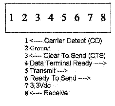
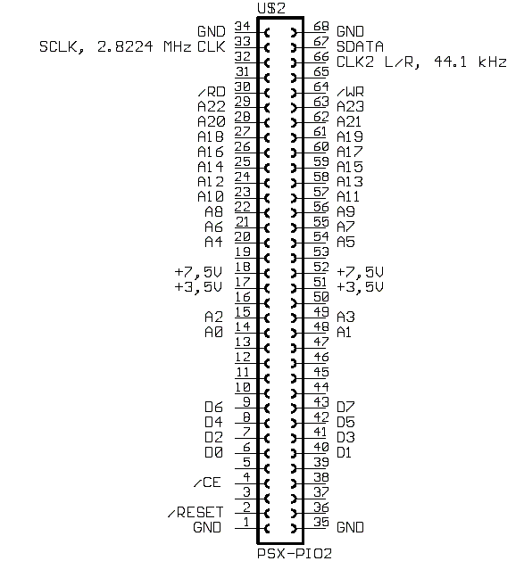

import AuthorCard from '@site/src/components/AuthorCard';

<AuthorCard authors={['半个水果','Pinocchio', 'pinokio']} />

## 串行I/O

PSX有个8针的适配器，使用非标准的协议传输和接收。针定义如图：

端口速度可以达到256Kbps，通常是使用56K。如果有连接问题，端口会尝试重连接，但是不会因速度低而后退。连接电缆如下所示。

<table>
    <tr>
        <td>1</td>
        <td>\<-\></td>
        <td>4</td>
    </tr>
    <tr>
        <td>2</td>
        <td>空</td>
        <td></td>
    </tr>
    <tr>
        <td>3</td>
        <td>\<-\></td>
        <td>6</td>
    </tr>
    <tr>
        <td>4</td>
        <td>\<-\></td>
        <td>1</td>
    </tr>
    <tr>
        <td>5</td>
        <td>\<-\></td>
        <td>8</td>
    </tr>
    <tr>
        <td>6</td>
        <td>\<-\></td>
        <td>3</td>
    </tr>
    <tr>
        <td>7</td>
        <td>\<-\></td>
        <td>7</td>
    </tr>
    <tr>
        <td>8</td>
        <td>\<-\></td>
        <td>5</td>
    </tr>
</table>

## 并行口I/O

并行口是一个伪名称，实际是一个扩张端口。任何连接到这个端口的设备会访问到内部总线的所有东西。PIO端口位于0x1F00_0000-0x1F00_FFFF。下图是PIO的针图。

