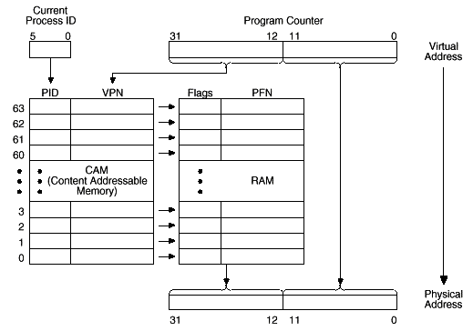

import AuthorCard from '@site/src/components/AuthorCard';

<AuthorCard authors={['半个水果','Pinocchio', 'pinokio']} />

PSX有4个512K共2M的60ns SRAM芯片，它的编址是0x00xxxxxx、0xA0xxxxxx和0x80xxxxxx，都指向相同的物理内存。PSX用Cop0来处理内存管理的几乎每一个方面，先看一下内存是如何安排的。

## 内存映像图

<table border="1" cellpadding="0" cellspacing="0">
  <tr><td>开始地址</td><td>用途</td><td>结束地址</td></tr>
  <tr><td>0000_0000</td><td>内核 64K</td><td>0000_FFFF</td></tr>        
  <tr><td>0001_0000</td><td>用户内存 1.9M</td><td>001F_FFFF</td></tr>        
  <tr><td colspan="3"></td></tr>
  <tr><td>1F00_0000</td><td>并行口 64K</td><td>1F00_FFFF</td></tr>        
  <tr><td colspan="3"></td></tr>
  <tr><td>1F80_0000</td><td>便笺本 1K</td><td>1F80_03FF</td></tr>        
  <tr><td colspan="3"></td></tr>
  <tr><td>1F80_1000</td><td>硬件寄存器 8K</td><td>1F80_2FFF</td></tr>        
  <tr><td colspan="3"></td></tr>
  <tr><td>8000_0000</td><td>内核和用户内存镜像 2M，缓冲</td><td>801F_FFFF</td></tr>        
  <tr><td colspan="3"></td></tr>
  <tr><td>A000_0000</td><td>内核和用户内存镜像 2M，不缓冲</td><td>A01F_FFFF</td></tr>        
  <tr><td colspan="3"></td></tr>
  <tr><td>BFC0_0000</td><td>BIOS 512K</td><td>BFC7_FFFF</td></tr>
</table>

空白格表示没有内存，镜像主要是用来缓冲和进行中断处理，内核也和用户内存一样被镜像。

## 虚拟内存

PSX使用虚拟内存体系来帮助普通系统内存和缓存的管理，简单地说，PSX把2M的内存映射到3个不同的虚拟地址空间段，它们的名字是Kuseg、Kseg0和Kseg1。

Kuseg从0x0000_0000到0x001F_FFFF，你可以把它叫做“真实”内存，内核可以方便的通过它访问用户内存区域。

Kseg0位于虚拟地址的0x8000_0000到0x801F_FFFF，它转换到从0开始的2M的物理线性地址空间，所有通过这个段的调用都是可缓冲的。当虚拟地址的最高3位是`100`的时候，虚拟地址驻留在Kseg0，将`100`替换为`000`就得到物理地址。

Kseg1位于虚拟地址的0xA000_0000到0xA01F_FFFF，它也是指向从0开始2M线性空间。当虚拟地址的最高3位是`101`的时候，虚拟地址驻留在Kseg1，将`101`替换为`000`就得到物理地址。不同于Kseg0的是，通过Kseg1的调用是不缓冲的。

更深入一点了解R3000A的虚拟内存，32位虚拟地址的高20位叫做虚拟页面号码（VPN），而其中只用到了最高的3位来做虚拟地址和物理地址的转换。

<table border="1" cellpadding="0" cellspacing="0">
  <tr><td colspan="4">VPN</td><td>偏移</td></tr>
  <tr><td colspan="4">20位</td><td>12位</td></tr>
  <tr><td>31</td><td>30</td><td>29</td><td>28－12</td><td>11－0</td></tr>
  <tr><td>0</td><td>x</td><td>x</td><td colspan="2">Kuseg</td></tr>
  <tr><td>1</td><td>0</td><td>0</td><td colspan="2">Kseg0</td></tr>
  <tr><td>1</td><td>0</td><td>1</td><td colspan="2">Kseg1</td></tr>
</table>

虚拟地址的三个最高位指示了处理器正在使用哪个虚拟内存段，这些段关联到各自的映射算法和是否被缓冲，页面通过替换虚拟地址的20位VPN到20位的物理帧号码（PFN）来映射。这个映射是通过译码检索缓冲器（TLB）来进行的，这个TLB是一个全相联储存器，包含64个条目，提供64个4KB页面的映射，每个TLB条目的宽度是64位，当虚拟调用Kuseg时，每一个TLB条目都会被检查是否对应到相应的VPN。

下图是TLB的示意图，整个子系统都是由Cop0来操作的。

## Cop0 系统控制处理器        

这个单元实际是R3000A的一部分，它由原来的R3000A的Cop0增加了小量的寄存器和函数改制而成，Cop0包含16个32位的控制寄存器，用来进行内存管理、系统中断管理和断点的多方面控制。大多数是和普通的R3000A兼容的，下面是寄存器一览表。

<table border="1" cellpadding="0" cellspacing="0">
  <tr><td>号码</td><td>助记符</td><td>名字</td><td>读/写</td><td>用途</td></tr>
  <tr><td>0</td><td>INDX</td><td>Index</td><td>读/写</td><td>64条目TLB文件的条目索引</td></tr>
  <tr><td>1</td><td>RAND</td><td>Random</td><td>读</td><td>为软件提供随机的TLB条目来写入正确的译码</td></tr>
  <tr><td>2</td><td>TLBL</td><td>TBL low</td><td>读/写</td><td>提供对TLB文件进行读、写和检索操作的数据路径（前32位）</td></tr>
  <tr><td>3</td><td>BPC</td><td>Breakpoint PC</td><td>读/写</td><td>设置运行中断的断点地址</td></tr>
  <tr><td>4</td><td>CTXT</td><td>Context</td><td>读</td><td> BADV寄存器的副本，但它的格式更适应于软件的TLB中断处理</td></tr>
  <tr><td>5</td><td>BDA</td><td>Breakpoint data</td><td>读/写</td><td>设置装入/储存操作的断点地址</td></tr>
  <tr><td>6</td><td>PIDMASK</td><td>PID Mask</td><td>读/写</td><td>进程标识符</td></tr>
  <tr><td>7</td><td>DCIC</td><td>Data/Counter interrupt control</td><td>读/写</td><td>断点控制</td></tr>
  <tr><td>8</td><td>BADV</td><td>Bad Virtual Address</td><td>读</td><td>引起中断的调用的地址</td></tr>
  <tr><td>9</td><td>BDAM</td><td>Break data mask</td><td>读/写</td><td>数据提取地址和这个值进行‘与’操作，然后和BDA的值比较</td></tr>
  <tr><td>10</td><td>TLBH</td><td>TBL high</td><td>读/写</td><td>提供对TLB文件进行读、写和检索操作的数据路径（后32位）</td></tr>
  <tr><td>11</td><td>BPCM</td><td>Break point counter mask</td><td>读/写</td><td>指令指针和这个值进行‘与’操作，然后和BPC的值比较</td></tr>
  <tr><td>12</td><td>SR</td><td>System status register</td><td>读/写</td><td>包含全部主要的状态标志</td></tr>
  <tr><td>13</td><td>CAUSE</td><td>Cause</td><td>读</td><td>指示最近发生的中断</td></tr>
  <tr><td>14</td><td>EPC</td><td>Exception Program Counter </td><td>读</td><td>中断返回地址</td></tr>
  <tr><td>15</td><td>PRID</td><td>Processor ID</td><td>读</td><td>Cop0的型号和版本</td></tr>
  <tr><td>16</td><td>ERREG</td><td>???</td><td>?</td><td>????</td></tr>
</table>

### TLB相关寄存器

`Index寄存器：`32位可读写寄存器，其中6位用来指示TLB中的条目，最高位是状态位用来表示TLB检索（tlbp）指令是成功还是失败，失败时被设为1。它也用来指定TBL读写指令的目的条目。结构如下：（0是保留的，必须写0，读的时候也返回0）

<table border="1" cellpadding="0" cellspacing="0">
  <tr><td>P</td><td>0</td><td>Index</td><td>0</td></tr>
  <tr><td>1位</td><td>17位</td><td>6位</td><td>8位</td></tr>
  <tr><td>32</td><td>31－14</td><td>13－8</td><td>7－0</td></tr>
</table>

`Random寄存器：`32位只读寄存器，其中6位用来指示TLB中随机的一个条目。它是一个每个时钟周期都递减的计算器，但是计数范围是从63到8，这就是可以保证Random寄存器永远不指向TLB前8个条目，这些条目就可以被软件“锁定”到TLB文件，保证在使用这些虚拟地址时TLB不会发生未命中中断，这对于操作系统尤为重要。Random寄存器最典型的是用在TLB未命中中断中，它提供一个“推荐”的TLB条目来写入正确的译码，尽管它的效率不如最近最少使用算法（LRU），但是在允许很简单的硬件软件管理条件下，提供了非常接近的性能。要进行一个TLB替换，使用TLB写随机（tlbwr）指令来写到这个寄存器指向的条目。就算使用随机TLB替换算法，两个处理器也能同步工作。在系统复位时，计算器被预置为63。软件也可以直接读这个寄存器，尽管它在设备测试和诊断之外几乎没有用处。结构如下：（0是保留的，读的时候返回0）

<table border="1" cellpadding="0" cellspacing="0">
  <tr><td>0</td><td>Random</td><td>0</td></tr>
  <tr><td>18位</td><td>6位</td><td>8位</td></tr>
  <tr><td>32－14</td><td>13－8</td><td>7－0</td></tr>
</table>

`TLB High和TLB Low寄存器：`这两个寄存器提供了读、写和检索TLB文件的数据路径，它的格式和TLB条目格式是一样的，如下：PID是6位的进程标识符，TBL是允许多进程共享的，当不同的进程用同一个虚拟地址指向不同物理地址时，用PID来区别条目； 
N是Non-Cacheable，当它被设置时，表示页面是不可缓冲的； 
D是Dirty，当它被设置时表示页面是脏的，即是可写，可以把它看作一个“写保护&quot;标志，软件可以用它来防止数据被修改； 
V是Valid，当它被设置时表示TLB条目有效，否则表示TLBL或TLBS未命中发生； 
G是Global，当它被设置时将忽略PID的匹配检查，在kseg2里，它允许内核访问全部映射的数据而不要保存或恢复PID值。 
0是保留的，必须写0，读的时候也返回0。

<table border="1" cellpadding="0" cellspacing="0">
  <tr><td colspan="3">TLB High</td><td colspan="6">TLB Low</td></tr>        
  <tr><td>VPN</td><td>PID</td><td>0</td><td>FPN</td><td>N</td><td>D</td><td>V</td><td>G</td><td>0</td></tr>
  <tr><td>20位</td><td>6位</td><td>6位</td><td>20位</td><td>1位</td><td>1位</td><td>1位</td><td>1位</td><td>8位</td></tr>
  <tr><td>31－12</td><td>11－6</td><td>5－0</td><td>31－12</td><td>11</td><td>10</td><td>9</td><td>8</td><td>7－0</td></tr>
</table>

## 中断处理

程序运行中总有些时候需要挂起当前任务去处理一些其他硬件或软件功能，R3000A提供的中断（异常）处理功能是用来确保控制权从执行程序有秩序地转移到内核。中断可以大致分为2类：一是由指令或者指令序列产生，包括一些不正常地条件出现；二是由外部事件产生，例如硬件中断。当R3000A检测到中断发生，正常的指令序列会被暂停和悬挂起来，处理器会被迫进入内核模式，来处理一些不正常的或不同步的事件，下表列出了R3000A所认识的中断：

<table border="1" cellspacing="0" cellpadding="1">
  <tr><td>中断</td><td>助记符</td><td>触发</td></tr>
  <tr><td>Reset</td><td>Reset</td><td>复位信号，把控制权转移到指定的虚拟地址0xBFC0_0000(BIOS的开始)</td></tr>
  <tr><td>Bus Error</td><td>IBE DBE(Data)</td><td>总线输入错误，外部事件引起。如总线超时，底层内存错误，无效物理地址或访问类型</td></tr>
  <tr><td>Address Error</td><td>AdEL(Load) AdES(Store)</td><td>常识装入、提取或储存一个不联结的字，也即一个字或半字不均匀地分成4或2份； 在用户模式，调用一个最高有效位被设置的虚拟地址</td></tr>        
  <tr><td>Overflow</td><td>Ovf</td><td>加或减溢出</td></tr>
  <tr><td>System Call</td><td>Sys</td><td>执行SYSCALL陷阱指令</td></tr>        
  <tr><td>Breakpoint</td><td>Bp</td><td>执行break指令</td></tr>
  <tr><td>Reserved Instruction</td><td>RI</td><td>执行未定义的或保留的大操作码(31:26位)或特殊的未定义的小操作码(5:0)指令</td></tr>        
  <tr><td>Co-processorUnusable</td><td>CpU</td><td>执行一个协处理器指令而该协处理器的CU(Co-processor&nbsp; usable)位未被设置</td></tr>        
  <tr><td>TLB Miss</td><td>TLBL(Load) TLBS(Store)</td><td>调用的TLB条目的Valid位未被设置</td></tr>        
  <tr><td>TLB Modified</td><td>Mod</td><td>执行储存指令时，相应TLB条目的Valid位被设置而Dirty位没有被设置</td></tr>        
  <tr><td>Interrupt</td><td>Int</td><td>六个硬件中断中的一个有输入或Cause寄存器的两个软件中断中的一个被设置</td></tr>
</table>

### 中断相关寄存器

`Cause寄存器：`指示最近发生的中断，5位的中断代码，指示了当前的中断，其他位包含了这个中断的详细信息。除了SW位，其他位都是只读的。结构如下： 
`BD：`Branch Delay，如果中断发生在转移指令执行的时候，这个位会被设置，EPC会返回到跳转指令的地方，在中断返回之后重新判断转移方向，重执行转移指令； 
`CE：`Coprocessor Error，因为某个协处理器没有在SR里被使能，而导致协处理器指令出错发生中断的这个协处理号码； 
`IP：`Interrupt Pending，指示了哪个中断在处理中，而不管它是否被屏蔽了，IP区可以用来测定那个中断正在处理； 
`SW：`Software Interrupts，SW可以用写来设置或复位软件中断，只要SW的任何一个位被设置，并且在SR的中断掩字里相应的位也被设置，则发生一个中断。 
`0：`保留，必须写0，读取的时候返回0。 
`EXECODE：`Exception Code，描述中断发生的类型，见下表：        

<table border="1" cellspacing="0" cellpadding="0">
  <tr><td>号码</td><td>助记符</td><td>描述</td></tr>
  <tr><td>0</td><td>INT</td><td>外部中断</td></tr>
  <tr><td>1</td><td>MOD</td><td>TLB修改中断</td></tr>
  <tr><td>2</td><td>TLBL</td><td>TLB未命中中断(读取或指令取出)</td></tr>
  <tr><td>3</td><td>TLBS</td><td>TLB未命中中断(储存)</td></tr>
  <tr><td>4</td><td>ADEL</td><td>地址错误中断(读取或指令取出)</td></tr>
  <tr><td>5</td><td>ADES</td><td>地址错误中断(储存)</td></tr>
  <tr><td>6</td><td>IBE</td><td>总线错误中断(指令取出)</td></tr>
  <tr><td>7</td><td>DBE</td><td>总线错误中断(数据装入或储存)</td></tr>
  <tr><td>8</td><td>SYS</td><td>SYSCALL中断</td></tr>
  <tr><td>9</td><td>BP</td><td>断点中断</td></tr>
  <tr><td>10</td><td>RI</td><td>保留的指令中断</td></tr>
  <tr><td>11</td><td>CPU</td><td>协处理器不可用中断</td></tr>
  <tr><td>12</td><td>OVF</td><td>算术运算溢出中断</td></tr>
  <tr><td>13-31</td><td>-</td><td>保留</td></tr>
</table>

<table border="1" cellpadding="0" cellspacing="0">
  <tr><td>BD</td><td>0</td><td>CE</td><td>0</td><td>IP</td><td>SW</td><td>0</td><td>EXECODE</td><td>0</td></tr>
  <tr><td>1位</td><td>1位</td><td>2位</td><td>12位</td><td>6位</td><td>2位</td><td>1位</td><td>5位</td><td>2位</td></tr>
  <tr><td>31</td><td>30</td><td>29、28</td><td>27-16</td><td>15-10</td><td>9、8</td><td>7</td><td>6-2</td><td>1、0</td></tr>
</table>

EPC寄存器： 
Exception Program Counter，32位的EPC寄存器保存了发生中断时正常指令的虚拟地址，亦即中断服务完成后的返回地址，当中断发生在转移指令中，EPC保存的是转移指令的地址，中断后从新执行转移指令。

BADV寄存器： 
保存了任何发生地址错误中断的错误虚拟地址，只读。

Context寄存器： 
部分BADV寄存器的副本，但是它的格式更方便于软件TLB中断处理程序的使用。Context寄存器用来使软件快速测定页面表条目里错误地址在主记忆体里的地址，也使软件能快速地用一个9指令的代码序列来更新TLB。结构如下： 
`0：`保留，读写都是0； 
`BADV：`失效虚拟页面号码（由硬件设置，和BADV一样是只读的）； 
`PTE Base：`页面表条目的基址（由内核设置）；        

<table border="1" cellpadding="0" cellspacing="0">
  <tr>
    <td>PTE Base</td>
    <td>BADV</td>
    <td>0</td>
  </tr>
  <tr>
    <td>11位</td>
    <td>19位</td>
    <td>2位</td>
  </tr>
  <tr>
    <td>31－21</td>
    <td>20－2</td>
    <td>1、0</td>
  </tr>
</table>

Status寄存器： 
这个寄存器包含了全部主要的状态位，任何中断都把系统置于内核模式，除了TS（TLB Shutdown）位是只读的之外，其他所有位都是可读可写的。这个寄存器里的KU（Kernel/User）位和IE（Interrupt）位有3层‘栈’（current，previous和old），每发生一个中断就压一次‘栈’，然后由中断指令的Restore来出‘栈’，这些位也是可读可写的。复位的时候，SWc，KUc和IEc位被设为0，BEV被设为1，TS被设为0，其他位在复位的时候没有被定义。寄存器结构如下： 
`CU：`Co－processor Usability，这些位分别控制用户级访问协处理器的操作，包括BrCond输入端口的表决和系统控制协处理器（CP0）如何处理。CU2是GTE，CU1是FPA（在PSX里没有用到）； 
`RE：`Rverse Endianess，R3000A允许系统在复位时决定内核模式字节顺序的习惯和用户模式的缺省设置。如果该位被清除，当前用户任务使用和内核模式一样的字节顺序；如果被设置，用户任务就用相反的字节顺序。这个位对内核模式没用影响。 
`BEV：`Bootstrap Exception Vector。这个位的值决定了处理器中断向量的位置，BEV＝1，处理器处于自举模式，中断向量位于BIOS ROM里；BEV＝0，处理器处于正常模式，中断向量处于RAM里； 
`TS：`TLB Shutdown，这个位反映了TLB是否工作；         
`PE：`Parity Error，在起动的时候这个位应该被写一个“1”，一旦初始化之后，读这个位就总会返回“0”；         
`CM：`Cache Miss，当缓存未命中发生时这个位被设置，这个在确定内部子系统缓存的大小和操作方面很有用； 
`PZ：`Parity Zero，这个位应该写0；         
`SwC：`Swap Caches，设置这个位会引起执行核心将芯片内的指令缓存当作数据缓存来用，而将它清除则不交换缓存。这个在某些操作例如缓存填充上很有用，而在正常操作中不应该交换缓存； 
`IsC：`隔离缓存，如果这个位被设置，数据缓存是和主存隔离的；也就是储存数据时修改数据缓存不会引起主存的改变，读取数据时也只从缓存返回而不管缓存是否命中。在多种操作里，这个位也是很有用的，例如填充； 
`IM：`Interrupt Mask，这个8位的域用来对执行引擎屏蔽硬件和软件中断，也就是不允许他们引起中断。IM（1：0）用了屏蔽软件中断，IM（7：2）屏蔽6个外部中断。0禁止一个特定的中断，1使能这个中断。注意IE位是一个全局的中断使能，也就是说，如果IE禁止了中断，特殊屏蔽位的值就不起作用了，如果IE使能中断，指定的中断将受这个域内的屏蔽位影响；         
`KUo：`Kernel/User old，这是两个中断之前的特权状态，0表示内核模式；         
`IEo：`Interrupt Enable old，这是两个中断之前的全局中断使能状态。1表示中断使能，受到IM屏蔽的影响； 
`KUp：`Kernel/User previous，这是当前中断之前的特权状态，0表示内核模式；         
`IEp：`Interrupt Enable previous，这是当前中断之前的全局中断使能状态。1表示中断使能，受到IM屏蔽的影响； 
`KUc：`Kernel/User current，这是当前特权状态，0表示内核模式；         
`IEc：`Interrupt Enable current，这是当前全局中断使能状态。1表示中断使能，受到IM屏蔽的影响；         
`0：`保留，必须写0，读取也返回0。

<table border="1" cellspacing="0" cellpadding="0">
  <tr>
    <td>CU</td>
    <td>0</td>
    <td>RE</td>
    <td>0</td>
    <td>BEV</td>
    <td>TS</td>
    <td>PE</td>
    <td>CM</td>
    <td>PZ</td>
    <td>SwC</td>
    <td>IsC</td>
    <td>IntMask</td>
    <td>0</td>
    <td>KUo</td>
    <td>IEo</td>
    <td>KUp</td>
    <td>IEp</td>
    <td>KUc</td>
    <td>IEc</td>
  </tr>
  <tr>
    <td>4位</td>
    <td>2位</td>
    <td>1位</td>
    <td>2位</td>
    <td>1位</td>
    <td>1位</td>
    <td>1位</td>
    <td>1位</td>
    <td>1位</td>
    <td>1位</td>
    <td>1位</td>
    <td>8位</td>
    <td>2位</td>
    <td>1位</td>
    <td>1位</td>
    <td>1位</td>
    <td>1位</td>
    <td>1位</td>
    <td>1位</td>
  </tr>
  <tr>
    <td>31-28</td>
    <td>27、26</td>
    <td>25</td>
    <td>24、23</td>
    <td>22</td>
    <td>21</td>
    <td>20</td>
    <td>19</td>
    <td>18</td>
    <td>17</td>
    <td>16</td>
    <td>15-8</td>
    <td>7</td>
    <td>5</td>
    <td>4</td>
    <td>3</td>
    <td>2</td>
    <td>1</td>
    <td>0</td>
  </tr>
</table>

PRID寄存器： 
这个寄存器对于软件确定用处理器的哪个版本执行代码很有用，格式如下： 
`Imp：`3代表CoP0型号R3000A，7代表IDT单元（3041）使用REV来确定正确的配置； 
`Rev：`版本。

<table border="1" cellpadding="0" cellspacing="0">
  <tr>
    <td>0</td>
    <td>Imp</td>
    <td>Rev</td>
  </tr>
  <tr>
    <td>16位</td>
    <td>8位</td>
    <td>8位</td>
  </tr>
  <tr>
    <td>31－16</td>
    <td>15－8</td>
    <td>7－0</td>
  </tr>
</table>

### 中断向量位置

R3000A把中断分到3个向量空间。每个向量的值都与状态寄存器的BEV位有关，它可以交替使用两套向量（因此有两套代码片断）。一般地说，这是用了在缓存可用之前用来分析测试的，处理器复位强迫BEV位的值变为1。

<table border="1" cellspacing="0">
  <tr>
    <td rowspan="2">中断</td>
    <td colspan="2">虚拟地址</td>
    <td colspan="2">物理地址</td>
  </tr>
  <tr>
    <td>BEV＝0</td>
    <td>BEV＝1</td>
    <td>BEV＝0</td>
    <td>BEV＝1</td>
  </tr>
  <tr>
    <td>Reset</td>
    <td>0xBFC0_0000</td>
    <td>0xBFC0_0000</td>
    <td>0x1FC0_0000</td>
    <td>0x1FC0_0000</td>
  </tr>
  <tr>
    <td>UTLB Miss</td>
    <td>0x8000_0000</td>
    <td>0xBFC0_0100</td>
    <td>0x0000_0000</td>
    <td>0x1FC0_0100</td>
  </tr>
  <tr>
    <td>General</td>
    <td>0x8000_0080</td>
    <td>0xBFC0_0180</td>
    <td>0x0000_0080</td>
    <td>0x1FC0_0180</td>
  </tr>
</table>

### 中断优先权

<table border="1" cellspacing="0">
  <tr>
    <td>Reset</td>
    <td>任何时候（最高）</td>
  </tr>
  <tr>
    <td>AdEL</td>
    <td>内存（载入指令）</td>
  </tr>
  <tr>
    <td>AdES</td>
    <td>内存（储存指令）</td>
  </tr>
  <tr>
    <td>DBE</td>
    <td>内存（载入和储存）</td>
  </tr>
  <tr>
    <td>MOD</td>
    <td>ALU（数据TLB）</td>
  </tr>
  <tr>
    <td>TLBL</td>
    <td>ALU（DTLB未命中）</td>
  </tr>
  <tr>
    <td>TLBS</td>
    <td>ALU（DTLB未命中）</td>
  </tr>
  <tr>
    <td>Ovf</td>
    <td>ALU</td>
  </tr>
  <tr>
    <td>Int</td>
    <td>ALU</td>
  </tr>
  <tr>
    <td>Sys</td>
    <td>RD（指令译码）</td>
  </tr>
  <tr>
    <td>Bp</td>
    <td>RD（指令译码）</td>
  </tr>
  <tr>
    <td>RI</td>
    <td>RD（指令译码）</td>
  </tr>
  <tr>
    <td>CpU</td>
    <td>RD（指令译码）</td>
  </tr>
  <tr>
    <td>TLBL</td>
    <td>I－Fetch（ITLB未命中）</td>
  </tr>
  <tr>
    <td>AdEL</td>
    <td>IVA（指令虚拟地址）</td>
  </tr>
  <tr>
    <td>IBE</td>
    <td>BD（I－Fetch结束，最低）</td>
  </tr>
</table>

## 断点管理

下面是Cop0里用来做断点管理的寄存器，这些寄存器在低级调试中很有用。

`BPC寄存器：`执行断点，设置执行时的断点地址。

`BDA寄存器：`数据访问断点，设置要中断的载入和储存操作地址。

`DCIC寄存器：`断点控制，要使用执行断点，设PC位1；要使用数据访问断点，设DA为1或者设置R，W两者的任意组合。两种断点都可以相似地使用，当遇到断点时PSX跳到0x0000_0040。寄存器结构如下： 
`W：`1表示‘写’时中断； 
`R：`1表示‘读’时中断； 
`DA：`1表示数据访问中断使能； 
`PC：`1表示执行中断使能。

<table border="1" cellspacing="0">
  <tr>
    <td>1</td>
    <td>1</td>
    <td>1</td>
    <td>0</td>
    <td>W</td>
    <td>R</td>
    <td>DA</td>
    <td>PC</td>
    <td>1</td>
    <td>0</td>
  </tr>
  <tr>
    <td>1位</td>
    <td>1位</td>
    <td>1位</td>
    <td>1位</td>
    <td>1位</td>
    <td>1位</td>
    <td>1位</td>
    <td>1位</td>
    <td>1位</td>
    <td>23位</td>
  </tr>
  <tr>
    <td>31</td>
    <td>30</td>
    <td>29</td>
    <td>28</td>
    <td>27</td>
    <td>26</td>
    <td>25</td>
    <td>24</td>
    <td>23</td>
    <td>22-0</td>
  </tr>
</table>

`BDAM寄存器：`数据访问断点掩码，数据提取地址和这个值进行‘与’操作，然后和BDA比较。

`BPCM寄存器：`执行断点掩码，指令指针和这个值进行‘与’操作，然后和BPC比较。

## DMA

为了让一个设备直接访问内存，PSX需要不时地把CPU从总线上撤下来。这些可以控制总线地设备是CD－ROM，MDEC，GPU，SPU和并行口。一共有7个DMA通道，其中GPU和MDEC各使用2个，DMA寄存器位于0x1F80_1080到0x1F80_10F4之间。DMA通道寄存器从0x1F80_1080开始，每个通道的基地址如下：

<table border="1" cellspacing="0">
  <tr>
    <td>基地址</td>
    <td>通道号码</td>
    <td>设备</td>
  </tr>
  <tr>
    <td>0x1F80_1080</td>
    <td>DMA0</td>
    <td>MDECin</td>
  </tr>
  <tr>
    <td>0x1F80_1090</td>
    <td>DMA1</td>
    <td>MDECout</td>
  </tr>
  <tr>
    <td>0x1F80_10A0</td>
    <td>DMA2</td>
    <td>GPU(列表＋图像数据)</td>
  </tr>
  <tr>
    <td>0x1F80_10B0</td>
    <td>DMA3</td>
    <td>CD-ROM</td>
  </tr>
  <tr>
    <td>0x1F80_10C0</td>
    <td>DMA4</td>
    <td>SPU</td>
  </tr>
  <tr>
    <td>0x1F80_10D0</td>
    <td>DMA5</td>
    <td>PIO</td>
  </tr>
  <tr>
    <td>0x1F80_10E0</td>
    <td>DMA6</td>
    <td>GPU OTC(反向清除顺序表)</td>       
  </tr>
</table>

每个通道都有3个32位控制寄存器，他们是DMA内存地址寄存器（D_MADR）位于基地址，DMA块控制寄存器（D_BCR）位于基地址＋4，和DMA通道控制寄存器（D_CHCR）位于基地址＋8。为了使用某个DMA通道，这个通道必须通过DMA主控制寄存器（DPCR，位于0x1F80_10F0）来使能。

DMA主控制寄存器（DPCR），0x1F80_10F0，在这个寄存器里为每个通道分配了一个4位的控制块，要使能一个通道，第3位必须被设为1，其他位作用未明。

<table border="1" cellspacing="0">
  <tr>
    <td>　</td>
    <td>DMA6</td>
    <td>DMA5</td>
    <td>DMA4</td>
    <td>DMA3</td>
    <td>DMA2</td>
    <td>DMA1</td>
    <td>DMA0</td>
  </tr>
  <tr>
    <td>4位</td>
    <td>4位</td>
    <td>4位</td>
    <td>4位</td>
    <td>4位</td>
    <td>4位</td>
    <td>4位</td>
    <td>4位</td>
  </tr>
  <tr>
    <td>31-28</td>
    <td>27-24</td>
    <td>23-20</td>
    <td>19-16</td>
    <td>15-12</td>
    <td>11-8</td>
    <td>7-4</td>
    <td>3-0</td>
  </tr>
</table>

如前所述，每个设备有3个32位控制寄存器位于自己的DMA地址空间里，下面描述了他们的功能。n代表了8，9，A，B，C，D，E，分别相对于0，1，2，3，4，5，6通道。

DMA内存地址寄存器（D_MADR），0x1F80_10n0 
`MADR：`指向DMA读取/写入的开始地址

<table border="1" cellspacing="0">
  <tr>
    <td>MADR</td>
  </tr>
  <tr>
    <td>32位</td>
  </tr>
  <tr>
    <td>31－0</td>
  </tr>
</table>

DMA块控制寄存器（D_BCR），0x1F80_10n4，通道将传输BA个BS大小的字块。注意不要把尺寸设置大于对于单元所有的缓存大小（GPU和SPU都是$10字大小的缓存）。块尺寸越大，传输越快。 
`BA：`块数目； 
`BS：`块尺寸。

<table border="1" cellspacing="0">
  <tr>
    <td>BA</td>
    <td>BS</td>
  </tr>
  <tr>
    <td>16位</td>
    <td>16位</td>
  </tr>
  <tr>
    <td>31－16</td>
    <td>15-0</td>
  </tr>
</table>

DMA通道控制寄存器（D_CHCR），0x1F80_10n8 
`TR：`0表示没有DMA传输忙，1表示开始DMA传输或DMA传输忙； 
`LR：`1表示传送连接列表； 
`CO：`1表示传送数据连续流； 
`DR：`传送方向。

<table border="1" cellspacing="0">
  <tr>
    <td>0</td>
    <td>TR</td>
    <td>0</td>
    <td>LI</td>
    <td>CO</td>
    <td>0</td>
    <td>DR</td>
  </tr>
  <tr>
    <td>7位</td>
    <td>1位</td>
    <td>13位</td>
    <td>1位</td>
    <td>1位</td>
    <td>8位</td>
    <td>1位</td>
  </tr>
  <tr>
    <td>31－25</td>
    <td>24</td>
    <td>23－11</td>
    <td>10</td>
    <td>9</td>
    <td>8－1</td>
    <td>0</td>
  </tr>
</table>

DMA中断控制寄存器（DICR），0x1F80_10F4，是用来了控制DMA中断的，用法到现在还不知道。
