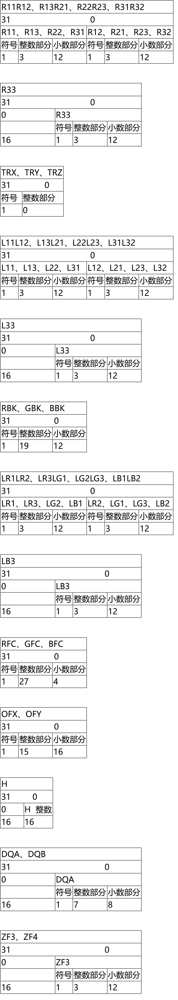

# 几何变换引擎（GTE）

几何变换引擎（GTE）是PSX全部3D计算的核心。GTE可以进行向量和矩阵操作，视角变换，颜色均衡等等。它比CPU进行这些操作快得多，作为PSX的第二个协处理器，没有分配物理地址内存，所有的控制通过特殊指令完成。

## 基本算法

在3D空间中一个点（顶点）的描述是用一个向量[X,Y,Z]。在GTE操作中，有两种向量，一种是变长度的，另一种是1.0单元长度，叫做法向量。前者用来描述3D空间的一个位置和平移，第二个用来描述方向。

顶点的旋转是进行顶点向量和旋转矩阵的乘法。旋转矩阵是3×3的矩阵包含了3个正交法向量（它实际上是一个矩阵，描述了顶点所在的坐标系统和全局坐标系统的关系）。这个矩阵来自旋转角度，如下所示：

$$
sn=sin(n),cn=cos(n)
$$

绕X轴旋转角度A：

| \|1 | 0   | 0\|   |
| --- | --- | ----- |
| \|0 | cA  | -sA\| |
| \|0 | sA  | cA\|  |

绕Y轴旋转角度B：

| \|cB  | 0   | sB\| |
| ----- | --- | ---- |
| \|0   | 1   | 0\|  |
| \|-sB | 0   | cB\| |

绕Z轴旋转角度C：

| \|cC | -sC | 0\| |
| ---- | --- | --- |
| \|sC | cC  | 0\| |
| \|0  | 0   | 1\| |

绕多个轴旋转可以通过这些矩阵相乘完成，注意相乘的顺序非常重要。GTE没有sin或者cos函数，所以这些计算要通过CPU完成。平移是简单的两个向量相加，在当前坐标系中重定位顶点，当然，顶点平移和旋转的顺序也是很重要的。

## 函数简要描述

| RTPS/RTPT   | 旋转、平移和视角转换   这两个函数对1个或者3个顶点同时进行最终的3D计算。这些点先乘以旋转矩阵R再加上平移矩阵TR，最后应用一个视角转换，生成2D屏幕坐标。它也返回一个插值值用在各种深度化指令中。 |
| ----------- | ------------------------------------------------------------------------------------------------------- |
| MVMVA       | 矩阵和向量乘法和加法   乘以一个向量和一个旋转矩阵或者光源矩阵或者颜色矩阵，然后加上平移向量或者背景颜色向量                                           |
| DCPL        | 深度化光源颜色   先从光源向量（一个平面的法向量乘以光源矩阵后限制到零）和一个提供的RGB值计算出一个颜色。然后通过在远颜色向量和新得到的颜色之间插值来进行深度化。               |
| DPCS/DPCT   | 单色/3色深度化   在一个颜色和远颜色向量之间插值对1个或者3个颜色进行深度化。                                                         |
| INTPL       | 插值   在一个向量和远颜色向量之间插值                                                                              |
| SQR         | 平方   计算一个向量的平方                                                                                    |
| NCS/CNT     | 法向颜色   从一个点或平面的法向和光源和颜色计算一个颜色。法向参考的平面或点的基本颜色认为是白色                                                 |
| NCDS/NCDT   | 法向颜色深度化   和NCS/NCT类似，但是同时进行深度化（像DPCS/DPCT）                                                        |
| NCCS/NCCT   | 和NCS/NCT类似，但是平面或点的基本颜色也计算在内                                                                             |
| CDP         | 从光源向量（基本颜色当成白色）计算一个颜色和进行深度化（像DPCS）                                                                      |
| CC          | 从光源向量和一个基本颜色计算一个颜色                                                                                      |
| NCLIP       | 计算3个2D点的外积（例如投影后定义一个平面的3个顶点）   3个顶点相对于虚拟点应该按顺时针储存，这样如果我们面对平面的背面，函数的结果是负值                          |
| AVSZ3/AVSZ4 | 累加3或者4个Z值，然后乘以一个固定点的值。这个值通常是经过挑选的，这样函数可以返回这些Z值的平均值（通常还要用2或者4去除一下，以便加到顺序表OT）                             |
| OP          | 计算两个向量的外积                                                                                               |
| GPF         | 两个向量相乘。返回值作为24位RGB值                                                                                     |
| GPL         | 一个向量乘以一个标量后加到另一个向量。返回值作为24位RGB值                                                                         |

## 指令

CPU有6个特别的针对GTE寄存器的装入和储存指令，一个指令用来向协处理器下达命令

| rt        | CPU寄存器0－31    |
| --------- | ------------- |
| gd        | GTE数据寄存器0－31  |
| gc        | GTE控制寄存器0－31  |
| imm       | 16位立即数        |
| base      | CPU寄存器0－31    |
| imm（base） | base＋imm指向的地址 |
| b25       | 25位字长数据段      |

| LWC2 gd,imm(base) | 储存imm（base）的值到GTE数据寄存器gd |
| ----------------- | ------------------------ |
| SWC2 gd,imm(base) | 储存GTE数据寄存器到imm（base）     |
| MTC2 rt,gd        | 储存寄存器rt到GTE数据寄存器gd       |
| MFC2 rt,gd        | 储存GTE数据寄存器gd到寄存器rt       |
| CTC2 rt,gc        | 储存寄存器rt到GTE控制寄存器gc       |
| CFC2 rt,gc        | 储存GTE控制寄存器gc到寄存器rt       |
| COP2 b25          | 执行GTE命令                  |

所有访问该寄存器的GTE命令和操作，GTE装入和储存指令有2个指令的延迟。

### 对GTE编程

使用GTE前要先打开它，在系统控制协处理器（cop0）的状态寄存器中分配了第30位给GTE。在使用任何GTE指令前，先要设置它。

GTE指令和函数不应该用在：跳转和分支的延迟中、事件处理和中断中。

如果在当前GTE命令未完成前读取GTE寄存器或者执行GTE命令，CPU会保持它知道指令完成。每个GTE指令所需的周期数在命令列表中显示。

## 寄存器

GTE有32个数据寄存器和32个控制寄存器，每个都是32字长。控制寄存器通称为Cop2C，数据寄存器称为Cop2D。下表描述了他们的用法。

**控制寄存器Cop2C**

| 序号  | 名称     | 描述               |
| --- | ------ | ---------------- |
| 0   | R11R12 | 旋转矩阵元素11，12      |
| 1   | R13R21 | 旋转矩阵元素13，21      |
| 2   | R22R23 | 旋转矩阵元素22，23      |
| 3   | R31R32 | 旋转矩阵元素31，32      |
| 4   | R33    | 旋转矩阵元素33         |
| 5   | TRX    | 旋转向量X            |
| 6   | TRY    | 旋转向量Y            |
| 7   | TRZ    | 旋转向量Z            |
| 8   | L11L12 | 光源矩阵元素11，12      |
| 9   | L13L21 | 光源矩阵元素13，21      |
| 10  | L22L23 | 光源矩阵元素22，23      |
| 11  | L31L32 | 光源矩阵元素31，32      |
| 12  | L33    | 光源矩阵元素33         |
| 13  | RBK    | 背景颜色红色分量         |
| 14  | BBK    | 背景颜色蓝色分量         |
| 15  | GBK    | 背景颜色绿色分量         |
| 16  | LR1LR2 | 光源颜色矩阵源1和2红色分量   |
| 17  | LR3LG1 | 光源颜色矩阵源3红色，1绿色分量 |
| 18  | LG2LG3 | 光源颜色矩阵源2和3绿色分量   |
| 19  | LB1LB2 | 光源颜色矩阵源1和2蓝色分量   |
| 20  | LB3    | 光源颜色矩阵源3蓝色分量     |
| 21  | RFC    | 远颜色红色分量          |
| 22  | GFC    | 远颜色绿色分量          |
| 23  | BFC    | 远颜色蓝色分量          |
| 24  | OFX    | 屏幕偏移X            |
| 25  | OFY    | 屏幕偏移Y            |
| 26  | H      | 投影平面距离           |
| 27  | DQA    | 深度查询参数A（系数）      |
| 28  | DQB    | 深度查询参数B（偏移）      |
| 29  | ZSF3   | Z3平均缩放因子（通常是1/3） |
| 30  | ZSF4   | Z4平均缩放因子（通常是1/4） |
| 31  | FLAG   | 返回任何计算错误         |

## 控制寄存器

GTE使用带符号定点寄存器进行运算，下面是寄存器字长描述。

标志寄存器

| 位   | 标志                                        |
| --- | ----------------------------------------- |
| 31  | 第30－23、18－13位的逻辑和                         |
| 30  | 计算测试结果＃1溢出（大于$2^{43}$）                    |
| 29  | 计算测试结果＃2溢出（大于$2^{43}$）                    |
| 28  | 计算测试结果＃3溢出（大于$2^{43}$）                    |
| 27  | 计算测试结果＃1下溢出（小于－$2^{43}$）                  |
| 26  | 计算测试结果＃2下溢出（小于－$2^{43}$）                  |
| 25  | 计算测试结果＃3下溢出（小于－$2^{43}$）                  |
| 24  | 限制器A1超出范围（小于0，或者小于-$2^{15}$，或者大于$2^{15}$） |
| 23  | 限制器A2超出范围（小于0，或者小于-$2^{15}$，或者大于$2^{15}$） |
| 22  | 限制器A3超出范围（小于0，或者小于-$2^{15}$，或者大于$2^{15}$） |
| 21  | 限制器B1超出范围（小于0，或者大于$2^8$）                  |
| 20  | 限制器B2超出范围（小于0，或者大于$2^8$）                  |
| 19  | 限制器B3超出范围（小于0，或者大于$2^8$）                  |
| 18  | 限制器C超出范围（小于0，或者大于$2^{16}$）                |
| 17  | 除法溢出（商大于等于2.0）                            |
| 16  | 计算测试结果＃4溢出（大于$2^{43}$）                    |
| 15  | 计算测试结果＃4下溢出（小于－$2^{43}$）                  |
| 14  | 限制器D1超出范围（小于-$2^{10}$，或者大于$2^{10}$）       |
| 13  | 限制器D2超出范围（小于-$2^{10}$，或者大于$2^{10}$）       |
| 12  | 限制器E超出范围（小于0，或者大于$2^{12}$）                |

## 数据寄存器

数据寄存器Cop2D

| 序号  | 名字   | 读/写 | 31   16 | 15    0  | 定点数格式          | 描述                          |
| --- | ---- | --- | ------- | -------- | -------------- | --------------------------- |
| 0   | VXY0 | R/W | VY0     | VX0      | 1,3,12或者1,15,0 | 向量0的X和Y                     |
| 1   | VZ0  | R/W | 0       | VZ0      | 1,3,12或者1,15,0 | 向量0的Z                       |
| 2   | VXY1 | R/W | VY1     | VX1      | 1,3,12或者1,15,0 | 向量1的X和Y                     |
| 3   | VZ1  | R/W | 0       | VZ1      | 1,3,12或者1,15,0 | 向量1的Z                       |
| 4   | VXY2 | R/W | VY2     | VX2      | 1,3,12或者1,15,0 | 向量2的X和Y                     |
| 5   | VZ2  | R/W | 0       | VZ2      | 1,3,12或者1,15,0 | 向量2的Z                       |
| 6   | RGB  | R/W | Code,R  | G,B      | 每个8位           | RGB值，Code也传送但是不用在计算中        |
| 7   | OTZ  | R   | 0       | OTZ      | 0,15,0         | Z平均值                        |
| 8   | IR0  | R/W | 符号      | IR0      | 1,3,12         | 立即数0，格式可能不同                 |
| 9   | IR1  | R/W | 符号      | IR1      | 1,3,12         | 立即数1，格式可能不同                 |
| 10  | IR2  | R/W | 符号      | IR2      | 1,3,12         | 立即数2，格式可能不同                 |
| 11  | IR3  | R/W | 符号      | IR3      | 1,3,12         | 立即数3，格式可能不同                 |
| 12  | SXY0 | R/W | SX0     | SY0      | 1,15,0         | 屏幕XY坐标FIFO（注1）              |
| 13  | SXY1 | R/W | SX1     | SY1      | 1,15,0         | 屏幕XY坐标FIFO（注1）              |
| 14  | SXY2 | R/W | SX2     | SY2      | 1,15,0         | 屏幕XY坐标FIFO（注1）              |
| 15  | SXYP | R/W | SXP     | SYP      | 1,15,0         | 屏幕XY坐标FIFO（注1）              |
| 16  | SZ0  | R/W | 0       | SZ0      | 0,16,0         | 屏幕Z FIFO（注1）                |
| 17  | SZ1  | R/W | 0       | SZ1      | 0,16,0         | 屏幕Z FIFO（注1）                |
| 18  | SZ2  | R/W | 0       | SZ2      | 0,16,0         | 屏幕Z FIFO（注1）                |
| 19  | SZ3  | R/W | 0       | SZ3      | 0,16,0         | 屏幕Z FIFO（注1）                |
| 20  | RGB0 | R/W | CD0,B0  | G0,R0    | 每个8位           | 特征颜色FIFO（注1）                |
| 21  | RGB1 | R/W | CD1,B1  | G1,R0    | 每个8位           | 特征颜色FIFO（注1）                |
| 22  | RGB2 | R/W | CD2,B2  | G2,R0    | 每个8位           | 特征颜色FIFO（注1），CD2是当前执行函数的位图案 |
| 23  | RES1 | －   | －       | －        | －              | 禁止                          |
| 24  | MAC0 | R/W | MAC0    | 1,31,0   | 乘积之和0          |                             |
| 25  | MAC1 | R/W | MAC1    | 1,31,0   | 乘积之和1          |                             |
| 26  | MAC2 | R/W | MAC2    | 1,31,0   | 乘积之和2          |                             |
| 27  | MAC3 | R/W | MAC3    | 1,31,0   | 乘积之和3          |                             |
| 28  | IRGB | W   | 0       | IB,IG,IR | 注2             | 注2                          |
| 29  | ORGB | R   | 0       | OB,OG,OR | 注3             | 注3                          |
| 30  | LZCS | W   | LZCS    | 1,31,0   | 源数据前导0计数（注4）   |                             |
| 31  | LZCR | R   | LZCR    | 6,6,0    | 结果前导0计数（注4）    |                             |

**注1：** SXYx，SZx和RGBx是FIFO寄存器，最后计算的结果存在最后的寄存器，如果得到一个新的SXY值，下面的事情将会发生：

    SXY0＝SXY1  
    SXY1＝SXY2  
    SXY2＝SXYP  
    SXYP＝结果

**注2：**

IRGB

| 0       | R       | G      | B      |
| ------- | ------- | ------ | ------ |
| 31   15 | 14   10 | 9    5 | 4    0 |

当向IRGB写一个值时，发生下面的事情：

IR1＝IR格式转换到（1，11，4）  
IR2＝IG格式转换到（1，11，4）  
IR3＝IB格式转换到（1，11，4）

**注3：**

IRGB

| 0       | R       | G      | B      |
| ------- | ------- | ------ | ------ |
| 31   15 | 14   10 | 9    5 | 4    0 |

当向IRGB写一个值时，发生下面的事情：

IR＝(IR1>>7)&0x1F  
IG＝(IR2>>7)&0x1F  
IB＝(IR3>>7)&0x1F

**注4：**

如果LZCS是正数，读取LZCR返回LZCS的前导0，如果是负数，返回前导1。

## GTE命令

这节描述各种GTE函数的实际进行的计算。第一行是函数的名字、周期数和简要描述，第二行包含了任何需要输入到操作码的字段，第三行是实际操作码。在列表的最后查看各字段和它们的描述。然后是一个需要输入的各个寄存器列表和输出的寄存器列表。再然后是初始化函数后进行的计算，左边格式字段是数据存放格式，右边格式字段是计算进行所需的格式。在计算的某时刻，会进行一些检查和限制，结果存在标志寄存器中，见前面的表。下面计算表中第二列内方括号的内容表示被前面的限制符限制，附加的限制标识器表示数值如果超出了范围就被限制到下限或上限。

| 名称   | 周期  | 命令             | 描述   |
| ---- | --- | -------------- | ---- |
| RTPS | 15  | cop2 0x0180001 | 视角转换 |
| 字段   | 无   |                |      |

输入

| V0              | 转换向量    | 1，15，0  |
| --------------- | ------- | ------- |
| R               | 旋转矩阵    | 1，3，12  |
| TR              | 平移向量    | 1，31，0  |
| H               | 视平面距离   | 0，16，0  |
| DQA   DQB | 深度查询插值值 | 1，7，8   |
| OFX   OFY | 屏幕平移值   | 1，15，16 |

输出

| SXY FIFO | 屏幕XY坐标（短） | 1，15，0 |
| -------- | --------- | ------ |
| SZ FIFO  | 屏幕Z坐标（短）  | 0，16，0 |
| IR0      | 深度查询插值值   | 1，3，12 |
| IR1      | 屏幕X（短）    | 1，15，0 |
| IR2      | 屏幕Y（短）    | 1，15，0 |
| IR3      | 屏幕Z（短）    | 1，15，0 |
| MAC1     | 屏幕X（长）    | 1，31，0 |
| MAC2     | 屏幕Y（长）    | 1，31，0 |
| MAC3     | 屏幕Z（长）    | 1，31，0 |

计算

| 1,31,0                        | $MAC1=A1[TRX + R11VX0 + R12 \times VY0 + R13 \times VZ0]$         | 1,31,12 |
| ----------------------------- | ----------------------------------------------------------------- | ------- |
| 1,31,0                        | $MAC2=A2[TRY + R21 \times VX0 + R22 \times VY0 + R23 \times VZ0]$ | 1,31,12 |
| 1,31,0                        | $MAC3=A3[TRZ + R31 \times VX0 + R32 \times VY0 + R33 \times VZ0]$ | 1,31,12 |
| 1,15,0                        | $IR1= Lm_B1[MAC1]$                                                | 1,31,0  |
| 1,15,0                        | $IR2= Lm_B2[MAC2]$                                                | 1,31,0  |
| 1,15,0                        | $IR3= Lm_B3[MAC3]$                                                | 1,31,0  |
|                               | $SZ0<-SZ1<-SZ2<-SZ3$                                              | 1,31,0  |
| 0,16,0                        | $SZ3= Lm_D(MAC3)$                                                 |         |
|                               | $SX0<-SX1<-SX2, SY0<-SY1<-SY2$                                    |         |
| 1,15,0                        | $Lm_G1[F[OFX + IR1\times(H \div SZ)]]$                            | 1,27,16 |
| 1,15,0                        | $SY2= Lm_G2[F[OFY + IR2\times(H \div SZ)]]$                       |         |
| 1,31,0                        | $MAC0= F[DQB + DQA\times(H \div SZ)]$                             | 1,19,24 |
| 1,15,0                        | $IR0= Lm_H[MAC0]$                                                 | 1,31,0  |
| 注：Z值下限为0.5×H，对于更小的Z值，你要自己写程序。 |                                                                   |         |

| 名称   | 周期  | 命令             | 描述     |
| ---- | --- | -------------- | ------ |
| RTPT | 23  | cop2 0x0280030 | 3点视角转换 |
| 字段   | 无   |                |        |

输入

| V0   V1   V2 | 转换向量    | 1，15，0  |
| ------------------ | ------- | ------- |
| R                  | 旋转矩阵    | 1，3，12  |
| TR                 | 平移向量    | 1，31，0  |
| H                  | 视平面距离   | 0，16，0  |
| DQA   DQB    | 深度查询插值值 | 1，7，8   |
| OFX   OFY    | 屏幕平移值   | 1，15，16 |

输出

| SXY FIFO | 屏幕XY坐标（短） | 1，15，0 |
| -------- | --------- | ------ |
| SZ FIFO  | 屏幕Z坐标（短）  | 0，16，0 |
| IR0      | 深度查询插值值   | 1，3，12 |
| IR1      | 屏幕X（短）    | 1，15，0 |
| IR2      | 屏幕Y（短）    | 1，15，0 |
| IR3      | 屏幕Z（短）    | 1，15，0 |
| MAC1     | 屏幕X（长）    | 1，31，0 |
| MAC2     | 屏幕Y（长）    | 1，31，0 |
| MAC3     | 屏幕Z（长）    | 1，31，0 |

计算

和RTPS一样，但是重复V1和V2

| 名称    | 周期            | 命令             | 描述         |
| ----- | ------------- | -------------- | ---------- |
| MVMVA | 8             | cop2 0x0400012 | 向量乘以矩阵加上向量 |
| 字段    | sf,mx,v,cv,lm |                |            |

输入

| V0/V1/V2/IR | 向量V0,V1,V2或者[IR1,IR2,IR3] |        |
| ----------- | ------------------------- | ------ |
| R/LLM/LCM   | 旋转、光或者颜色矩阵                | 1，3，12 |
| TR/BK       | 平移或者背景颜色向量                |        |

输出

| [IR1,IR2,IR3]    | 短向量 |
| ---------------- | --- |
| [MAC1,MAC2,MAC3] | 长向量 |

计算

MX＝mx指定的矩阵  
V ＝v 指定的矩阵  
CV＝cv指定的矩阵  
$MAC1=A1[CV1 + MX11 \times V1 + MX12 \times V2 + MX13 \times V3]  $

$MAC2=A2[CV2 + MX21 \times V1 + MX22 \times V2 + MX23 \times V3]  $

$MAC3=A3[CV3 + MX31 \times V1 + MX32 \times V2 + MX33 \times V3]  $

$IR1=Lm_B1[MAC1]  $

$IR2=Lm_B2[MAC2]  $

$IR3=Lm_B3[MAC3]  $

注，cv字段允许选择远颜色向量，但是GTE不能正确加这个向量

| 名称   | 周期  | 命令             | 描述      |
| ---- | --- | -------------- | ------- |
| DPCL | 8   | cop2 0x0680029 | 深度化颜色光源 |
| 字段   | 无   |                |         |

输入

| RGB           | 主颜色。 R，G，B，CODE | 0，8，0  |
| ------------- | --------------- | ------ |
| IR0           | 插值值             | 1，3，12 |
| [IR1,IR2,IR3] | 本地颜色向量          | 1，3，12 |
| CODE          | 由RGB得到的颜色值 CODE | 0，8，0  |
| FC            | 远颜色             | 1，27，4 |

输出

| RGBn             | RGB FIFO     Rn，Gn，Bn，CDn | 0，8，0  |
| ---------------- | ------------------------- | ------ |
| [IR1,IR2,IR3]    | 颜色向量                      | 1，11，4 |
| [MAC1,MAC2,MAC3] | 颜色向量                      |        |

计算

| 1,27,4 | $MAC1=A1[R \times IR1 + IR0 \times (Lm_B1[RFC - R \times IR1])]$ | 1,27,16 |
| ------ | ---------------------------------------------------------------- | ------- |
| 1,27,4 | $MAC2=A2[G \times IR2 + IR0 \times (Lm_B1[GFC - G \times IR2])]$ | 1,27,16 |
| 1,27,4 | $MAC3=A3[B \times IR3 + IR0 \times (Lm_B1[BFC - B \times IR3])]$ | 1,27,16 |
| 1,11,4 | $IR1= Lm_B1[MAC1]$                                               | 1,27,4  |
| 1,11,4 | $IR2= Lm_B2[MAC2]$                                               | 1,27,4  |
| 1,11,4 | $IR3= Lm_B3[MAC3]$                                               | 1,27,4  |
| 0,8,0  | $Cd0<-Cd1<-Cd2<- CODE$                                           |         |
| 0,8,0  | $R0<-R1<-R2<- Lm_C1[MAC1]$                                       | 1,27,4  |
| 0,8,0  | $G0<-G1<-G2<- Lm_C2[MAC2]$                                       | 1,27,4  |
| 0,8,0  | $B0<-B1<-B2<- Lm_C3[MAC3]$                                       | 1,27,4  |

| 名称   | 周期  | 命令             | 描述  |
| ---- | --- | -------------- | --- |
| DPCS | 8   | cop2 0x0780010 | 深度化 |
| 字段   | 无   |                |     |

输入

| IR0 | 插值值              | 1，3，12 |
| --- | ---------------- | ------ |
| RGB | 颜色。 R，G，B，CODE   | 0，8，0  |
| FC  | 远颜色  RFC,GFC,BFC | 1，27，4 |

输出

| RGBn             | RGB FIFO     Rn，Gn，Bn，CDn | 0，8，0  |
| ---------------- | ------------------------- | ------ |
| [IR1,IR2,IR3]    | 颜色向量                      | 1，11，4 |
| [MAC1,MAC2,MAC3] | 颜色向量                      | 1，27，4 |

计算

| 1,27,4 | $MAC1=A1[(R + IR0 \times (Lm_B1[RFC - R])]$ | 1,27,16   lm=0 |
| ------ | ------------------------------------------- | -------------- |
| 1,27,4 | $MAC2=A2[(G + IR0 \times (Lm_B1[GFC - G])]$ | 1,27,16   lm=0 |
| 1,27,4 | $MAC3=A3[(B + IR0 \times (Lm_B1[BFC - B])]$ | 1,27,16   lm=0 |
| 1,11,4 | $IR1= Lm_B1[MAC1]$                          | 1,27,4    lm=0 |
| 1,11,4 | $IR2= Lm_B2[MAC2]$                          | 1,27,4    lm=0 |
| 1,11,4 | $IR3= Lm_B3[MAC3]$                          | 1,27,4    lm=0 |
| 0,8,0  | $Cd0<-Cd1<-Cd2<- CODE$                      |                |
| 0,8,0  | $R0<-R1<-R2<- Lm_C1[MAC1]$                  | 1,27,4         |
| 0,8,0  | $G0<-G1<-G2<- Lm_C2[MAC2]$                  | 1,27,4         |
| 0,8,0  | $B0<-B1<-B2<- Lm_C3[MAC3]$                  | 1,27,4         |

由于markdown文档处理不方便，剩下的[内容在这里](/doc/PSX_introduces_CN/ps_gte_UTF-8.html)。

