import AuthorCard from '@site/src/components/AuthorCard';

<AuthorCard authors={['半个水果', '中国宋庄']} />

<details>
<summary>关于该文章...</summary>

原文章在[bilibili专栏](https://www.bilibili.com/opus/847229470779637762)，因网站提到了该文章，防止以后因某种原因原文章不可用故在此抄录过来。

</details>

最近因为汉化PSP游戏的缘故，了解了一些PSP专用视频文件PMF格式的一些知识，因为网上的资料大都年代久远，一些细节语焉不详，所以在尝试制作PMF的过程中遇到了一些问题，经过反复的测试，终于弄明白了一些事情，为了记录这些经验，特写此文，供后来人参考。

## 一、PMF文件是什么

PMF文件是PSP专用的视频文件格式，本质是封装了H264/AVC编码视频和ATRAC3plus编码音频的容器，这也是为什么一些播放器（如：完美解码）可以播放PMF文件的原因。但是因为ATRAC3plus是索尼的私有编码，没有公开的解码器，所以完美解码虽然可以播放PMF的视频，却无法播放音频。

## 二、准备工作

1. AVI视频文件，分辨率480x272，无压缩（即编码是Uncompressed）

2. WAV音频文件，44.1kHz，16bit，无压缩（即编码是PCM）

:::tip
AVI和WAV文件的编码和参数如果不符合上述要求，在制作过程中可能会报错，无法正确生成目标文件。我测试过FFV1、Huffyuv编码的AVI文件和48kHz的WAV文件，在后续编码阶段会报system error错误。转换软件根据个人喜好选择，我用的是VirtualDub2。
:::

3. 索尼官方出品的Umd Stream Composer软件，版本是1.50，网上有泄露版，用于将AVI和WAV文件转换封装为MPS文件。

4. pmftools或PMFCreater，用于将Umd Stream Composer编码完成的MPS文件转换为PMF文件。pmftools是网上大多数资料提到的软件（其实就是个批处理），不太好用，至少我这里测试是失败的。PMFCreater有图形界面，使用非常简单，推荐。

## 三、具体步骤

### 1. 运行Umd Stream Composer

因为该软件非常古老，根据自述文档，只能运行在WindowsXP以下系统中。我的系统是Win10 x64，直接运行软件会闪退，在XP和98se的虚拟机中同样无法运行，就是下图这个样子。

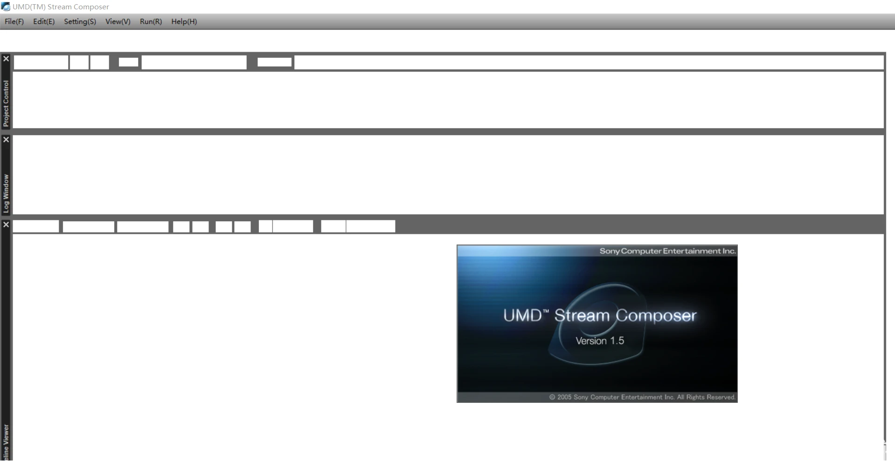

经过在外网反复搜索，其实有个非常简单粗暴的解决办法，就是将UmdStreamComposer.exe改名，我这里是改成了Composer.exe，改完之后就不会闪退了。

如果报找不到某某DLL的错误，只需要将runtime文件夹中的三个DLL文件复制到bin文件夹中，就不会报错了。

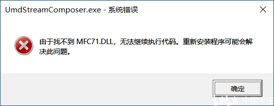

复制这三个DLL到bin文件夹

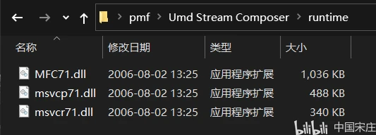

如果报下面这个错误，表示软件在当前设备下不支持预览，没关系，我们不需要预览，点确定就行。

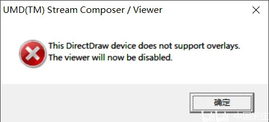

### 2. 新建项目

软件运行起来以后，点击左上方的New，弹出Create new clip窗口，Clip name和Project name随便填写，Comment可以不填，点击下一页。

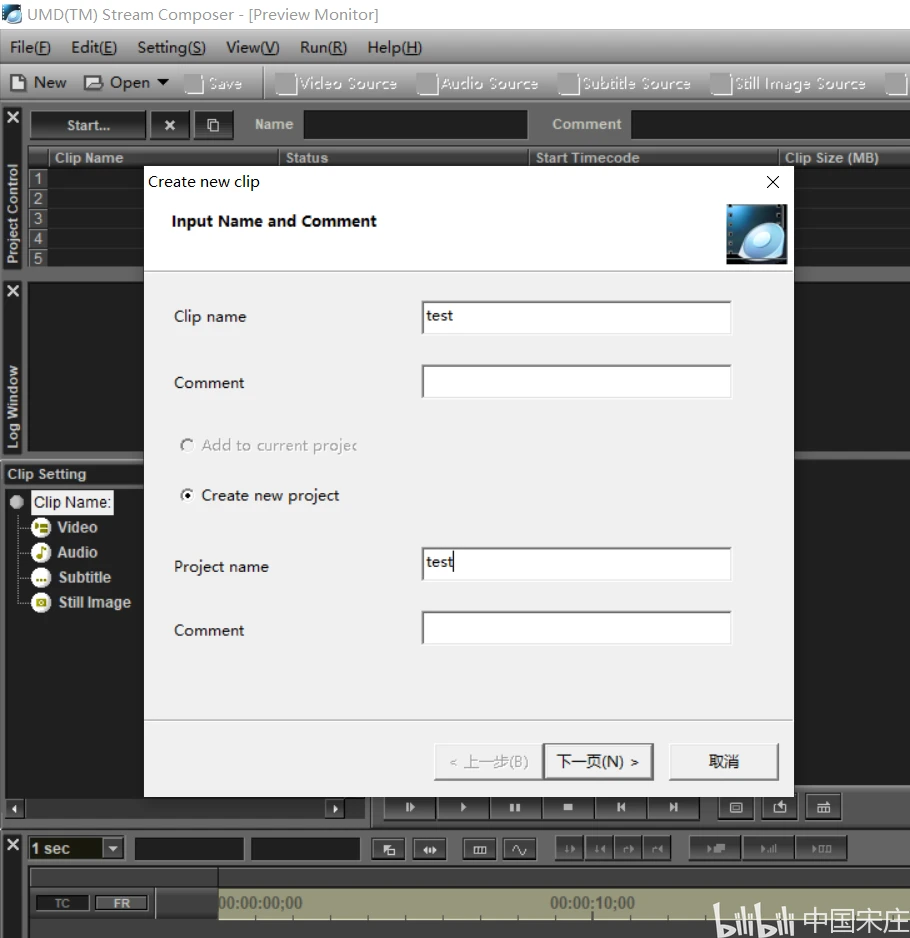

勾选PSP Movie Format选项，点击完成。（如果不勾选PSP Movie Format，后续无法添加视频源。）


### 3. 导入视频源和音频源

点击工具栏的Video Source，弹出Video Source Setting窗口，点击Open，选择准备好的AVI文件，再点击OK。

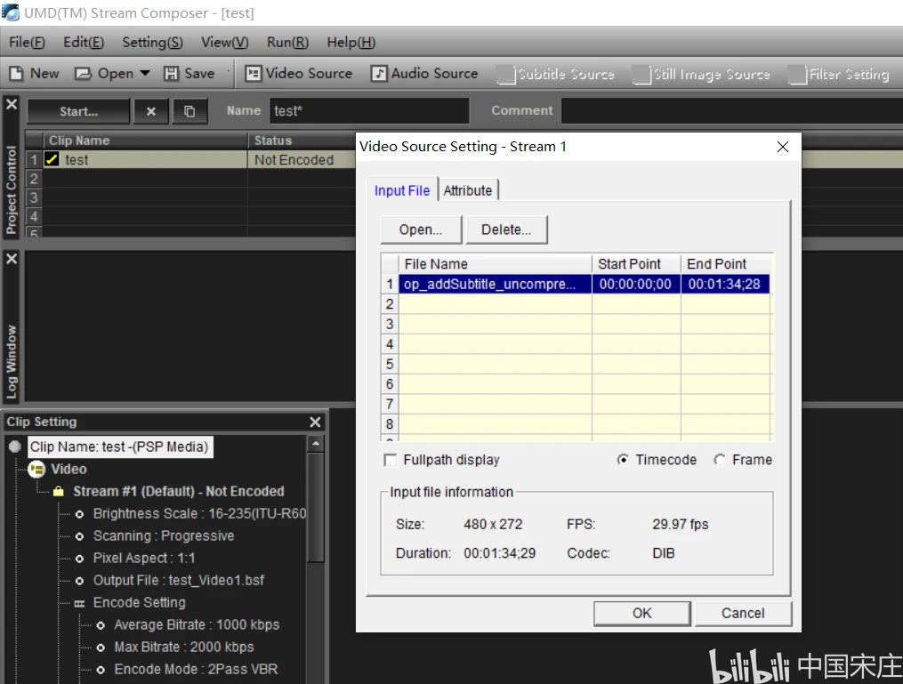

点击工具栏的Audio Source，弹出Audio Source Setting窗口，点击Open，选择准备好的WAV文件，再点击OK。

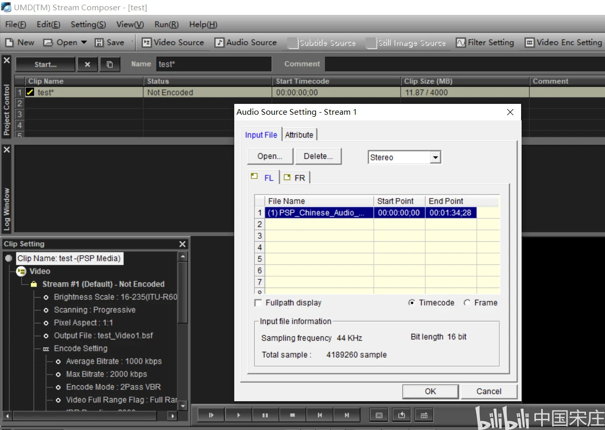

### 4. 编码

如果AVI和WAV文件都符合要求，在下方的Timeline Viewer窗口中会出现1条Video轨道和2条Audio轨道，两条Audio轨道分别表示左右声道（如果导入的WAV是单声道，这里可能只有一条轨道，未测试）。至于那两个黄灯是什么意思，我也没弄明白，反正不用管。网上还说要把黄灯左边的灯点绿，我猜测那是在有多条轨道时，设定默认轨道用的，这里就不点了。

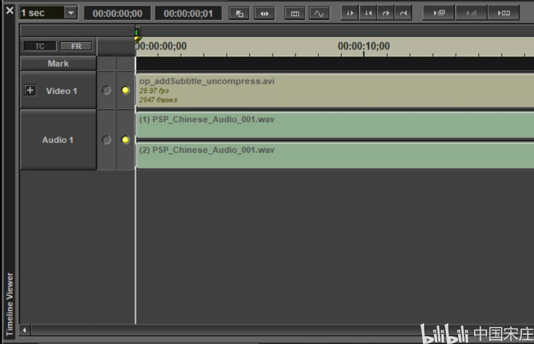

以上准备就绪后，点击菜单栏Run下面的Encode+Multiplex，弹出Project Progress窗口。

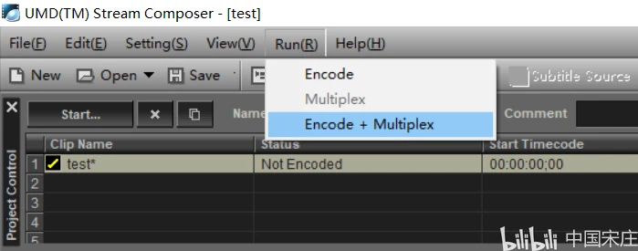

这里有三个进度条，其中Stream1 (2Pass)这个是最慢的，我测试的视频时长1分多钟，这里编码用了几十秒吧。

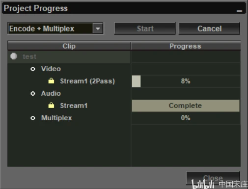

等到三个进度条都变成Complete时，编码就完成了。Umd Stream Composer的任务结束。

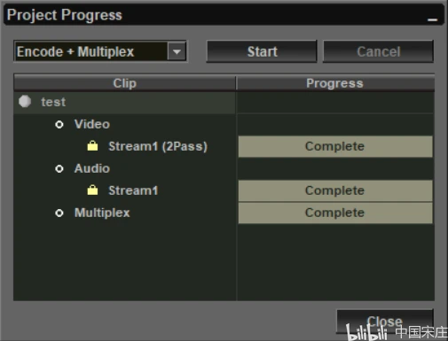

### 5. 重封装

打开我的文档\UmdStreamComposer\MuxWork\项目名称\00001目录，这里有一个00001.MPS文件。没有的话，说明前面编码没有成功。

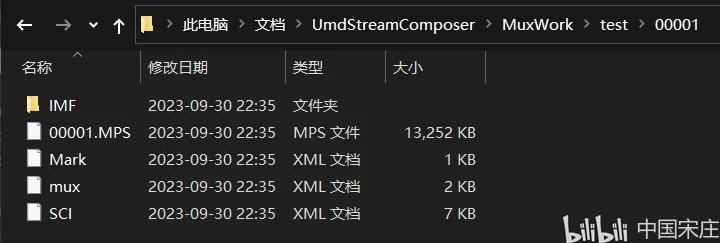

运行PMFCreater，点击左边的browse选择00001.MPS，点击右边的browse选择保存PMF文件的路径，Total Time下面的M或S随便填写一个数字，这里在M处填了1，不管填多少，都没有影响。然后点击Convert。

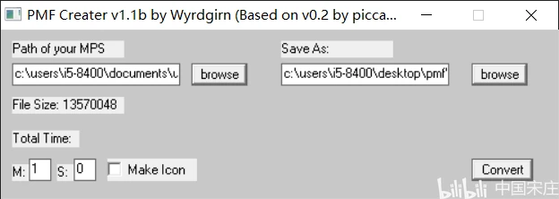

弹出Done提示，转换完成，在目标路径下找到PMF文件。

### 6. 测试

把PMF文件拖动到完美解码图标上即可播放视频，如果要测试音频，需要将PMF文件替换ISO中的原文件（一般是用WQSG_UMD，此处不赘述），再用实机或模拟器运行ISO。这里用PPSSPP测试视频和音频都是正常的。

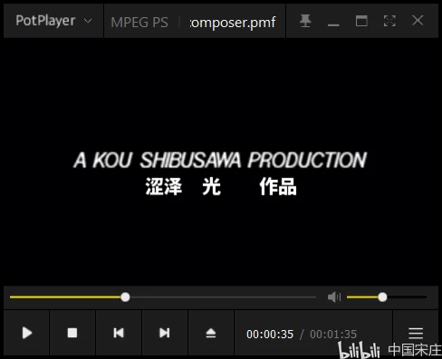

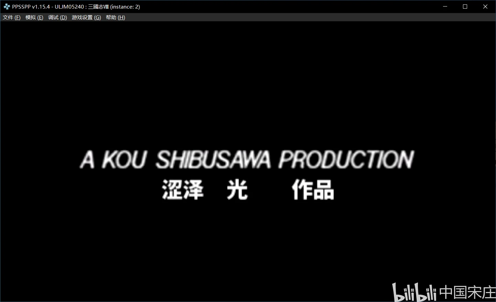

## 四、其他说明

以上步骤，除了特别提到的之外，都是使用软件默认设置，即视频平均比特率1000kbps、最大比特率2000kbps、编码模式2PassVBR，音频编码ATRAC3plus、44.1KHZ 2CH、128kbps，测试的视频编码后比ISO中的原视频略小，可以正常替换而不用重新生成ISO。

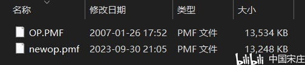

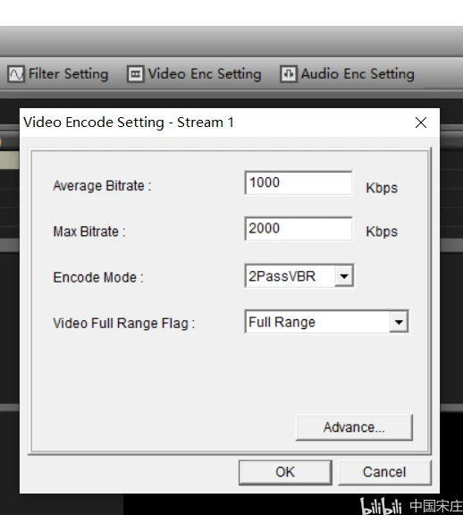

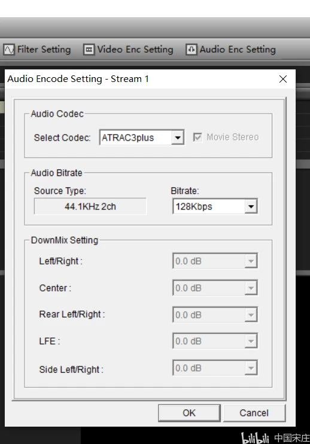

如果调高了码率导致文件变大，就不能直接替换原文件了，只能重新生成ISO。当然也可以调低码率达到ISO瘦身的目的，不过应该不会有人这么做了吧。

（完）

mszl100

2023.10.01

## 一些补充

补充一些up文本中个人需要补充稳妥的Tips哈：

*我已踩坑的记录。

导出视频后，可以任意修改视频，建议还是h264输出mp4 480*272

关键准备的avi和分轨的音频wav，防止反复徘徊在Umd Stream Composer导出失败。

1. 建议直接用ffmpeg标准处理，用如下命令，绝对稳妥。

```batch
ffmpeg -i 已修改过的视频.mp4  -map 0:0 -vf scale=480:272:flags=lanczos -vb 4M 输出的avi视频.avi
```

```batch
ffmpeg -i 已修改过的视频.mp4 -ar 44100 分离出的音轨.wav
```

2. Umd Stream Composer操作时，按照文本的选择，请注意：

创建项目勾选PSP Movie Format那个界面的“Max Clip Size ”，建议最好填写你期望的视频最大字节长度。*尤其是汉化或修改文件大小影响其他流程ISO文件偏移量的操作。

建议最好小于源文件大小。

（拷贝Runtime后在启动Umd Stream Composer在非WinXP系统启动闪退时，按文本说的修改exe名字，或者直接删掉“UmdStreamComposer.exe.manifest”均可。win10/Win11启动后，弹出Windows安装功能时候，点跳过，则可以继续使用）

3. 编码生成之前，建议设置【Video Enc Setting】平均码率，和最大码率。这样可保证文件大小可控的情况下，尽可能保证视频效果。

顺带PMF Create中建议M和S都填上，比如原视频是1分39秒，那么就1M39S，稳妥一些。

按照我的个人建议，不会出问题。希望帮到大家