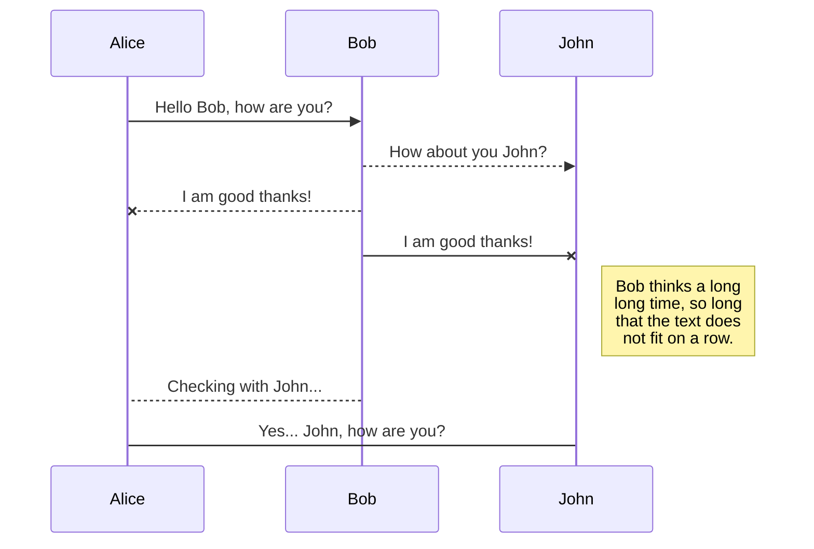

import AuthorCard from '@site/src/components/AuthorCard';

<AuthorCard authors={['半个水果']} />

如标题，加粗，链接等基本语法可以看下面的文档，这里不再赘述。

[Markdown 基本语法](https://markdown.com.cn/basic-syntax)

## 黑幕
本站添加了萌娘百科的黑幕功能。
似乎只能用在Markdown编辑器

```
<span class="heimu" title="你知道的太多了">本站添加了萌娘百科的黑幕功能。</span>
```
鼠标移动到下面的黑幕看看效果。

<span class="heimu" title="你知道的太多了">本站添加了萌娘百科的黑幕功能。</span>

## 引用块

```js
> Lorem ipsum dolor sit amet
> Consectetur adipiscing elit
```

> Lorem ipsum dolor sit amet
> Consectetur adipiscing elit

### 带样式

````js
> 默认

> 信息
{.is-info}

> 成功
{.is-success}

> 警告
{.is-warning}

> 危险
{.is-danger}

````

## 加粗
可使用快捷键<kbd>Ctrl</kbd> + <kbd>B</kbd>
具体基本语法可看[基本语法](#基本语法)部分。

## 代码块
默认情况下，代码块呈现为纯文本。但是，最好使用语法高亮来编程代码，这样可以更轻松地阅读。要指定代码块中使用的编程语言，只需在开头的三重反引号之后添加 language 关键字：

````js
```js
function lorem (ipsum) {
	const dolor = 'consectetur adipiscing elit'
}
```
````
以上渲染为：

```js
function lorem (ipsum) {
	const dolor = 'consectetur adipiscing elit'
}
```

## 页面横向表格

```
# Tabs {.tabset}
## First Tab

Any content here will go into the first tab...

## Second Tab

Any content here will go into the second tab...

## Third Tab

Any content here will go into the third tab...
```

## Emojis
查看[完整的Emojis列表](https://www.webfx.com/tools/emoji-cheat-sheet)。
```markdown
:apple:

Can be also be used :fire: inline
```

:apple:

Can be also be used :fire: inline

## 脚注
所有脚注均显示在页面底部，点击注释序号可跳转。

```
This sentence[^1] needs a few footnotes.[^2]

[^1]: A string of syntactic words.
[^2]: A useful example sentence.
```

This sentence[^1] needs a few footnotes.[^2]

[^1]: A string of syntactic words.
[^2]: A useful example sentence.

## 大标题
参见[基本语法](#基本语法)。

## 水平分割线

```
Lorem ipsum dolor

---

Consectetur adipiscing elit
```

Lorem ipsum dolor

---

Consectetur adipiscing elit

## 图片
可以直接使用直接的图片链接

```
  图片带描述

Consectetur  elit    行内图片

有些图片过大，可以指定图片尺寸：


也可以省略的一个值以自动保留图像的比例：


也可以使用其他单位，如 % 有时需要把图像填充满：


对于图片对齐，需使用标签

其中align为对齐方式，有如下几种：
left  靠左
right 靠右
middle 居中
width和height为宽和高，数值可以是百分数或者是具体数字。
```

## 行内代码

```
Lorem `ipsum` dolor
```
Lorem `ipsum` dolor

## 斜体

```
Lorem *ipsum* dolor
```

Lorem *ipsum* dolor

## 键盘按键

```
Lorem ipsum dolor <kbd>CTRL</kbd> + <kbd>C</kbd>
```

Lorem ipsum dolor <kbd>CTRL</kbd> + <kbd>C</kbd>

## 链接

```
[Lorem ipsum](https://wiki.js.org/about)

Consectetur [adipiscing](/install/requirements) elit
```

[Lorem ipsum](https://wiki.js.org/about)

Consectetur [adipiscing](/install/requirements) elit

### 带样式

```
- [Markdown 基本语法*Markdown 是一种轻量级的标记语言*](https://markdown.com.cn/basic-syntax)
{.links-list}
```

## 美人鱼图

[Mermaid website](https://mermaid-js.github.io/mermaid)
````

````


## 有序列表

```
1. Lorem ipsum dolor sit amet
1. Consectetur adipiscing elit
1. Morbi vehicula aliquam
```

1. Lorem ipsum dolor sit amet
1. Consectetur adipiscing elit
1. Morbi vehicula aliquam

## PlantUML图
[PlantUML website](https://plantuml.com)

````
```plantuml
Bob->Alice : hello
```
````

## 删除线
参看[基本语法](#基本语法)
```
Lorem ~~ipsum~~ dolor
```

Lorem ~~ipsum~~ dolor

## 下标

```
Lorem ~ipsum~ dolor

Lorem <sub>ipsum</sub> dolor
```

Lorem ~ipsum~ dolor

Lorem <sub>ipsum</sub> dolor

## 上标

```
Lorem ^ipsum^ dolor

Lorem <sup>ipsum</sup> dolor
```

Lorem ^ipsum^ dolor

Lorem <sup>ipsum</sup> dolor

## 表格

```
| Header 1 | Header 2 | Header 3 |
|----------|----------|----------|
| Foo      | Bar      | Xyz      |
| Abc      | Def      | 123      |
```

| Header 1 | Header 2 | Header 3 |
|----------|----------|----------|
| Foo      | Bar      | Xyz      |
| Abc      | Def      | 123      |

### 带样式

通过在表格后面的单独行上添加`{.dense}`，可以使表格使用较小的字体和较小的填充：
```
| Header 1 | Header 2 | Header 3 |
|----------|----------|----------|
| Foo      | Bar      | Xyz      |
| Abc      | Def      | 123      |
{.dense}
```

## 任务清单

```
- [x] Checked task item
- [x] Another checked task item
- [ ] Unchecked task item
```
- [x] Checked task item
- [x] Another checked task item
- [ ] Unchecked task item

## 无序列表

```
- Lorem ipsum dolor sit amet
- Consectetur adipiscing elit
- Morbi vehicula aliquam
```

- Lorem ipsum dolor sit amet
- Consectetur adipiscing elit
- Morbi vehicula aliquam

### 带样式

```
- Grid Item 1
- Grid Item 2
- Grid Item 3
{.grid-list}

还有

- [Lorem ipsum dolor sit amet *Subtitle description here*](https://www.google.com)
- [Consectetur adipiscing elit *Another subtitle description here*](https://www.google.com)
- [Morbi vehicula aliquam *Third subtitle description here*](https://www.google.com)
{.links-list}
```