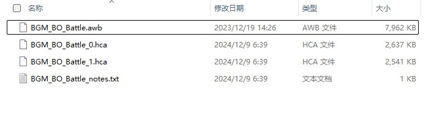
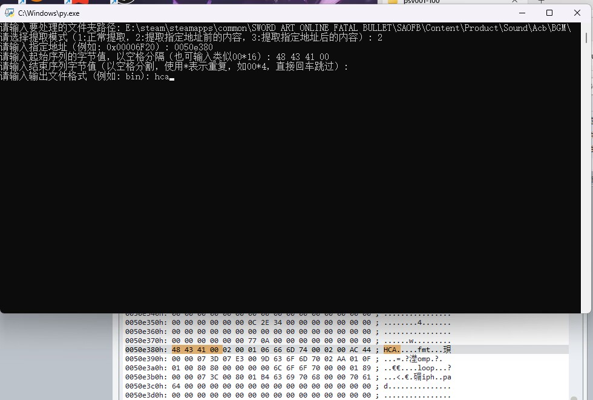

import AuthorCard from '@site/src/components/AuthorCard';

<AuthorCard authors={['半个水果','偷吃布丁的涅普缇努']} />

在使用这些脚本之前，请确认已经安装了Python
如果没有，请到官网下载。由于为外网，网页可能打不开[Download Python](https://www.python.org/downloads)

自行复制代码，再粘贴到一个文本文件内，然后把`.txt`后缀改为`.py`

## 3dstool自动解包

3ds解包脚本，使用任天堂toolbox有时候仍然解不开一些3ds游戏，不得不再次使用3dstool去解，由于它这个命令解包太复杂，所以制作了个脚本，可以很轻松搞定3ds游戏的解包流程。

使用之前，先安装依赖：

```Python
pip install tkinterdnd2 -i https://pypi.tuna.tsinghua.edu.cn/simple
```

该程序源码：

```Python showLineNumbers
import tkinter as tk
from tkinter import filedialog
import subprocess
import os

def extract_partition(file_path, rom_folder, partition_number):
    # 提取指定分区
    partition_folder = os.path.join(rom_folder, f'cfa{partition_number}')
    os.makedirs(partition_folder, exist_ok=True)

    partition_command = f'3dstool -xvt{partition_number}f cci "{partition_folder}\\{partition_number}.cfa" "{file_path}"'
    partition_process = subprocess.run(partition_command, shell=True, stdout=subprocess.PIPE, stderr=subprocess.PIPE, text=True)
    print(partition_process.stdout)

    # 提取分区头和romfs
    cfa_command = f'3dstool -xvtf cfa "{partition_folder}\\{partition_number}.cfa" --header "{partition_folder}\\ncchheader.bin" --romfs "{partition_folder}\\romfs.bin"'
    cfa_process = subprocess.run(cfa_command, shell=True, stdout=subprocess.PIPE, stderr=subprocess.PIPE, text=True)
    print(cfa_process.stdout)

    # 解压romfs
    romfs_bin_path = os.path.join(partition_folder, 'romfs.bin')
    romfs_folder = os.path.join(partition_folder, 'romfs')
    romfs_command = f'3dstool -xvtf romfs "{romfs_bin_path}" --romfs-dir "{romfs_folder}"'
    romfs_process = subprocess.run(romfs_command, shell=True, stdout=subprocess.PIPE, stderr=subprocess.PIPE, text=True)
    print(romfs_process.stdout)

def extract_exefs(exefs_bin_path, exh_bin_path, exefs_folder):
    # 检查exefs是否需要-u参数
    with open(exh_bin_path, 'rb') as exh_file:
        exh_data = exh_file.read(0x10)
        use_u = exh_data[0x0D] == 1

    # 提取exefs
    exefs_command = f'3dstool -{"xvtfu" if use_u else "xvtf"} exefs "{exefs_bin_path}" --exefs-dir "{exefs_folder}"'
    exefs_process = subprocess.run(exefs_command, shell=True, stdout=subprocess.PIPE, stderr=subprocess.PIPE, text=True)
    print(exefs_process.stdout)

def extract_3ds():
    # 获取用户选择的文件
    file_path = filedialog.askopenfilename(filetypes=[("3DS files", "*.3ds")])
    if not file_path:
        return

    # 获取文件所在目录和文件名
    dir_path = os.path.dirname(file_path)
    file_name = os.path.splitext(os.path.basename(file_path))[0]

    # 创建与ROM同名的文件夹
    rom_folder = os.path.join(dir_path, file_name)
    os.makedirs(rom_folder, exist_ok=True)

    # 执行3dstool命令提取cci
    cci_command = f'3dstool -xvt0f cci "{rom_folder}\\0.cxi" "{file_path}" --header "{rom_folder}\\ncsdheader.bin"'
    cci_process = subprocess.run(cci_command, shell=True, stdout=subprocess.PIPE, stderr=subprocess.PIPE, text=True)
    print(cci_process.stdout)

    # 检查未解压的分区并提取
    if 'INFO: partition 1' in cci_process.stdout:
        extract_partition(file_path, rom_folder, '1')
    if 'INFO: partition 7' in cci_process.stdout:
        extract_partition(file_path, rom_folder, '7')

    # 创建cxi0子文件夹并提取cxi/cfa
    cxi0_folder = os.path.join(rom_folder, 'cxi0')
    os.makedirs(cxi0_folder, exist_ok=True)

    cxi_command = f'3dstool -xvtf cxi "{rom_folder}\\0.cxi" --header "{cxi0_folder}\\ncchheader.bin" --exh "{cxi0_folder}\\exh.bin" --plain "{cxi0_folder}\\plain.bin" --exefs "{cxi0_folder}\\exefs.bin" --romfs "{cxi0_folder}\\romfs.bin"'
    cxi_process = subprocess.run(cxi_command, shell=True, stdout=subprocess.PIPE, stderr=subprocess.PIPE, text=True)
    print(cci_process.stdout)

    # 解压cxi0文件夹中的romfs.bin和exefs.bin
    romfs_bin_path = os.path.join(cxi0_folder, 'romfs.bin')
    exefs_bin_path = os.path.join(cxi0_folder, 'exefs.bin')
    exh_bin_path = os.path.join(cxi0_folder, 'exh.bin')
    romfs_folder = os.path.join(cxi0_folder, 'romfs')
    exefs_folder = os.path.join(cxi0_folder, 'exefs')

    # 解压romfs.bin
    romfs_command = f'3dstool -xvtf romfs "{romfs_bin_path}" --romfs-dir "{romfs_folder}"'
    romfs_process = subprocess.run(romfs_command, shell=True, stdout=subprocess.PIPE, stderr=subprocess.PIPE, text=True)
    print(romfs_process.stdout)

    # 解压exefs.bin
    extract_exefs(exefs_bin_path, exh_bin_path, exefs_folder)

    print(f"Extraction complete for {file_name}")

def on_button_click():
    extract_3ds()

# 创建主窗口
root = tk.Tk()
root.title("3ds游戏解包")
root.geometry("600x300")
root.resizable(True, True)

# 创建按钮并绑定点击事件
extract_button = tk.Button(root, text="Extract 3DS File", command=on_button_click)
extract_button.pack(pady=20)

# 启动事件循环
root.mainloop()
```

然后双击打开脚本，选择你要解的3ds游戏rom，就ok了，它会自动创建个跟rom名字一样的文件夹，然后剩下就全程自动解里面的`cxi`和`romfs.bin`，并提取`romfs.bin`里面的所有资源。

## 提取图片

二进制数据读取，批量提取游戏里面存储的png、jpg、dds和webp图片，任何没有使用特殊加密的游戏都可以解出来。

分为四个文件：

`ddsextract.py`
`jpgextract.py`
`pngextract.py`
`webpextract.py`

视频讲解：[读取二进制数据，自制脚本提取图片](https://www.bilibili.com/video/BV1dU22YUE6X)

`ddsextract.py`

```Python showLineNumbers
import os

def extract_dds_content(file_path, directory_path, start_sequence, end_sequence):
    with open(file_path, 'rb') as file:
        content = file.read()
        count = 0
        start_index = 0  # 从文件开头开始

        while start_index < len(content):
            # 查找文件头
            start_index = content.find(start_sequence, start_index)
            if start_index == -1:
                print(f"No more start sequences found in {file_path}")
                break

            # 查找下一个文件头
            next_start_index = content.find(start_sequence, start_index + len(start_sequence))
            if next_start_index == -1:
                end_index = len(content)
            else:
                end_index = next_start_index

            # 提取从当前文件头到下一个文件头之前的内容
            extracted_data = content[start_index:end_index]
            # 生成新的文件名
            new_filename = f"{os.path.splitext(os.path.basename(file_path))[0]}_extracted_{count}.dds"
            new_filepath = os.path.join(directory_path, new_filename)
            # 保存到新文件
            with open(new_filepath, 'wb') as new_file:
                new_file.write(extracted_data)
            print(f"Extracted content saved as: {new_filepath}")
            count += 1

            # 更新内容，继续查找
            start_index = next_start_index

def main():
    directory_path = input("请输入要处理的文件夹路径: ")
    if not os.path.isdir(directory_path):
        print(f"错误: {directory_path} 不是一个有效的目录。")
        return

    start_sequence = b'\x44\x44\x53\x20\x7C'  # DDS file header
    end_sequence = b'\x44\x44\x53\x20\x7C'  # Next DDS file header

    for root, dirs, files in os.walk(directory_path):
        for file in files:
            file_path = os.path.join(root, file)
            print(f"Processing file: {file_path}")
            extract_dds_content(file_path, directory_path, start_sequence, end_sequence)

if __name__ == "__main__":
    main()
```

`jpgextract.py`

```Python showLineNumbers
import os

def is_valid_jpg(data):
    # JPEG文件的开始标记
    start_marker = b'\xFF\xD8\xFF\xE0'
    # JPEG文件的结束标记
    end_marker = b'\xFF\xD9'
    # 数据块标记（JFIF或EXIF）
    block_markers = [b'JFIF', b'Exif']

    # 检查JPEG文件的开始标记
    if not data.startswith(start_marker):
        return None

    # 检查数据块开始标记
    for block_marker in block_markers:
        block_index = data.find(block_marker)
        if block_index != -1:
            # 检查文件尾标记
            end_index = data.find(end_marker, block_index)
            if end_index != -1:
                # 提取JPEG数据
                return data[:end_index + len(end_marker)]
    return None

def find_jpg_in_file(file_path):
    with open(file_path, 'rb') as file:
        file_content = file.read()
        jpg_start = file_content.find(b'\xFF\xD8\xFF\xE0')
        jpgs = []
        while jpg_start != -1:
            # 从文件头开始查找有效的JPEG数据
            jpg_data = is_valid_jpg(file_content[jpg_start:])
            if jpg_data:
                jpgs.append(jpg_data)
            # 移动到下一个可能的文件头位置
            jpg_start = file_content.find(b'\xFF\xD8\xFF\xE0', jpg_start + len(b'\xFF\xD8\xFF\xE0'))
        return jpgs

def extract_jpgs(directory_path):
    total_jpgs_extracted = 0
    for root, dirs, files in os.walk(directory_path):
        for file in files:
            file_path = os.path.join(root, file)
            # Skip Python files and files containing 'disabled'
            if file.endswith('.py') or 'disabled' in file.lower():
                continue

            jpgs = find_jpg_in_file(file_path)
            for index, jpg_data in enumerate(jpgs):
                base_filename, _ = os.path.splitext(file)
                extracted_filename = f'{base_filename}_extracted_{index}.jpg'
                extracted_path = os.path.join(root, extracted_filename)
                with open(extracted_path, 'wb') as jpg_file:
                    jpg_file.write(jpg_data)
                total_jpgs_extracted += 1

    return total_jpgs_extracted

def main():
    directory_path = input("请输入要处理的文件夹路径: ")
    if not os.path.isdir(directory_path):
        print(f"错误: {directory_path} 不是一个有效的目录。")
        return

    total_jpgs_extracted = extract_jpgs(directory_path)
    print(f"Total jpgs extracted: {total_jpgs_extracted}")

if __name__ == "__main__":
    main()
```

`pngextract.py`

```Python showLineNumbers
import os
import struct

def extract_content(file_path, directory_path, start_sequence, block_marker, end_sequence):
    with open(file_path, 'rb') as file:
        content = file.read()
        start_index = content.find(start_sequence)
        while start_index!= -1:
            sub_content = content[start_index:]
            end_marker_index = sub_content.find(end_sequence)
            if end_marker_index == -1:
                break

            extracted_data = sub_content[:end_marker_index + len(end_sequence)]
            if block_marker in extracted_data:
                new_filename = f"{os.path.splitext(os.path.basename(file_path))[0]}_{len(os.listdir(directory_path))}.png"
                new_filepath = os.path.join(directory_path, new_filename)
                os.makedirs(os.path.dirname(new_filepath), exist_ok=True)
                with open(new_filepath, 'wb') as new_file:
                    new_file.write(extracted_data)
                print(f"Extracted content saved as: {new_filepath}")

            content = content[start_index + len(start_sequence):]
            start_index = content.find(start_sequence)

def main():
    directory_path = input("请输入要处理的文件夹路径: ")
    if not os.path.isdir(directory_path):
        print(f"错误: {directory_path} 不是一个有效的目录。")
        return

    start_sequence = b'\x89\x50\x4E\x47'
    block_marker = b'\x49\x48\x44\x52'
    end_sequence = b'\x00\x00\x00\x49\x45\x4E\x44\xAE\x42\x60\x82'

    for root, dirs, files in os.walk(directory_path):
        for file in files:
            file_path = os.path.join(root, file)
            if not file.endswith(('.py', '.png')):
                print(f"Processing file: {file_path}")
                extract_content(file_path, directory_path, start_sequence, block_marker, end_sequence)

if __name__ == "__main__":
    main()
```

`webpextract.py`

```Python showLineNumbers
import os
import struct

def extract_webp_data(file_content):
    riff_header = b'\x52\x49\x46\x46'
    webp_header = b'\x57\x45\x42\x50'

    # 跳过第一个文件头之前的内容
    file_content = file_content[file_content.find(riff_header):]

    webp_data_start = file_content.find(riff_header)
    while webp_data_start != -1:
        # 检查文件大小
        file_size = struct.unpack('<I', file_content[webp_data_start + 4:webp_data_start + 8])[0]
        # 检查 WEBP 标记
        if file_content[webp_data_start + 8:webp_data_start + 12] == webp_header:
            # 提取 WebP 图像数据
            webp_data = file_content[webp_data_start:webp_data_start + file_size + 8]
            yield webp_data
        # 移动到下一个 RIFF 标记的位置
        webp_data_start = file_content.find(riff_header, webp_data_start + file_size + 8)

def extract_webps_from_file(file_path):
    with open(file_path, 'rb') as file:
        file_content = file.read()

    webp_data_generator = extract_webp_data(file_content)
    count = 0
    for webp_data in webp_data_generator:
        # 保存 WebP 数据到文件
        base_filename, _ = os.path.splitext(os.path.basename(file_path))
        extracted_filename = f"{base_filename}_{count}.webp"
        extracted_path = os.path.join(os.path.dirname(file_path), extracted_filename)
        with open(extracted_path, 'wb') as output_file:
            output_file.write(webp_data)
        print(f"Extracted content saved as: {extracted_path}")
        count += 1

def extract_webps(directory_path):
    for root, dirs, files in os.walk(directory_path):
        for file in files:
            # 跳过.py文件
            if file.endswith('.py'):
                continue
            file_path = os.path.join(root, file)
            extract_webps_from_file(file_path)

def main():
    directory_path = input("请输入要处理的文件夹路径: ")
    if not os.path.isdir(directory_path):
        print(f"错误: {directory_path} 不是一个有效的目录。")
        return

    extract_webps(directory_path)
    print("WebP 文件提取完成。")

if __name__ == "__main__":
    main()
```

## 万能二进制提取





`万能二进制提取.py`

```Python showLineNumbers
import os
import sys

def extract_content_normal(file_path, start_sequence_bytes, end_sequence=None, output_format='bin'):
    try:
        with open(file_path, 'rb') as f:
            content = f.read()
    except IOError as e:
        print(f"无法读取文件 {file_path}，错误信息：{e}")
        return

    count = 0
    start_index = 0
    notes = []

    while start_index < len(content):
        start_index = content.find(start_sequence_bytes, start_index)
        if start_index == -1:
            print(f"No more start sequences found in {file_path}")
            break

        end_index = get_end_index(content, start_index, end_sequence, start_sequence_bytes)

        extracted_data = content[start_index:end_index]
        new_filename = f"{os.path.splitext(os.path.basename(file_path))[0]}_{count}.{output_format}"
        new_filepath = os.path.join(os.path.dirname(file_path), new_filename)
        try:
            with open(new_filepath, 'wb') as new_file:
                new_file.write(extracted_data)
        except IOError as e:
            print(f"无法写入文件 {new_filepath}，错误信息：{e}")
            continue
        print(f"Extracted content saved as: {new_filepath}")

        notes.append(f"File: {new_filepath}, Start Address: {start_index}, End Address: {end_index}")
        count += 1
        start_index = end_index

    save_notes(file_path, notes)

def extract_content_repeat(file_path, start_sequence_bytes, end_sequence=None, output_format='bin', min_repeat_count=0):
    try:
        with open(file_path, 'rb') as f:
            content = f.read()
    except IOError as e:
        print(f"无法读取文件 {file_path}，错误信息：{e}")
        return

    count = 0
    start_index = 0
    notes = []

    while start_index < len(content):
        start_index = content.find(start_sequence_bytes, start_index)
        if start_index == -1:
            print(f"No more start sequences found in {file_path}")
            break

        end_index = find_end_index(content, start_index, end_sequence, min_repeat_count, start_sequence_bytes)

        extracted_data = content[start_index:end_index]
        new_filename = f"{os.path.splitext(os.path.basename(file_path))[0]}_{count}.{output_format}"
        new_filepath = os.path.join(os.path.dirname(file_path), new_filename)
        try:
            with open(new_filepath, 'wb') as new_file:
                new_file.write(extracted_data)
        except IOError as e:
            print(f"无法写入文件 {new_filepath}，错误信息：{e}")
            continue
        print(f"Extracted content saved as: {new_filepath}")

        notes.append(f"File: {new_filepath}, Start Address: {start_index}, End Address: {end_index}")
        count += 1
        start_index = end_index

    save_notes(file_path, notes)

def extract_before_address(file_path, target_address, start_sequence_bytes, end_sequence=None, output_format='bin',
                            min_repeat_count=0):
    try:
        with open(file_path, 'rb') as f:
            content = f.read()
    except IOError as e:
        print(f"无法读取文件 {file_path}，错误信息：{e}")
        return

    target_index = int(target_address, 16)
    if target_index > len(content):
        print(f"指定地址 {target_address} 超出文件范围，无法提取。")
        return

    count = 0
    start_index = 0
    notes = []

    while start_index < len(content) and start_index < target_index:
        start_index = content.find(start_sequence_bytes, start_index)
        if start_index == -1:
            print(f"No more start sequences found in {file_path} before the target address")
            break

        end_index = get_end_index(content, start_index, end_sequence, start_sequence_bytes)

        extracted_data = content[start_index:end_index]
        new_filename = f"{os.path.splitext(os.path.basename(file_path))[0]}_{count}.{output_format}"
        new_filepath = os.path.join(os.path.dirname(file_path), new_filename)
        try:
            with open(new_filepath, 'wb') as new_file:
                new_file.write(extracted_data)
        except IOError as e:
            print(f"无法写入文件 {new_filepath}，错误信息：{e}")
            continue
        print(f"Extracted content saved as: {new_filepath}")

        notes.append(f"File: {new_filepath}, Start Address: {start_index}, End Address: {end_index}")
        count += 1
        start_index = end_index

    save_notes(file_path, notes)

def extract_after_address(file_path, target_address, start_sequence_bytes, end_sequence=None, output_format='bin',
                           min_repeat_count=0):
    try:
        with open(file_path, 'rb') as f:
            content = f.read()
    except IOError as e:
        print(f"无法读取文件 {file_path}，错误信息：{e}")
        return

    target_index = int(target_address, 16)
    if target_index > len(content):
        print(f"指定地址 {target_address} 超出文件范围，无法提取。")
        return

    count = 0
    start_index = target_index
    notes = []

    while start_index < len(content):
        start_index = content.find(start_sequence_bytes, start_index)
        if start_index == -1:
            print(f"No more start sequences found in {file_path} after the target address")
            break

        end_index = get_end_index(content, start_index, end_sequence, start_sequence_bytes)

        extracted_data = content[start_index:end_index]
        new_filename = f"{os.path.splitext(os.path.basename(file_path))[0]}_{count}.{output_format}"
        new_filepath = os.path.join(os.path.dirname(file_path), new_filename)
        try:
            with open(new_filepath, 'wb') as new_file:
                new_file.write(extracted_data)
        except IOError as e:
            print(f"无法写入文件 {new_filepath}，错误信息：{e}")
            continue
        print(f"Extracted content saved as: {new_filepath}")

        notes.append(f"File: {new_filepath}, Start Address: {start_index}, End Address: {end_index}")
        count += 1
        start_index = end_index

    save_notes(file_path, notes)

def get_extraction_parameters():
    start_sequence_input = input("请输入起始序列的字节值，以空格分隔（也可输入类似00*16）: ")
    start_sequence_bytes = parse_start_sequence(start_sequence_input)
    end_sequence_input = input("请输入结束序列字节值（以空格分割，使用*表示重复，如00*4，直接回车跳过）: ")
    use_repeat_method = False
    min_repeat_count = 0
    if end_sequence_input:
        end_sequence_bytes = parse_end_sequence(end_sequence_input)
        if '*' not in end_sequence_input and len(end_sequence_bytes) == 1:
            try:
                min_repeat_count = int(input("请输入最小重复字节数量作为结束条件: "))
                use_repeat_method = True
            except:
                pass
    else:
        end_sequence_bytes = None
    output_format = input("请输入输出文件格式 (例如: bin): ")
    return start_sequence_bytes, end_sequence_bytes, use_repeat_method, min_repeat_count, output_format

def get_end_index(content, start_index, end_sequence, start_sequence_bytes):
    if end_sequence:
        end_index = content.find(end_sequence, start_index + len(start_sequence_bytes))
        if end_index == -1:
            end_index = len(content)
        else:
            end_index += len(end_sequence)
    else:
        next_start_index = content.find(start_sequence_bytes, start_index + len(start_sequence_bytes))
        end_index = next_start_index if next_start_index!= -1 else len(content)
    return end_index

def save_notes(file_path, notes):
    notes_filename = f"{os.path.splitext(os.path.basename(file_path))[0]}_notes.txt"
    notes_filepath = os.path.join(os.path.dirname(file_path), notes_filename)
    with open(notes_filepath, 'w') as notes_file:
        for note in notes:
            notes_file.write(note + '\n')
    print(f"Notes saved as: {notes_filepath}")

def parse_start_sequence(start_sequence_input):
    if '*' in start_sequence_input:
        parts = start_sequence_input.split('*')
        byte_value = bytes.fromhex(parts[0].replace(' ', ''))
        repeat_count = int(parts[1])
        return byte_value * repeat_count
    else:
        return bytes.fromhex(start_sequence_input.replace(' ', ''))

def parse_end_sequence(end_sequence_input):
    parts = end_sequence_input.split()
    result = b""
    for part in parts:
        if '*' in part:
            sub_parts = part.split('*')
            byte_value = bytes.fromhex(sub_parts[0].replace(' ', ''))
            repeat_count = int(sub_parts[1])
            result += byte_value * repeat_count
        else:
            result += bytes.fromhex(part.replace(' ', ''))
    return result

def find_end_index(content, start_index, end_sequence, min_repeat_count, start_sequence_bytes):
    if end_sequence is None:
        next_start_index = content.find(start_sequence_bytes, start_index + 1)
        if next_start_index == -1:
            return len(content)
        else:
            return next_start_index
    else:
        if min_repeat_count == 0:
            end_index = content.find(end_sequence, start_index + 1)
            if end_index == -1:
                return len(content)
            else:
                return end_index + len(end_sequence)
        else:
            byte_value = end_sequence[0]
            repeat_count = 0
            current_index = start_index + 1
            while current_index < len(content):
                if content[current_index] == byte_value:
                    repeat_count += 1
                    if repeat_count >= min_repeat_count and (min_repeat_count == 0 or
                                                            content[current_index + 1]!= byte_value):
                        return current_index + 1
                else:
                    repeat_count = 0
                current_index += 1
            return len(content)

def main():
    directory_path = input("请输入要处理的文件夹路径: ")
    if not os.path.isdir(directory_path):
        print(f"错误: {directory_path} 不是一个有效的目录。")
        sys.exit(1)

    extract_mode = input("请选择提取模式（1:正常提取，2:提取指定地址前的内容，3:提取指定地址后的内容）: ")

    if extract_mode == '2':
        target_address = input("请输入指定地址（例如: 0x00006F20）: ")
        start_sequence_bytes, end_sequence_bytes, use_repeat_method, min_repeat_count, output_format = get_extraction_parameters()
        for root, dirs, files in os.walk(directory_path):
            for file in files:
                file_path = os.path.join(root, file)
                print(f"Processing file: {file_path}")
                extract_before_address(file_path, target_address, start_sequence_bytes, end_sequence_bytes,
                                       output_format, min_repeat_count)

    elif extract_mode == '3':
        target_address = input("请输入指定地址（例如: 0x00006F20）: ")
        start_sequence_bytes, end_sequence_bytes, use_repeat_method, min_repeat_count, output_format = get_extraction_parameters()
        for root, dirs, files in os.walk(directory_path):
            for file in files:
                file_path = os.path.join(root, file)
                print(f"Processing file: {file_path}")
                extract_after_address(file_path, target_address, start_sequence_bytes, end_sequence_bytes,
                                      output_format, min_repeat_count)
    elif extract_mode == '1':
        start_sequence_bytes, end_sequence_bytes, use_repeat_method, min_repeat_count, output_format = get_extraction_parameters()
        for root, dirs, files in os.walk(directory_path):
            for file in files:
                file_path = os.path.join(root, file)
                print(f"Processing file: {file_path}")
                if use_repeat_method:
                    extract_content_repeat(file_path, start_sequence_bytes, end_sequence_bytes, output_format,
                                           min_repeat_count)
                else:
                    extract_content_normal(file_path, start_sequence_bytes, end_sequence_bytes, output_format)
    else:
        print("无效的提取模式选择，请重新运行脚本并正确选择。")
        sys.exit(1)

if __name__ == "__main__":
    main()
```

## RIFF-RIFX文件批量提取

```Python showLineNumbers
import os
import struct

# 用于记录用户输入的音频格式，初始值为None
user_audio_format = None
# 用于标记是否已经输入过音频格式，初始值为False
audio_format_entered = False

def extract_data_blocks(file_content):
    riff_header = b'\x52\x49\x46\x46'
    rifx_header = b'\x52\x49\x46\x58'
    start_index = 0
    while True:
        riff_index = file_content.find(riff_header, start_index)
        rifx_index = file_content.find(rifx_header, start_index)
        if riff_index == -1 and rifx_index == -1:
            break
        current_index = riff_index if riff_index!= -1 and (rifx_index == -1 or riff_index < rifx_index) else rifx_index
        header = riff_header if current_index == riff_index else rifx_header

        file_size = struct.unpack('<I', file_content[current_index + 4:current_index + 8])[0]
        file_size = (file_size + 1) & ~1

        block_start = current_index + 8
        wave_format = b'\x57\x41\x56\x45\x66\x6D\x74'
        block_end_index = file_content.find(rifx_header if header == rifx_header else riff_header, current_index + file_size + 8)
        if block_end_index == -1:
            block_end_index = len(file_content)
        while block_start < block_end_index:
            current_block = file_content[block_start:block_start + 7]
            if current_block == b'\x46\x45\x56\x20\x46\x4D\x54':
                yield ('bank', file_content[current_index:current_index + file_size + 8])
            elif current_block == b'\x57\x45\x42\x50\x56\x50\x38':
                yield ('webp', file_content[current_index:current_index + file_size + 8])
            elif current_block == b'\x58\x57\x4D\x41\x66\x6D\x74':
                yield ('xwma', file_content[current_index:current_index + file_size + 8])
            elif current_block == wave_format:
                if header == riff_header:
                    global audio_format_entered
                    global user_audio_format
                    if not audio_format_entered:
                        valid_formats = ['at3', 'at9', 'wav', 'wem', 'xma']
                        user_audio_format = input(f"请输入要保存的格式({', '.join(valid_formats)}): ")
                        while user_audio_format not in valid_formats:
                            user_audio_format = input(f"无效格式，请重新输入要保存的格式({', '.join(valid_formats)}): ")
                        audio_format_entered = True
                    yield (user_audio_format, file_content[current_index:current_index + file_size + 8])
                else:
                    yield ('wem', file_content[current_index:current_index + file_size + 8])
            block_start += 7
        start_index = current_index + file_size + 8

def extract_from_file(file_path):
    with open(file_path, 'rb') as file:
        file_content = file.read()

    data_generator = extract_data_blocks(file_content)
    count = 0
    base_filename = os.path.splitext(os.path.basename(file_path))[0]
    for target_extension, data in data_generator:
        extracted_filename = f"{base_filename}_{count}.{target_extension}"
        extracted_path = os.path.join(os.path.dirname(file_path), extracted_filename)
        os.makedirs(os.path.dirname(extracted_path), exist_ok=True)
        with open(extracted_path, 'wb') as output_file:
            output_file.write(data)
        print(f"Extracted content saved as: {extracted_path}")
        count += 1

def extract(directory_path):
    for root, dirs, files in os.walk(directory_path):
        for file in files:
            if file.endswith('.py'):
                continue
            file_path = os.path.join(root, file)
            extract_from_file(file_path)

def main():
    directory_path = input("请输入要处理的文件夹路径: ")
    if not os.path.isdir(directory_path):
        print(f"错误: {directory_path} 不是一个有效的目录。")
        return

    extract(directory_path)
    print("文件提取完成。")

if __name__ == "__main__":
    main()
```